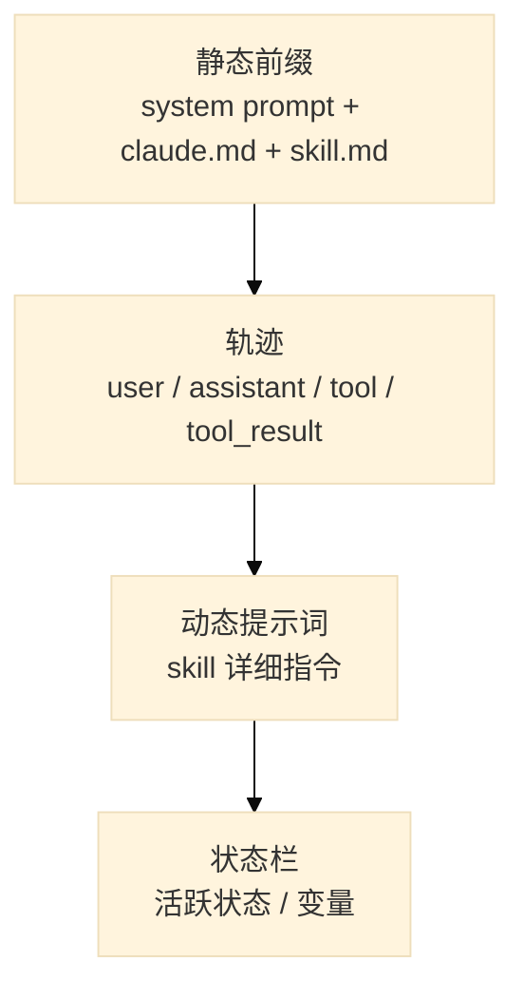

# 上下文剖面图（12–15 min）

一次 Agent 推理时，上下文窗口大致可以看成四层：

## 静态前缀

每次请求都会带上的固定部分。通常最大、最稳定，也最值得一次性优化好。

## 轨迹

多轮对话的历史。Agent 每走一步，历史就被重新塞回去，因此最容易膨胀。

## 动态提示词

运行时根据用户意图注入的某个 skill 的详细说明。只在该 skill 被触发时出现。

## 状态栏

当前会话中的关键变量，例如用户身份、任务阶段、已确认字段。

## 一句话总结

上下文 = 固定前缀 + 历史轨迹 + 动态注入 + 当前状态。
