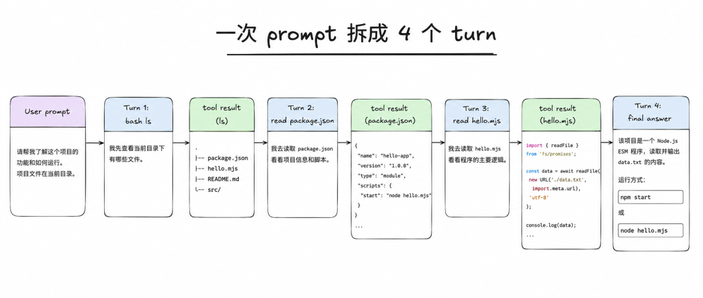
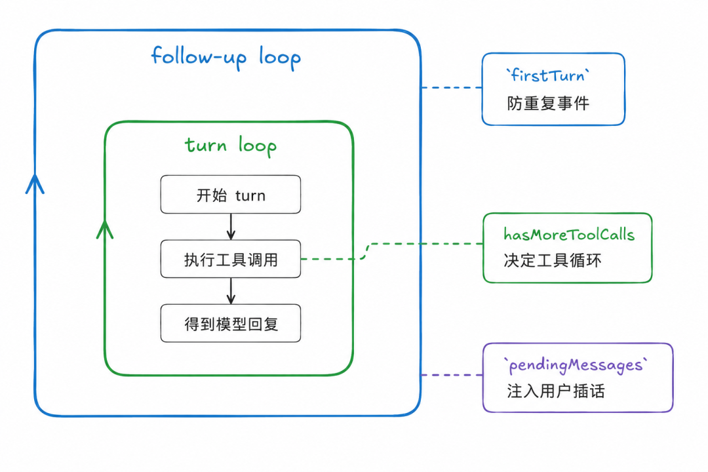
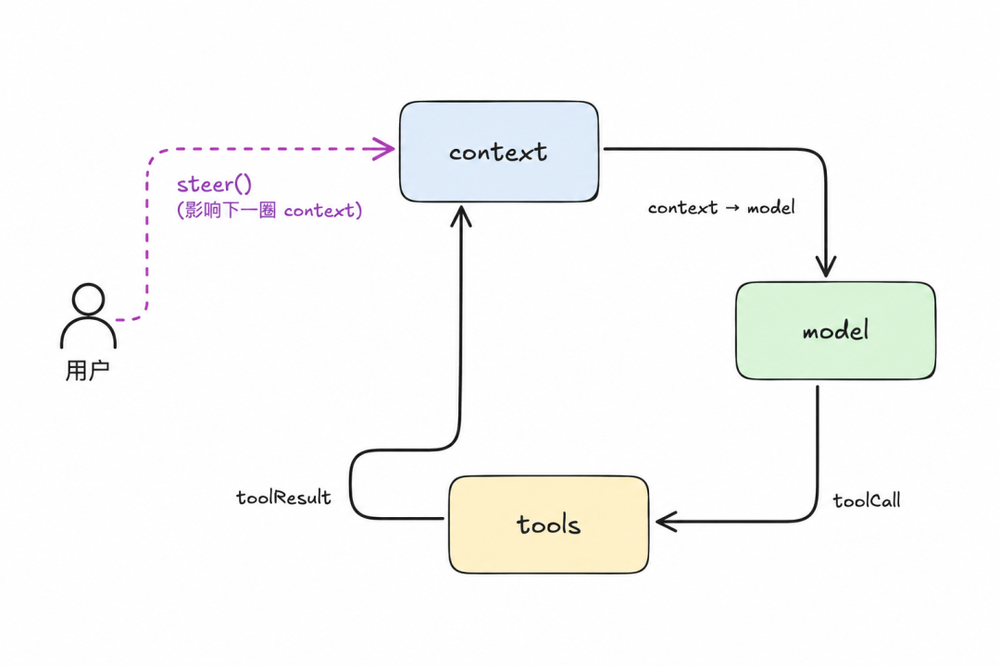
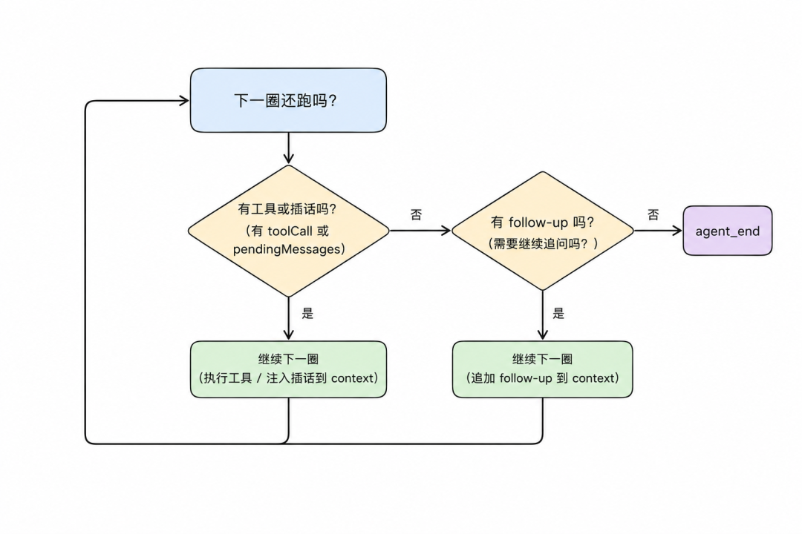
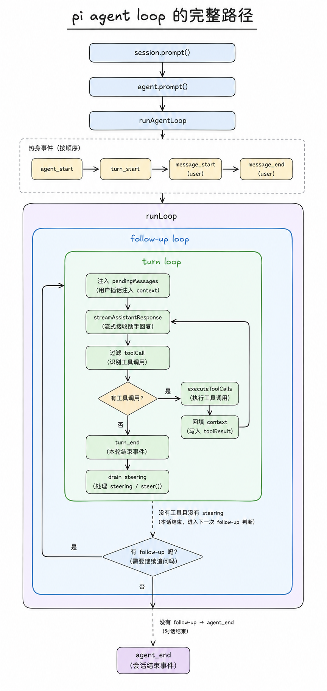

# Pi 系列 02｜Agent loop 与 turn：一次 prompt 为什么会拆成 4 趟

- 来源：https://mp.weixin.qq.com/s/FUrWPnxGYpCgyRmVMUNSgQ
- 公众号：CodeAgent
- 发布时间：2026-06-05
- 抓取日期：2026-08-05
- 说明：正文由微信 HTML 完整转换为 Markdown，文章配图已本地归档。

---

没看过上一篇的话，可以先看 [Pi 系列 01｜用最小例子看 agent runtime 的事件流](https://mp.weixin.qq.com/s?__biz=MzU4NDk1MTk2MA==&mid=2247484544&idx=1&sn=20d89abeb7586d4471e2e81c56a7a780&scene=21#wechat_redirect)
## 写在前面
为什么一句 prompt 明明只问了一句话，pi 最后却跑了 4 个 turn？
如果你把 agent 理解成"把 prompt 发给模型一次"，这里会很反直觉：模型没有一次性回答，而是先请求 `ls`，拿到结果后再请求 `read package.json`，接着又读 `hello.mjs`，最后才总结。
这篇就看这一件事：输入 prompt 之后，loop 怎么把一次用户请求拆成多轮 模型决策 → 工具执行 → 上下文回填。
我们拿一个真实输入做样本：
```
await session.prompt("List files in the current directory, then tell me what this project is.");

```
模型最后会调 3 次工具（bash `ls`、`read package.json`、`read hello.mjs`），再回一段总结文字。整个过程 4 个 turn。
这里的 "4" 不是 pi 固定拆出来的数字，而是这个样本刚好走出了：3 个工具 turn + 1 个最终回答 turn。只要模型继续请求工具，loop 就继续；等模型不再请求工具，最后一个纯文本 turn 才把循环停下来。
我们用这个例子来一步步看下。

## 先看大图：4 个 turn 在干什么
这里要先校正一个直觉：turn 不是用户的一问一答，而是 assistant 的一次行动机会。一次 prompt 会跑几个 turn，取决于 assistant 想要几次工具、什么时候不再要。
所以这 4 个 turn 不是 4 次用户对话，而是 4 次 assistant 获得行动机会。前 3 次机会里，assistant 都选择继续要工具；第 4 次机会里，它选择直接回答。
Turn

模型拿到的新信息

模型做的事

pi 做的事

1

用户原始 prompt

请求 `bash ls`

执行命令，把文件列表写回上下文

2

`ls`
 输出

请求 `read package.json`

读取文件，把内容写回上下文

3

`package.json`
 内容

请求 `read hello.mjs`

读取文件，把内容写回上下文

4

两个文件内容

输出总结文字

发现没有工具调用，结束内层循环

所以 agent loop 的核心不是"模型回答一次"，而是反复问：你现在要继续用工具，还是已经可以回答了？
## 按回车之后，控制权一路下放
你按回车，触发 `session.prompt("List files...")`。这是 coding-agent 层的外壳，负责命令解析、skill 展开、扩展 hook 这些前处理（这一篇我们不展开），处理完把消息递给核心层的 `agent.prompt(text)`。
`agent.prompt` 干两件事：
1.
把字符串包成一条 user message：
```
{ role: "user", content: [{type:"text", text:"List files..."}], timestamp: ... }

```

1.
起一个 `AbortController`、把 `state.isStreaming = true`，然后调 `runAgentLoop(messages, ctx, cfg, emit)`

`runAgentLoop` 是热身阶段，先把开场 4 个事件喊出去：
```
emit agent_start

emit turn_start                ← 第 1 个 turn_start（runAgentLoop 自己发的）

emit message_start (user)

emit message_end (user)

```
注意：user message 是 start 紧跟 end，中间没事件。因为用户文字一次性就完整了，没有"流式生成"过程 —— 不像 assistant message 中间还会夹几十个 `text_delta`。
热身完了，控制权交给 `runLoop` ，真正的循环开始。
## 进 runLoop：先认识 3 个状态点
`runLoop` 的循环围着 3 个状态点转，先认识一下：
```
let firstTurn = true;        // runAgentLoop 已经发过一次 turn_start 了

let pendingMessages = (await config.getSteeringMessages?.()) || [];

                             // 待注入的用户消息（一般是空的）

while (true) {               // 外层：follow-up loop

  let hasMoreToolCalls = true;

  while (hasMoreToolCalls || pendingMessages.length > 0) {

    // 内层：turn loop

  }

}

```
`firstTurn` ：防 turn_start 重发。`runAgentLoop` 刚才发过 1 个，第 1 圈进来时不能再发。
`hasMoreToolCalls`：外层每次开始时先重置成 `true`，强制内层循环至少跑一圈（不然条件直接 false，模型都没调到就退了）。之后每圈结束根据"模型这一轮有没有调工具"刷新。
`pendingMessages`：steering 队列里这一圈要消化的消息快照。它不是队列本身，只是从队列里取出来、准备注入 context 的这一批消息；真正的队列住在 `Agent` 对象上。
这里有两个词要先说清楚：
-
`steer` ：运行中插话。比如 agent 正在读文件时，用户又补一句“顺便也看 README”，这条消息会先进入 steering 队列。

-
`drain` ：取出并清空队列。也就是把 steering 队列里当前攒着的消息一次性拿出来，放进 `pendingMessages`，然后队列本身变空。

在这个普通 prompt 路径里，为什么 `runLoop` 一进来就先尝试 `drain`？因为用户可能在你按回车的同一瞬间，也调用了 `steer("顺便也看 README")`。如果不先 drain，第一轮模型调用就看不到这条插话；先 drain，loop 就能把它放进 `pendingMessages`，在下一次调模型前注入上下文。

## Turn 1：模型说"我先 ls 一下"
### 进内层 while 第 1 圈
```
while (hasMoreToolCalls || pendingMessages.length > 0)  // true || 0 → 进

```
### 第一件事：firstTurn 防重发
```
if (!firstTurn) {

  await emit({ type: "turn_start" });

} else {

  firstTurn = false;

}

```
第 1 圈 `firstTurn=true` → 走 else → 不发 turn_start（外面 `runAgentLoop` 已经发过了），把 `firstTurn` 改成 false。
为什么要这判断？ 如果第 1 圈再发一次，listener 看到 turn_start 连发两次，UI 会渲染出一个空 turn。这 4 行代码是"事件流不重复"的契约保证。
### 第二件事：注入 pending 消息
```
if (pendingMessages.length > 0) { ... }   // 空，跳过

```
这次队列空，不进。但记住它在那 —— Turn 2 我们再细看。
### 第三件事：调模型
```
const message = await streamAssistantResponse(...)

```
这一句内部发出几十个事件（message_start、N 个 text_delta/toolcall_delta、message_end），最后返回完整 assistant message：
```
message = {

  role: "assistant",

  content: [

    { type:"text", text:"I'll start by listing the files..." },

    { type:"toolCall", id:"tc_1", name:"bash", arguments:{command:"ls -la"} }

  ],

  stopReason: "toolUse",

}

```
### 第四件事：判断要不要跑工具
```
const toolCalls = message.content.filter(c => c.type === "toolCall")

// toolCalls.length === 1  有工具调用

```
这里没读 `stopReason` 。pi 不信模型接口返回的 stopReason，它只看 assistant 实际请求了什么 —— 这是 ground truth。
### 第五件事：跑工具
```
const executedToolBatch = await executeToolCalls(...)

```
本地真的执行 `ls -la`，拿到输出：
```
executedToolBatch = {

  messages: [{ role:"toolResult", toolCallId:"tc_1", content:[文件列表] }],

  terminate: false              ← bash 没声明 terminate

}

hasMoreToolCalls = !executedToolBatch.terminate    // = true   ← 下一圈还会进

```
工具结果 push 进 `currentContext.messages`，让下一次调模型能看到。
### 第六件事：收尾这一圈
```
emit turn_end { message: assistant, toolResults: [ls 结果] }

```
检查 `shouldStopAfterTurn` hook（没配，跳过）。
检查 steering 队列：
```
pendingMessages = await config.getSteeringMessages()  // → []  你没插话

```
判定下一圈：`hasMoreToolCalls=true` → 进 Turn 2。
对应到这个例子：模型说"我先 ls 一下"，pi 真的跑了 `ls -la`，拿到目录列表。模型还想接着用工具，所以接着转。
## Turn 2/3：同一个模式又跑了两遍
Turn 2 和 Turn 3 不再出现新的分叉，重点是看出 agent loop 的稳定节奏：
```
上一轮 toolResult 进入 context

→ 模型读到新证据

→ 模型决定下一步还要工具

→ pi 执行工具，把结果再塞回 context

→ turn_end

```
从 Turn 2 开始，`firstTurn=false`，所以每圈一进来都会真的发：
```
emit turn_start

```
如果你监听 `turn_start` 事件，数到的就是这些 turn 边界。
Turn 2 里，模型看到 `ls` 结果后决定读项目清单：
```
message = {

  content: [{type:"toolCall", name:"read", arguments:{path:"package.json"}}],

  stopReason: "toolUse"

}

```
pi 执行 `read package.json`，把内容写回 context，`hasMoreToolCalls=true`，于是进 Turn 3。
Turn 3 里，模型继续根据 `package.json` 判断还要看入口文件：
```
message = {

  content: [{type:"toolCall", name:"read", arguments:{path:"hello.mjs"}}],

  stopReason: "toolUse"

}

```
pi 再执行 `read hello.mjs`，把内容写回 context。到这里，模型已经拿到足够证据：目录结构、包信息、入口代码。
这一段最重要的不是 `read` 工具本身，而是这个循环模式：模型不是直接拥有文件系统，它每次只提出一个行动请求；pi 执行后，把结果变成下一次模型调用的上下文。
### steering 插在哪里
这里顺手看一下 `pendingMessages` 的位置。假设你在 Turn 1 末尾调了：
```
agent.steer("顺便也读 README")

```
Turn 1 收尾时，drain 会拿到这条消息，赋给 `pendingMessages`。Turn 2 一进来，loop 会先把这条 user message 注入 context，再调模型：
```
emit message_start (user)

emit message_end (user)

currentContext.messages.push(userMessage)

```
所以 `pendingMessages` 是 steering 队列和真正对话历史之间的桥。用户中途插话，不需要等 agent 完全结束；下一圈 turn 就会被模型看到。

## Turn 4：转折点 —— 模型不调工具了
### 进内层 while 第 4 圈
```
emit turn_start                       ← 第 4 个

```
### 调模型 → 这次只回文本
```
message = {

  content: [

    { type:"text", text:"This project is a minimal pi SDK harness..." }

  ],

  stopReason: "stop"           ← 注意是 stop 不是 toolUse

}

```
### 判断：没工具
```
const toolCalls = message.content.filter(c => c.type === "toolCall")

// toolCalls.length === 0      ← 没工具！

```
代码先把 `hasMoreToolCalls` 设回 `false`；因为这次没有工具调用，执行工具的 if 块整段跳过，它就保持 `false`。
### emit turn_end，toolResults 是空数组
```
emit turn_end { toolResults: [] }    ← 空数组！这是终止信号

```
### 检查 steering，仍然空
```
pendingMessages = []

```
### 判定下一圈
```
hasMoreToolCalls = false

pendingMessages.length = 0

// 内层 while 条件不成立 → 退出

```
对应到这个例子：模型已经看完所有需要的文件，开始用大白话总结项目。说完不再调工具。
## 外层：最后查一次 follow-up
```
const followUpMessages = await config.getFollowUpMessages()  // → []

if (followUpMessages.length > 0) {

  pendingMessages = followUpMessages

  continue       // 外层 while 重新进入内层

}

break  ← 走这里

```
你没调过 `agent.followUp()`，队列空，break 退出外层。
对应到这个例子：模型说完了，你也没给新任务，loop 就结束。
## 收尾
```
emit agent_end { messages: [本次 run 的 7 条新消息] }

```
`Agent.processEvents` 把 `agent_end` 归约：`streamingMessage = undefined`，run 结束，`isStreaming = false`。
## 一张状态表把 4 个 turn 串起来
如果前面的表讲的是"发生了什么"，这张表只看循环状态：
Turn

firstTurn 进来时

谁发的 turn_start

toolCalls 数

terminate

出口 hasMoreToolCalls

1

true

`runAgentLoop`
（外面已发）

1 (bash)

false

true

2

false

内层 while 自己发

1 (read)

false

true

3

false

内层 while 自己发

1 (read)

false

true

4

false

内层 while 自己发

0
—

false
 → 内层退

## 关键的"两个开关"
前面已经看过内外两层 while。走完整个例子之后，可以把它压成一句话：
```
有工具或插话 → 内层继续

没工具也没插话，但有 follow-up → 外层再来一轮

都没有 → agent_end

```
也就是说，内层解决"这一轮工作还要不要继续"，外层解决"agent 本来要停了，但用户有没有排新的任务"。

这些状态落到这个例子里：
状态

loop 反应

assistant 还想用工具

内层继续

用户中途插话（steer）

内层继续，下一圈先把插话注入

assistant 说完了，但用户又给新任务（followUp）

外层重启进内层

assistant 说完了，没人吭声

收工

## 反过来想：换一种实现会怎样
##### 没有 `firstTurn` 标记？
`runAgentLoop` 一开始已经发了 turn_start，内层 while 第 1 圈再发一次 → listener 看到 turn_start 连发两次。UI 会渲染一个空 turn。
##### 循环判据直接读 `stopReason === "toolUse"`？
看着等价。但 `stopReason` 仍然是模型接口一路转换出来的字段，会受不同 API 形态和适配层实现影响。如果你只信 `stopReason`，就会把"模型有没有请求工具"这个事实交给一个附带声明来决定。
看 content 里有没有 `toolCall` 才是 ground truth。信状态，不信声明 是 pi 少踩坑的关键。
##### 工具结果不写回 context？
如果 `ls` 的输出只给 UI 看，不写回 `currentContext.messages`，下一轮模型就不知道目录里有什么。它要么重复请求工具，要么开始猜。agent loop 能连续推进，靠的就是工具结果被塞回上下文。
##### steering 和 follow-up 合成一个队列？
用户在 agent 跑了一半时的"打断"和 agent 跑完后的"接着干"是两件事。
如果都按 steering 处理：agent 正在跑工具时，follow-up 也会在下一圈 turn 提前注入当前 run —— 用户想"等它做完了再追加任务"做不到，每条新消息都变成打断。
反过来，如果都按 follow-up 处理：用户中途插话要等 agent 完全跑完才被消费 —— "我都说了顺便也读 README 了，它怎么还在读 package.json" 这种体验立刻出现。
pi 给 steering 一个更紧的插入点（每 turn 末尾就检查），给 follow-up 一个更松的插入点（agent 本来要停才检查），就是为了把"实时插话"和"待办堆积"分开成两套语义。
## 一点启发
1.
工具结果必须回填 context。 agent loop 的心跳是：模型提出工具请求 → 本地执行工具 → 工具结果进入上下文 → 模型基于新证据继续判断。少了"回填"这一步，模型要么重复请求工具，要么开始猜。

1.
信状态，不信声明。 判循环继续看消息内容里有没有 `toolCall`，不看 `stopReason`；判模型能不能基于工具结果继续推理，看 context 里真的有那条 toolResult，不靠任何"工具完成"的事件。状态是 ground truth，声明会随模型接口和适配层变化。

1.
"工作中插话"和"完工后接活"要分成两套队列。`steer` 适合让下一圈马上看到用户插话，`followUp` 适合等 agent 本来要停时再接新任务。合并它们必然有一边体验崩。

1.
事件协议要稳定，让 listener 少做特殊处理。 所有消息都 start/end 配对、所有 turn 都不会重发 turn_start —— `firstTurn` 这种小标记看起来啰嗦，但少了它，每个 listener 都要写自己的去重逻辑。

1.
loop 是 agent harness 的底层基础设施，不能写进应用层特例。 pi 把 loop 放在 `packages/agent`，不让它知道 coding-agent 的命令解析，也不让它知道某个模型厂商/API 的细节。换 UI、换模型接口、换业务工具，都不应该改主循环。如果 loop 里写了"if 这个工具是 bash 就特殊处理"，整个分层就塌了。

## 最后看整条路径
回到标题里的问题：一次 prompt 会拆成几趟，不是提前写死的，而是由模型每一轮有没有继续请求工具决定。`session.prompt()` 只是入口，`runAgentLoop` 负责发出起始事件，真正让 4 个 turn 串起来的，是 `runLoop` 里不断重复的"模型请求工具、pi 执行工具、结果回填上下文"。

