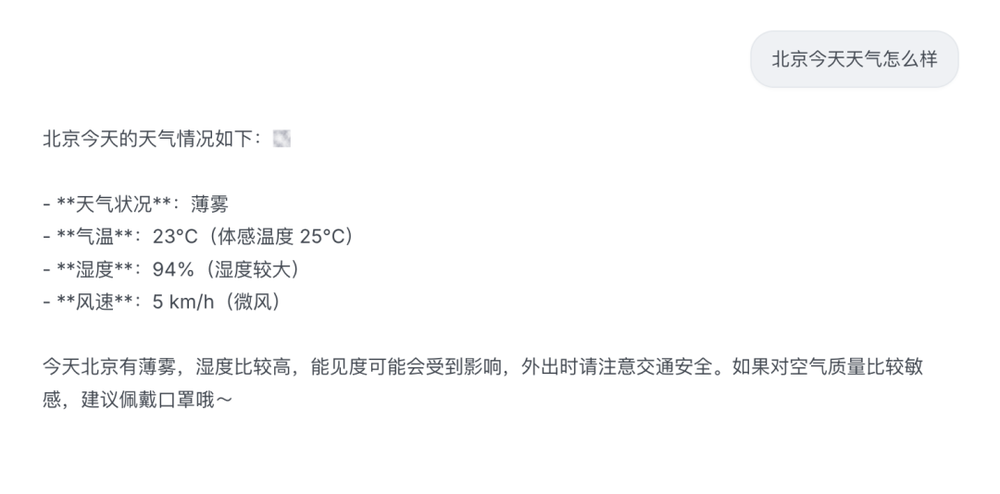

# Pi 系列 06｜实战：给应用加一个 tool（customTools 与 extension 两种方式）

- 来源：https://mp.weixin.qq.com/s/m9pSdVJe7SJuQ2e4gS25rA
- 公众号：CodeAgent
- 发布时间：2026-06-15
- 抓取日期：2026-08-05
- 说明：正文由微信 HTML 完整转换为 Markdown，文章配图已本地归档。

---

前几篇可以看这里：
[Pi 系列 01｜用最小例子看 agent runtime 的事件流](https://mp.weixin.qq.com/s?__biz=MzU4NDk1MTk2MA==&mid=2247484544&idx=1&sn=20d89abeb7586d4471e2e81c56a7a780&scene=21#wechat_redirect)
[Pi 系列 02｜Agent loop 与 turn：一次 prompt 为什么会拆成 4 趟](https://mp.weixin.qq.com/s?__biz=MzU4NDk1MTk2MA==&mid=2247484597&idx=1&sn=dbf2d7b09a59db4c9c47863593277cc9&scene=21#wechat_redirect)
[Pi 系列 03｜Provider 抽象与统一事件协议](https://mp.weixin.qq.com/s?__biz=MzU4NDk1MTk2MA==&mid=2247484612&idx=1&sn=2448667f924a09541e1707d94efc57c8&scene=21#wechat_redirect)
[Pi 系列 04｜Tool 系统 (上) ：一个 toolCall 的一生](https://mp.weixin.qq.com/s?__biz=MzU4NDk1MTk2MA==&mid=2247484637&idx=1&sn=074cde1e3e568a1b875c8c9ebb9826ce&scene=21#wechat_redirect)
[Pi 系列 05 ｜ Tool 系统(下)：工具从哪来、怎么暴露，以及 extension 的角色](https://mp.weixin.qq.com/s?__biz=MzU4NDk1MTk2MA==&mid=2247484646&idx=1&sn=27702ff8a7f1edcf001c1e9fb8d18575&scene=21#wechat_redirect)
> ❝
给基于 pi 的应用加一个 tool，有 `customTools` 和 extension 两种注册方式。本文以一个查天气的 tool 为例，分别用这两种方式实现。 tool 定义本身在两种方式下是一样的，区别只在于 tool 如何进入系统。

## 问题：模型查不了天气
加工具之前，询问「北京天气怎么样」，它会这样回答：“我这边不能实时查询天气数据。你可以看一下手机天气 App 或搜索"北京天气"获取最新情况。”

这不是模型不愿意回答，而是它没有这个能力。模型本身只能根据上下文生成文本，读不了实时数据；天气是实时的、训练数据里没有，所以只能让你自己去查。
要让它能查，就得给它一个工具 —— 下面用查天气这个例子，把加工具的两种方式走一遍。
## 工具定义：两种方式共用
两种方式下，tool 本身都是同一个 `ToolDefinition`——形状由 pi 给，`execute` 自己写。示例里会用到这些 import：
```
import {

  createAgentSession,

  DefaultResourceLoader,

  getAgentDir,

  type ExtensionAPI,

  type ToolDefinition,

} from '@earendil-works/pi-coding-agent';

import { Type } from 'typebox';

```
工具定义如下：
```
const getWeather: ToolDefinition = {

  name: 'get_weather',

  label: 'Get Weather',

  description: '查询某城市的实时天气。用户问天气时调用。',

  parameters: Type.Object({

    city: Type.String({ description: 'City name, e.g. "Beijing" or "北京".' }),

  }),

async execute(_id, params) {

    const city = String((params as { city: string }).city).trim();

    try {

      const r = await fetch(`https://wttr.in/${encodeURIComponent(city)}?format=j1`, {

        headers: { 'User-Agent': 'curl/8' }, // wttr.in 对 curl 才返回 JSON，否则给网页

      });

      if (!r.ok) thrownewError(`wttr.in ${r.status}`);

      const c = (await r.json()).current_condition?.[0];

      if (!c) thrownewError('wttr.in returned no current condition'); // 结构异常也走 catch

      const text = `Temperature: ${c.temp_C}°C, ${c.weatherDesc?.[0]?.value}`;

      return { content: [{ type: 'text', text }], details: c };

    } catch (err) {

      // 失败如实返回，不抛异常 —— 模型读到后会如实告诉用户，不会编假天气

      return { content: [{ type: 'text', text: `Failed: ${String(err)}` }], details: { error: String(err) } };

    }

  },

};

```
两个 execute 细节：
-
显式带 curl UA —— 这里带上 `User-Agent: curl`，让 wttr.in 稳定返回 JSON（它会按 UA 在网页和 JSON 之间切换）。

-
失败转成结果、不抛异常 —— 前面文章那条「错误变成结果回传给模型」的实际应用。

下面这个 `getWeather` 不再重复，两种方式都用它。
## 方式一：customTools（SDK 直接传）
把工具放进数组，传给 `createAgentSession` 的 `customTools`：
```
await createAgentSession({

  noTools: 'builtin',          // 关掉内置 read/bash/edit/write

  customTools: [getWeather],   // SDK 直接传入

});

```
这样就完成了。工具是应用自己的代码、写在项目里时，customTools 是最直接的方式。
## 方式二：extension 的 registerTool
把工具包进一个 extension factory，里面调 `pi.registerTool()`：
```
const weatherExtension = (pi: ExtensionAPI): void => {

  pi.registerTool(getWeather);

};

```
再把这个 factory 通过 `extensionFactories` 挂到 resource loader 上：
```
const loader = new DefaultResourceLoader({

  cwd: process.cwd(),

  agentDir: getAgentDir(),                 // cwd / agentDir 是必填项

  noExtensions: true,                       // 不做默认/配置发现的 extension 加载

  extensionFactories: [weatherExtension],   // 内联 factory 仍然执行

});

await loader.reload();                      // 关键：传入现成 loader 时，必须自己 reload

await createAgentSession({ resourceLoader: loader, noTools: 'builtin' });

```
这里有两点要注意：
-
必须自己调 `await loader.reload()`。`createAgentSession` 只在「自己创建默认 loader」时才替你 reload；传入现成的 `resourceLoader` 时不会代劳。漏掉这行，inline extension 不会被加载，weather 工具也就进不去。

-
`noExtensions: true` 只关掉「默认/配置发现的 extension」，不影响内联的 `extensionFactories`。所以即使设了 `noExtensions: true`，这个内联 extension 仍然生效。（实测验证过：这样注册的工具在 `noTools:'builtin'` 下同样会被激活、暴露给模型、成功调用。）

## 两种方式的结果一样
无论走哪条，问「北京今天天气怎么样」，模型都会生成 `get_weather({ city: "北京" })`，pi 执行、真实天气回上下文、模型据此回答。

对比开头那张「我查不了」——同一个问题，加上工具后，模型不再让你自己去查，而是给出实时数据。
原因在前一篇讲过：工具有三个来源（内置、extension、SDK customTools），最终都汇进同一个 registry，再统一暴露给模型。customTools 和 extension 只是两个不同的「入口」，进去之后没有区别。
## 区别和怎么选
工具定义一样、结果一样，那区别在哪？在「入口」附带的东西：

customTools

extension

写法

数组传给 `createAgentSession`

factory 调 `registerTool`

工具在哪

编译进应用，跟代码一起

可以是内联 factory，也可以是磁盘上单独的 extension 文件

还能干什么

只能加工具

除了加工具，还能挂生命周期 hook、加 provider、加命令

可插拔

不能，改了要重新构建

磁盘 extension 文件可通过 reload 重新加载、也可被第三方分发

只针对「加工具」这一件事，两者能力完全一样——同一个 `ToolDefinition`、同一个 registry、同一个结果。
所以选择标准很简单：
-
工具就是我应用的代码，不需要可插拔 → `customTools`，少一层 factory，最直接。

-
工具要做成可插拔/可分发的插件，或者除了加工具还要挂 hook（权限拦截、改上下文）/加 provider/加命令 → extension。
