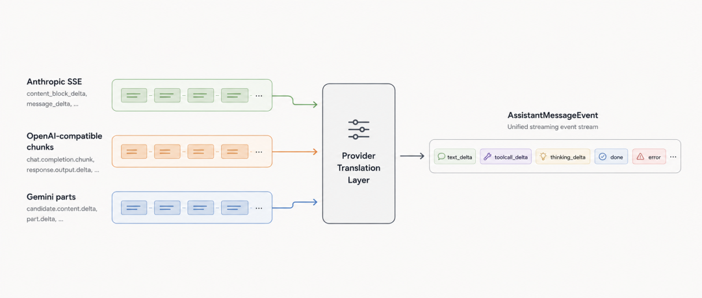
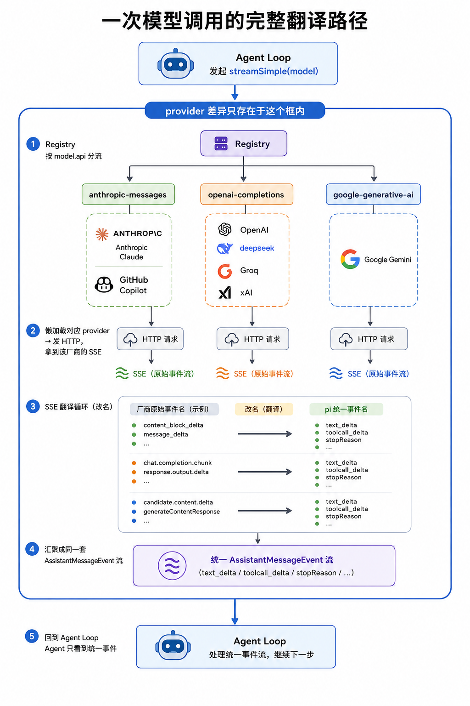

# Pi 系列 03｜Provider 抽象与统一事件协议

- 来源：https://mp.weixin.qq.com/s/ovRDD3RvoeLMPj_wPZZ0Rg
- 公众号：CodeAgent
- 发布时间：2026-06-09
- 抓取日期：2026-08-05
- 说明：正文由微信 HTML 完整转换为 Markdown，文章配图已本地归档。

---

上一篇可以看这里 [Pi 系列 02｜Agent loop 与 turn：一次 prompt 为什么会拆成 4 趟](https://mp.weixin.qq.com/s?__biz=MzU4NDk1MTk2MA==&mid=2247484597&idx=1&sn=dbf2d7b09a59db4c9c47863593277cc9&scene=21#wechat_redirect)
## 写在前面
上一篇结尾，`streamAssistantResponse` 里有这样一段调用：
```
const streamFunction = streamFn || streamSimple;

const response = await streamFunction(config.model, llmContext, options);

for await (const event of response) {

  // event.type: "start" / "text_delta" / "toolcall_delta" / "done" / "error" ...

}

```
agent loop 不直接处理各家厂商的 HTTP 流格式。它依赖的是 `AssistantMessageEvent` 这套统一事件协议：`start`、`text_delta`、`toolcall_delta`、`thinking_delta`、`done`、`error`，以及对应的 `*_start` / `*_end` 边界事件。
这篇用 Anthropic、OpenAI 和 Gemini 三类典型响应格式作为例子。它们的上游流格式并不相同：
-
Anthropic 返回 `content_block_delta` + `input_json_delta`

-
OpenAI 返回 `choices[].delta.tool_calls[]`

-
Gemini 返回 `candidates[].content.parts[]`

本文关注一个问题：`streamSimple(model, context, options)` 如何把某个 provider 的 HTTP 流转换成 agent loop 可以消费的统一事件流。
这是 `packages/ai` 负责的部分。provider 的 wire format 差异集中在这一层处理，上层的 agent loop、coding-agent 和 UI 不需要了解 Anthropic SSE 或 OpenAI chunk 的具体结构。

## 为什么api和provider是两个字段````
这是 provider 抽象的基础。
`Model` 类型里有两个容易混在一起的字段：
```
interface Model<TApi> {

  api: TApi;          // "anthropic-messages" | "openai-completions" | ...

  provider: Provider; // "anthropic" | "github-copilot" | "deepseek" | ...

}

```
`api` = 协议形状（wire format）。它决定请求体如何构造、响应流如何解析。pi 内置多种 API 实现，例如 `anthropic-messages`、`openai-completions`、`google-generative-ai`、`openai-responses`、`bedrock-converse-stream` 等。
`provider` = 厂商身份。它用于选择 API key 来源、认证方式、厂商相关 header 和兼容分支。请求 endpoint 通常来自 model 配置里的 `baseUrl`，而不是只由 `provider` 字段决定。
两者拆开的原因是：同一种协议形状可以被多个 provider 复用。
provider（厂商）

api（用的什么协议）

`anthropic`
`anthropic-messages`

`github-copilot`
`anthropic-messages`
（Copilot 兼容 Anthropic 协议）

`deepseek`
`openai-completions`
（DeepSeek 兼容 OpenAI 协议）

`groq`
`openai-completions`

在 pi 中，DeepSeek、Groq、xAI 等 provider 的模型按 OpenAI-compatible Chat Completions 协议接入。因此 `openai-completions` 只需要一份事件翻译器，多个 provider 可以共用。
API registry 也按 `api` 注册和查找 provider implementation。结果是：新增一个兼容既有协议的 provider 时，通常只需要补充模型配置、认证配置和必要的兼容选项，不需要重新实现一套流解析逻辑。
## 从 streamSimple 到统一事件流
`streamSimple` 的入口很短：
```
export function streamSimple(model, context, options) {

  const provider = resolveApiProvider(model.api);   // 按 "anthropic-messages" 查 registry

  return provider.streamSimple(model, context, options);

}

```
它按 `model.api` 查到对应的 API implementation，再调用该 implementation 的 `streamSimple`。内置 API implementation 在 `register-builtins.ts` 里注册。
这里有两个实现细节：
-
懒加载：`register-builtins.ts` 里的 `streamAnthropic` 是包装函数，第一次调用时才 `import("./anthropic.js")`，并缓存加载结果。

-
运行时校验：注册时会包装 stream 函数，调用时检查 `model.api` 是否与 provider implementation 的 `api` 一致。这个检查用于发现 model 配置与 registry 不一致的情况。

实际的协议翻译在各 provider 文件里完成。下面以 Anthropic 为例。
## 翻译核心：把 Anthropic 的 SSE 变回统一事件
`streamAnthropic` 的结构可以简化成下面这样。代码省略了参数构造、认证、usage 统计和部分事件类型：
```
export const streamAnthropic = (model, context, options) => {

const stream = new AssistantMessageEventStream();

(async () => {

    const output = { role: "assistant", content: [], stopReason: "stop", ... };

    try {

      // build request, send HTTP, receive Anthropic SSE response

      stream.push({ type: "start", partial: output });

      forawait (const event of response) {

        // translate Anthropic events into AssistantMessageEvent

      }

      stream.push({ type: "done", reason: output.stopReason, message: output });

    } catch (error) {

      output.stopReason = options?.signal?.aborted ? "aborted" : "error";

      stream.push({ type: "error", reason: output.stopReason, error: output });

    }

    stream.end();

  })();

return stream;

};

```
`streamSimple` 返回的是一个 `AssistantMessageEventStream`。HTTP 请求和事件翻译在异步任务中执行，调用方可以直接用 `for await` 消费这个流。
### output：一个贯穿整个流的累积器
`streamAnthropic` 一开始会创建一个 `AssistantMessage` 累积器：`content: []`、`stopReason: "stop"`。这个对象贯穿整个流。上游 SSE 每来一段，provider 先更新这个累积器，再向外发送事件。
delta 事件里同时包含两类信息：
-
`delta`：这一小段新增的文本 / JSON（增量）

-
`partial`：到目前为止累积的完整 message（全量快照）

只关心新增片段的消费者可以使用 `delta`。需要完整消息状态的消费者，例如 agent loop、UI 渲染、落盘或统计逻辑，可以使用 `partial`。同一套事件同时支持增量消费和完整状态消费。
### 翻译循环：改名 + 累积
Anthropic SSE 有自己的事件名和数据结构。provider 翻译循环做两件事：把上游事件更新到 `output`，再发送统一事件。
```
for await (const event of response) {

if (event.type === "content_block_delta") {

    if (event.delta.type === "text_delta") {

      block.text += event.delta.text;                  // 累积进 output

      stream.push({ type: "text_delta", ..., delta: event.delta.text, partial: output });

    } elseif (event.delta.type === "input_json_delta") {

      block.partialJson += event.delta.partial_json;   // 工具参数 JSON 逐段累积

      stream.push({ type: "toolcall_delta", ..., delta: event.delta.partial_json, partial: output });

    }

  } elseif (event.type === "message_delta") {

    output.stopReason = mapStopReason(event.delta.stop_reason);   // ★ 关键

  }

}

```
对应关系：
Anthropic 原始事件

pi 统一事件

`content_block_delta`
 / `text_delta`

`text_delta`

`content_block_delta`
 / `input_json_delta`

`toolcall_delta`

`content_block_delta`
 / `thinking_delta`

`thinking_delta`

`message_delta`
 / `stop_reason`

（写进 `output.stopReason`）

OpenAI 的翻译器也做同类转换，只是输入侧换成 `choices[].delta.content`、`choices[].delta.tool_calls[]`、`finish_reason` 等 OpenAI-compatible 字段。输出侧仍然是同一套 `AssistantMessageEvent`。
### mapStopReason：归一化停止原因
不同 provider 对停止原因的命名不同。Anthropic 的 `stop_reason` 会在 provider 层映射成 pi 的统一 `StopReason`：
```
function mapStopReason(reason) {

switch (reason) {

    case"end_turn":   return"stop";

    case"max_tokens": return"length";

    case"tool_use":   return"toolUse";    // ← Anthropic 用 tool_use

    case"refusal":    return"error";

    // ...

  }

}

```
Anthropic 的 `tool_use` 会被统一成 `toolUse`。OpenAI-compatible provider 的 `tool_calls` 也会映射到同一个值。agent loop 看到的是归一化后的 `StopReason`，而不是各家上游 API 的原始字符串。
## 错误也进入事件协议：StreamFunction 的契约
provider stream 函数有一个重要约定：请求、解析、运行期失败应编码进返回的事件流，而不是从 stream 函数向外抛出。错误终止时，流里会出现一个 `error` 事件，事件携带最终的 `AssistantMessage`，其 `stopReason` 为 `error` 或 `aborted`。
`streamAnthropic` 的 `catch` 会把 HTTP 失败、SSE 解析失败和 abort 等情况转换成 `error` 事件。懒加载 provider module 失败时，`register-builtins.ts` 里的外层包装也会构造一个 `error` 事件。`AssistantMessageEventStream` 把 `done` 和 `error` 都视为终止事件。
这个约定服务于 agent loop 的收尾逻辑。agent loop 使用 `for await (const event of stream)` 消费模型响应。如果请求或解析阶段的异常直接穿透，循环会在中间中断，`message_end`、`turn_end`、`agent_end` 等后续事件可能无法按预期发出。
把运行期错误编码成流里的终止事件后，成功路径收到 `done`，失败路径收到 `error`。两者都能通过统一的事件协议完成收尾。这里的边界是：registry 或配置层面的错误，例如没有注册对应 `api`，仍可能在拿到流之前抛出。
## 几个设计取舍
registry 按 `api` 做 key。 这样兼容同一协议的 provider 可以复用翻译器。否则每新增一个 OpenAI-compatible provider，都需要再注册一份功能相同的流解析实现。
运行期错误进入事件流。 这样 agent loop 可以通过 `done` / `error` 两种终止事件走统一收尾路径，而不需要为每个 provider 编写不同的异常处理逻辑。
事件同时提供 `delta` 和 `partial`。 只提供 `delta` 时，每个需要完整消息的消费者都要重新累积一遍。`partial` 把这个累积过程集中在 provider 层，降低了上层消费者的重复实现。
## 工程结论
1.
协议形状和厂商身份分开建模。`api` 描述 wire format，`provider` 描述厂商身份和认证相关差异。

1.
流格式差异集中在 provider 层。`packages/ai` 负责把各家上游事件转换成统一的 `AssistantMessageEvent`，上层不需要处理 provider-specific chunk 结构。

1.
统一事件同时携带增量和累积快照。`delta` 支持增量消费，`partial` 支持完整状态消费。

1.
运行期失败进入事件协议。 provider 请求和解析失败通过 `error` 事件终止，与成功的 `done` 共用同一套收尾机制。

## 最后看整条路径
agent loop 能只依赖统一事件协议，是因为 `packages/ai` 处理了 provider 的流格式差异：`model.api` 决定使用哪一套协议翻译器，翻译器把上游 HTTP/SSE chunk 累积并转换成同一套 `AssistantMessageEvent`，运行期错误也通过同一套事件流返回。

