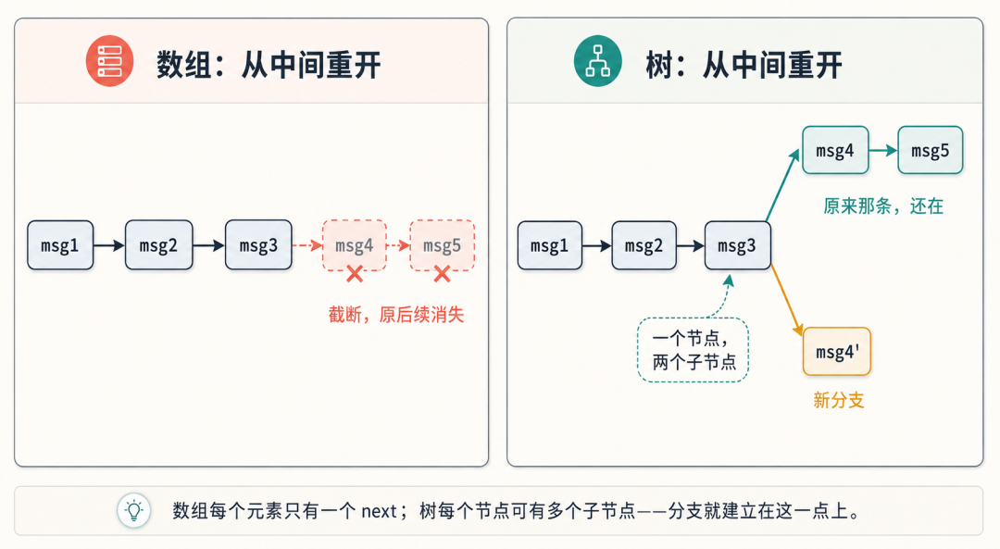
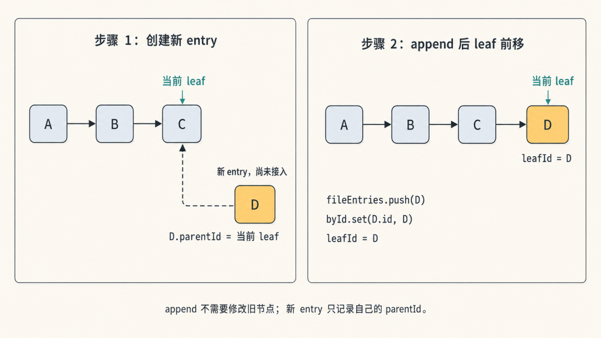
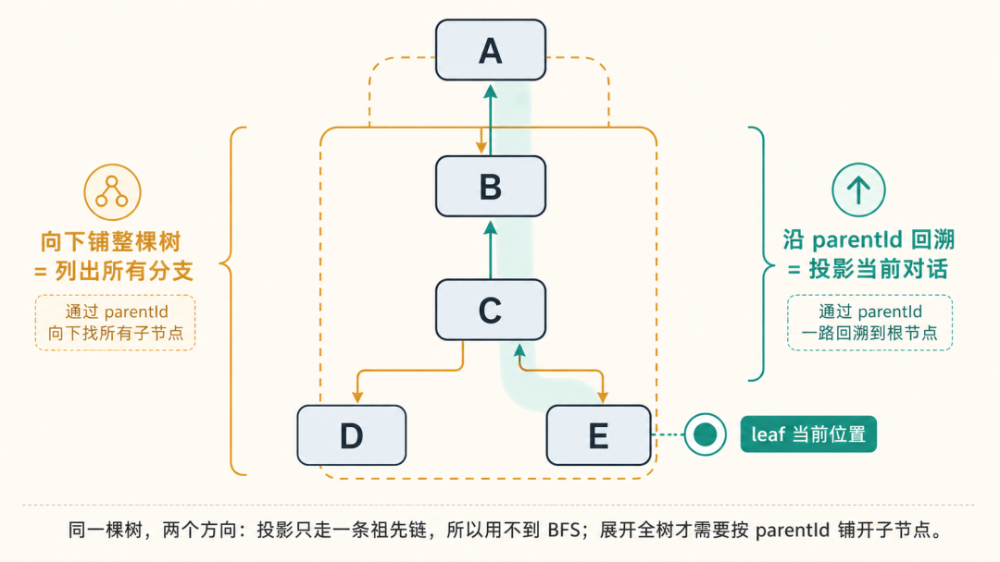
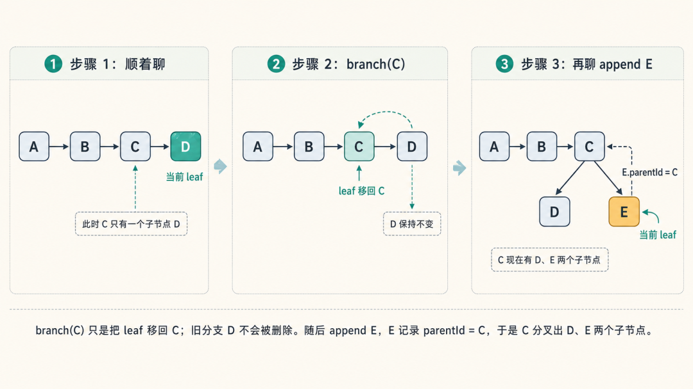
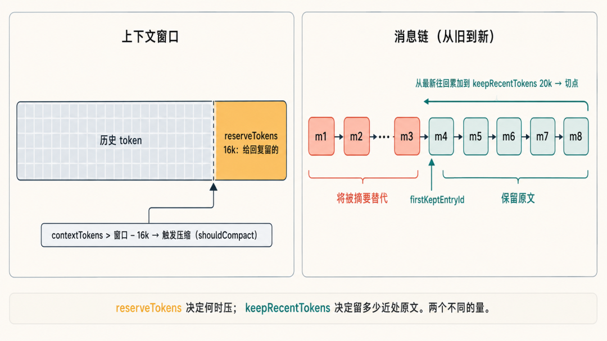
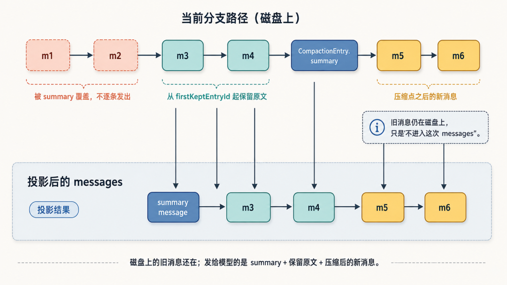
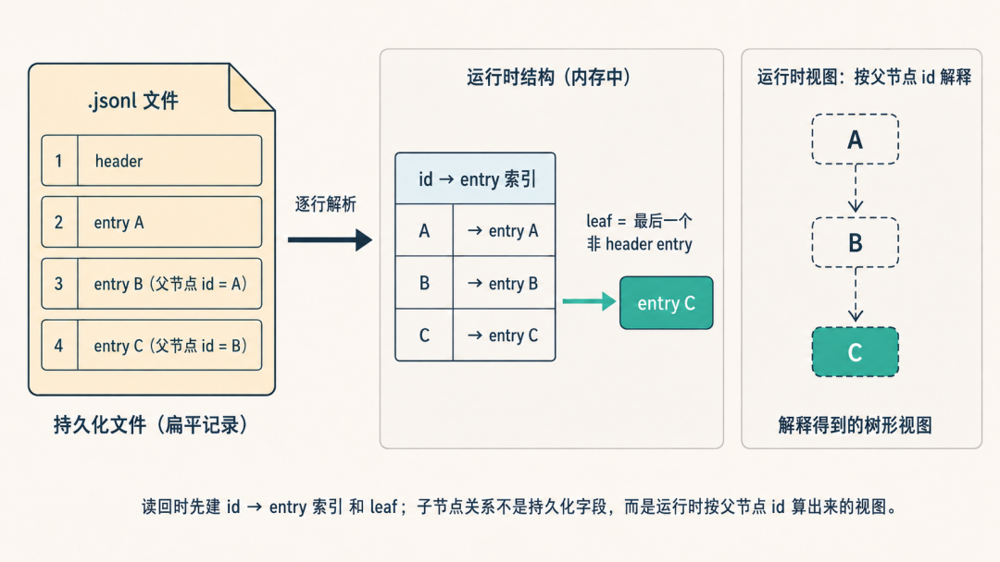
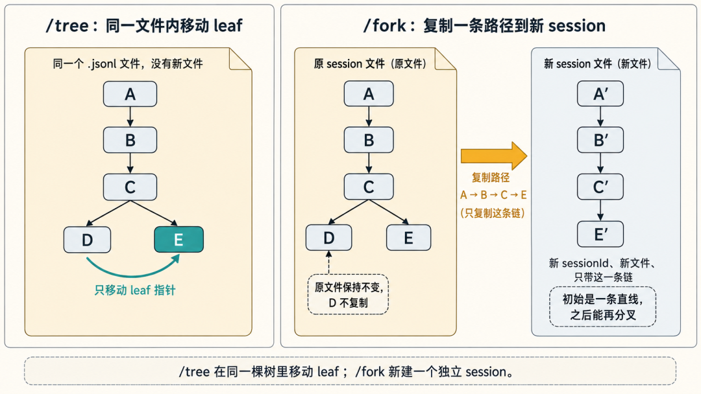

# Pi 系列 07｜Session 系统：对话怎么存、恢复、分支

- 来源：https://mp.weixin.qq.com/s/csRQ5E1B2fY_GMNiBjHEYA
- 公众号：CodeAgent
- 发布时间：2026-06-24
- 抓取日期：2026-08-05
- 说明：正文由微信 HTML 完整转换为 Markdown，文章配图已本地归档。

---

本系列其他文章：
[Pi 系列 01｜用最小例子看 agent runtime 的事件流](https://mp.weixin.qq.com/s?__biz=MzU4NDk1MTk2MA==&mid=2247484544&idx=1&sn=20d89abeb7586d4471e2e81c56a7a780&scene=21#wechat_redirect)
[Pi 系列 02｜Agent loop 与 turn：一次 prompt 为什么会拆成 4 趟](https://mp.weixin.qq.com/s?__biz=MzU4NDk1MTk2MA==&mid=2247484597&idx=1&sn=dbf2d7b09a59db4c9c47863593277cc9&scene=21#wechat_redirect)
[Pi 系列 03｜Provider 抽象与统一事件协议](https://mp.weixin.qq.com/s?__biz=MzU4NDk1MTk2MA==&mid=2247484612&idx=1&sn=2448667f924a09541e1707d94efc57c8&scene=21#wechat_redirect)
[Pi 系列 04｜Tool 系统 (上) ：一个 toolCall 的一生](https://mp.weixin.qq.com/s?__biz=MzU4NDk1MTk2MA==&mid=2247484637&idx=1&sn=074cde1e3e568a1b875c8c9ebb9826ce&scene=21#wechat_redirect)
[Pi 系列 05 ｜ Tool 系统(下)：工具从哪来、怎么暴露，以及 extension 的角色](https://mp.weixin.qq.com/s?__biz=MzU4NDk1MTk2MA==&mid=2247484646&idx=1&sn=27702ff8a7f1edcf001c1e9fb8d18575&scene=21#wechat_redirect)
[Pi 系列 06｜实战：给应用加一个 tool（customTools 与 extension 两种方式）](https://mp.weixin.qq.com/s?__biz=MzU4NDk1MTk2MA==&mid=2247484655&idx=1&sn=e4124a63651bc787c0686a863f138d4c&scene=21#wechat_redirect)
> ❝
本文源码主要在 `session-manager.ts` 和 `core/compaction/compaction.ts`。

本文来看 pi 的 session 系统。进入源码之前，先从一个设计问题开始：
> ❝
如果让你自己设计一个 session 系统，会怎么存一段对话？需要考虑哪些问题？

一段 agent 对话看起来像一条时间线：用户发一句，模型回一句，继续往后追加。最直接的做法，是准备一个 `messages` 数组，退出时写到磁盘，重启后再读回来。只考虑保存和恢复时，这种设计基本够用。
但 pi 的 session 还要支持另一件事：用户可以回到历史中的某一轮，从那里重新提问，同时保留原来的后续对话。这样一来，session 就不再是一条简单的线。第 5 条消息后面，可能接着原来的第 6 条，也可能接着一次新的提问。
这就是数组不够用的地方：数组只能表达一条后续，而这里需要表达分支。所以 pi 没有把 session 存成一个 `messages` 数组，而是存成一棵只追加的 entry 树。发给模型的对话，则是从当前叶子节点 leaf 往上取出的一条路径，再转换成 messages。
本文按这条线看：为什么要用树，消息怎么进树，树怎么投影成上下文，分支和压缩又怎么落到同一套机制里。
## 为什么是树，不是数组
先把要求拆开看：
-
保存到磁盘：数组够，存 JSON 就行。

-
重启恢复：数组够，读回来就行。

-
回到中间重开、不丢原来那条线：数组不够，需要能表达分支的结构。

分支的本质是"一个节点有多个后续"。数组里每个元素只有一个 next，从第 5 条重开就只能删掉后面——原来那条线没了。树里每个节点记着自己的父节点，但一个父节点可以有多个子节点，于是"从中间分出两条线、共享前 5 条"就能表达。

所以，树结构最关键的价值，是支持分支。保存到磁盘、重启恢复，线性数组也能做到；真正让数组不够用的，是"从中间重开但不丢原来的后续"。
## 一次提问怎么经过 session
先看一次提问的流程。当按下回车的时候，一条消息进入 session，最后变成发给模型的输入，中间是这样：
```
appendMessage(msg)              // 把消息作为当前 leaf 的子节点挂进树，leaf 前移

  └─ _appendEntry(entry)        // 进内存列表 + id 索引，更新 leafId，追加写盘

buildSessionContext(entries, leafId, byId)   // 从 leaf 沿 parentId 回溯到 root，投影成 messages

  └─ agent.state.messages = context.messages // 这批 messages 才是发给模型的

```
这里先分清两层：写进去的是 entry（树的节点），发出去的是 messages（投影的结果），两者不是同一个东西；中间隔着 `buildSessionContext` 这个投影函数。接下来逐步看这条流程。
## 树的节点：9 种 entry，靠 parentId 串起来
session 文件里存的不只是消息，而是 9 种 `SessionEntry`。它们记录的不止"谁说了什么"，还有"中途切了模型、改了思考等级、做了一次压缩"这类状态变化。九种类型共享同一个基底 `SessionEntryBase`，再各自带自己的字段（下面是类型轮廓，保留和 session 机制有关的字段）：
```
interface SessionEntryBase {

type: string;

  id: string;

  parentId: string | null;

  timestamp: string;

}

interface SessionMessageEntry extends SessionEntryBase {

type: "message";

  message: AgentMessage;

}

interface ThinkingLevelChangeEntry extends SessionEntryBase {

type: "thinking_level_change";

  thinkingLevel: string;

}

interface ModelChangeEntry extends SessionEntryBase {

type: "model_change";

  provider: string;

  modelId: string;

}

interface CompactionEntry extends SessionEntryBase {

type: "compaction";

  summary: string;

  firstKeptEntryId: string;

  tokensBefore: number;

}

interface BranchSummaryEntry extends SessionEntryBase {

type: "branch_summary";

  fromId: string;

  summary: string;

}

// Does NOT participate in LLM context (ignored by buildSessionContext).

interface CustomEntry extends SessionEntryBase {

type: "custom";

  customType: string;

  data?: unknown;

}

// Unlike CustomEntry, this DOES participate in LLM context.

interface CustomMessageEntry extends SessionEntryBase {

type: "custom_message";

  customType: string;

  content: string | (TextContent | ImageContent)[];

  display: boolean;

}

interface LabelEntry extends SessionEntryBase {

type: "label";

  targetId: string;

  label: string | undefined;

}

interface SessionInfoEntry extends SessionEntryBase {

type: "session_info";

  name?: string;

}

```
九种 entry 最后合成一个联合类型 `SessionEntry`。按用途简单梳理一下：
-
`message` 保存一条对话消息（`AgentMessage`），是最常见的节点。

-
`thinking_level_change`、`model_change` 记录某一刻调整了思考等级，或切换了模型；这类状态变化也会作为节点进入同一棵树。

-
`compaction` 保存压缩摘要和 `firstKeptEntryId`，投影时用摘要替代被压缩的那段旧消息。

-
`branch_summary` 保存切分支时带过来的摘要，用来把原分支的一部分上下文带到新分支。

-
`custom` 和 `custom_message` 都给 extension 使用：前者不进入模型上下文，后者会进入。

关键是它们共享同一个基底：每种 entry 不管自己带什么字段，都有 `id` 和 `parentId`。树关系就编码在每个节点上，而不是放在某个全局结构里。本文主要围绕 `message` 和 `compaction` 展开，其余类型也按同一套规则挂进这棵树。
新节点怎么挂进去：所有 `appendXXX` 方法的结构相近，以 `appendMessage` 为例：
```
appendMessage(message) {

  const entry = {

    type: "message",

    id: generateId(this.byId),

    parentId: this.leafId,        // 父节点 = 当前 leaf

    timestamp: new Date().toISOString(),

    message,

  };

  this._appendEntry(entry);       // 进树，并把 leaf 前移到这个新节点

  return entry.id;

}

```
负责把节点写入 session 树的是 `_appendEntry`：
```
private _appendEntry(entry) {

  this.fileEntries.push(entry);    // 进内存列表

  this.byId.set(entry.id, entry);  // 进 id→entry 索引

  this.leafId = entry.id;          // leaf 前移到新节点

  this._persist(entry);            // 追加写盘

}

```
规则很直接：先让新节点指向当前 leaf，再把新节点写入列表和索引，最后把 leaf 移到新节点上。连续对话时，每条新消息都会接在上一条后面，session 就形成一条不断延长的链。


## 投影：把树变回模型能读的对话
模型读的是一串有序消息，不是树。这里说的"投影"，就是从完整的 entry 树里，按当前 leaf 取出这一刻模型应该看到的那条路径，再转换成 messages。`buildSessionContext` 负责做这件事，分三步：
第一步，定位 leaf。`leafId` 是 null 就返回空（站在第一条之前）；有值就取对应节点；没有传入时就退回最后一条。leaf 表示当前分支的位置。
第二步，从 leaf 沿 parentId 回溯到 root，收集路径。 这是整个机制的核心：
```
const path = [];

let current = leaf;

while (current) {

  path.unshift(current); // 头插

  current = current.parentId ? byId.get(current.parentId) : undefined;

}

```
只走 leaf 到 root 这一条祖先链，每个节点只有一个父节点，所以"向上"永远是单线，一个 `while` 就够，不需要 BFS 或 DFS。
用 `unshift`（头插）而不是 `push`，是因为回溯方向是 leaf→root（新→老），但发给模型要老→新。头插把更老的节点不断挤到前面，自动得到正序。以 `A→B→C→D` 这条链为例：
```
unshift(D) → [D]

unshift(C) → [C, D]

unshift(B) → [B, C, D]

unshift(A) → [A, B, C, D]   ← 正序，模型从老读到新

```
第三步，沿路径提取设置。 遍历这条路径，取最后一次的思考等级、最后一次的模型、以及有没有压缩。注意范围是"当前这条路径"，不是整棵树——所以"用哪个模型、有没有压缩"都是相对当前分支而言的，切到别的分支可能不一样。
这里有一个对照：同一棵树，有两种方向相反的遍历。


-
沿 parentId 回溯一条链（`buildSessionContext`、`getBranch`）：叶→根，单线，用来投影"当前这条对话"。

-
向下铺整棵树（`getTree`）：根→叶，要处理"一个父节点多个子节点"，用来给 `/tree` 列出所有分支。

投影用不到 BFS，正是因为它只关心当前这一条链；只有要展开整棵树时，才需要按 `parentId` 把每个节点挂到父节点的子节点列表下。
举个具体例子，把 `buildSessionContext` 这三步对着一棵树走一遍。假设对话是四条：
```
A 用户：“帮我写个登录函数”

B 模型：“好的，这是用 cookie 的版本……”

C 用户：“第二个参数是什么意思？”

D 模型：“那个参数是过期时间……”

```
它们在树里是 `A → B → C → D`，leaf 在 D。调用 `buildSessionContext(entries, leafId=D)`：
1.
定位 leaf：`leafId` 是 D，取到 D 这个节点。

1.
沿 parentId 回溯：D → C → B → A，一路 `unshift`，得到正序 `[A, B, C, D]`。

1.
提取设置：扫这条路径，没有压缩，也没有模型切换，按默认设置发出。

最后 `agent.state.messages` 就是 `[A, B, C, D]`，这和线性对话里的 messages 顺序一致。
现在用户回到 B，改问“换成用 JWT 写”。新消息 E 挂在 B 下面，B 有了两个子节点，同时 leaf 移到 E：
```
A → B ─┬─ C → D        （原来那条，问 cookie 版本的）

       └─ E            （新分支，改问 JWT）

```
再调一次 `buildSessionContext`，这次 `leafId=E`：第二步从 E 回溯，只经过 B、A，得到 `[A, B, E]`。C、D 不在 E 的祖先链上，所以不会进入这次投影出来的 messages；但它们没有被删除，仍然留在树里。把 leaf 切回 D 再调一次，又会得到 `[A, B, C, D]`。
同一棵树、同一个 `buildSessionContext`，只是传入的 leaf 不同，投影出的对话就不同。 这就是这里所说的"投影"：发给模型的 messages 不是直接存好的一条数组，而是每次根据当前 leaf 从 entry 树里算出来的视图。
## 分支：移动 leaf，旧分支不进入当前投影
有了 leaf 指针，分支的实现很小。`branch` 方法只做一件事：
```
branch(branchFromId) {

  if (!this.byId.has(branchFromId)) throw new Error(`Entry ${branchFromId} not found`);

  this.leafId = branchFromId;     // 只改指针，不删改任何节点

}

```
把 leaf 移回一个历史节点后，下一次 `appendXXX` 创建的新 entry，会把 `parentId` 指向这个历史节点。于是，同一个父节点下面会出现第二个子节点：


当前 leaf 变成 E 后，沿 `parentId` 回溯得到的是 `E→C→B→A`。这条路径里没有 D，所以投影出来的 messages 也不包含 D。但 D 没有被删除，它仍然留在 session 树和磁盘文件里。“删掉”和“不进入当前投影”是两回事：D 只是这次不在模型上下文里，之后切回那条分支时仍然能被投影出来。
这就是树结构解决的问题：数组从 C 重开会截断 D；树从 C 重开只是增加一个子节点、移动 leaf，D 保持不变。
pi 把这套能力接在几个地方：
-
`/tree`：`slash-commands.ts` 里的描述是 "Navigate session tree (switch branches)"。它在同一个 session 文件里移动 leaf，用来切换已有分支，不创建新文件。

-
`/fork`：描述是 "Create a new fork from a previous user message"。它从当前树里抽出一条路径，创建一个独立 session。原 session 保持不变，新 session 从这条路径继续往后走。下一节细看。

-
`branchWithSummary`：切分支时先追加一条 `branch_summary`，把原分支的一部分上下文带到新分支；投影时它会变成一条消息发给模型。

其中，最能体现"同一棵树里切分支"的是 `/tree`；`/fork` 用到的是另一件事：从当前树里抽出一条路径，生成一个新的 session。
## 压缩：往树里加节点，不是删消息
对话太长时需要减少上下文 token。常见做法可能是把旧消息删掉、换成一段摘要；但 append-only 的树从不删节点。pi 的做法是把"压缩"也变成树上的一个普通节点：把前面一段对话概括成摘要，往当前 leaf 后面追加一个 `compaction` 节点。旧消息保持不变，仍然留在树上；变化只发生在投影那一步。
这一节分两半：先看压缩怎么发生（什么时候触发、压哪一段、压成什么），再看这个节点在投影时怎么被用。
### 压缩怎么发生
什么时候触发。 判断在 `shouldCompact`，一行：
```
return contextTokens > contextWindow - settings.reserveTokens;

```
当前上下文的 token 数超过"模型上下文窗口 − 预留量"时触发压缩。预留量 `reserveTokens` 默认 16384，相当于给模型回复保留 16k token 的空间；剩余空间接近被历史占满时，就需要压缩。也可以用 `/compact` 手动触发；把 `compaction.enabled` 关掉则不会自动压缩。
压哪一段（切点怎么定）。 切点在 `findCutPoint`：从最新的消息往回走，逐条累加估算的 token 数，累加到 `keepRecentTokens`（默认 20000）就停，在那里切。切点之前的旧消息将被摘要替代，切点及之后的保留原文。所以"保留多少原文"是由 keepRecentTokens 定的——大约留住最近 20k token 的原文。
这里有两个容易混的数字，作用不同：
-
`reserveTokens`（16k）：触发用——给回复留的空间，决定"什么时候该压"。

-
`keepRecentTokens`（20k）：保留用——决定"压的时候留多少近处原文"。

关于切点，还有几个细节：
-
不切在不可分的消息上：切点不会落在 `toolResult` 这类不能单独切开的消息上。

-
切在 turn 中间会补前缀摘要：如果切点落在一个 turn 中间，pi 会把这个 turn 的前缀单独做一段 `turn prefix summary`，让保留下来的后半段还能被理解。

-
token 是估算不是精算：token 数用 `chars / 4` 这个保守的估算（`estimateTokens`），不是精确计费。

-
切点就是 firstKeptEntryId：切点那条 entry 的 id，就是前面反复出现的 `firstKeptEntryId`。

压成什么（summary 长什么样）。 摘要不是随便概括一段话，而是 `generateSummary` 把"要压的那段消息"发给模型，用一个固定格式的 prompt（`SUMMARIZATION_PROMPT`）生成一份结构化的"上下文 checkpoint"。它要求模型按这几个固定小节输出：
```
## Goal                     目标

## Constraints & Preferences 约束与偏好

## Progress (Done/In Progress/Blocked)  进度

## Key Decisions            关键决策

## Next Steps               下一步

## Critical Context         关键上下文

```
prompt 里专门要求"保留确切的文件路径、函数名、错误信息"。也就是说，压缩的目标是保留继续工作的关键上下文，而不是做一般意义上的文本缩写——这解释了为什么摘要采用固定小节，并强调保留关键信息。生成完成后，pi 还会把这段历史里读过、改过的文件列表附到 summary 后面，进一步保留工作现场。
压第二次会怎样（迭代更新）。 如果这条路径上已经压过一次，`prepareCompaction` 会找到上一个 `compaction` 节点、取出它的 summary，这次走另一个 prompt（`UPDATE_SUMMARIZATION_PROMPT`）把新对话并入旧摘要：把"In Progress"里做完的挪到"Done"、更新"Next Steps"，并保留旧摘要里的信息。所以多次压缩时，磁盘上仍然会继续追加新的 `compaction` 节点；但新摘要会基于上一份摘要更新。投影时使用当前路径上最新的 compaction，相当于维护一份不断更新的 checkpoint。


### 压缩怎么用（投影时）
压缩发生后，当前这条路径长这样（假设原来是 m1 到 m6，在 m4 之后压了一次，切点取在 m3）：
```
m1 → m2 → m3 → m4 → [compaction] → m5 → m6

                       summary=...

                       firstKeptEntryId = m3

```
`compaction` 节点和别的节点一样挂在链上（父节点是 m4）。投影时 `buildSessionContext` 看到它，就把路径切成三段拼出 messages：
1.
先放摘要：用 `summary` 生成一条摘要消息，代替它前面"没保留"的那段（m1、m2）。

1.
再放保留的原文：从 `firstKeptEntryId`（m3）起、到压缩节点之前，逐条原样放（m3、m4）。

1.
最后放压缩之后的消息：压缩节点后面的全放（m5、m6）。

上例投影出来就是：`[摘要] → m3 → m4 → m5 → m6`。m1、m2 没有被删，磁盘上还在，只是这次被摘要代替、没进 messages。
对照源码（这里的 `appendMessage` 是 `buildSessionContext` 内部的一个局部函数，负责把一个 entry 翻成 message 塞进数组；它和上一节 `SessionManager.appendMessage`（往树里加节点）同名，但不是同一个东西，这里只是"取出来发给模型"）：
```
// 注意：此 appendMessage 是 buildSessionContext 内部的局部函数，

// 与 SessionManager.appendMessage 不同——这里只负责把 entry 转成 message。

if (compaction) {

// ① 先放摘要

  messages.push(createCompactionSummaryMessage(compaction.summary, ...));

const compactionIdx = path.findIndex((e) => e.id === compaction.id);

// ② 从 firstKeptEntryId 起、到压缩点之前，逐条转换

let kept = false;

for (let i = 0; i < compactionIdx; i++) {

    if (path[i].id === compaction.firstKeptEntryId) kept = true;

    if (kept) appendMessage(path[i]);

  }

// ③ 压缩点之后，全部转换

for (let i = compactionIdx + 1; i < path.length; i++) appendMessage(path[i]);

}

```
如下图：


压缩和分支用的是同一条原则：底层存储只追加，不删除；变化发生在投影阶段。
-
分支：移动 leaf，让投影走另一条路径。

-
压缩：追加 `compaction` 节点，让投影用摘要替代一段旧消息。

`buildSessionContext` 叫 build，也说明发给模型的上下文不是直接从文件里读出来的，而是按"树 + 当前 leaf + 压缩"算出来的视图。
## 保存到磁盘：JSONL 与写入时机
一个 session 就是一个 `.jsonl` 文件，文件名形如 `{时间戳}_{sessionId}.jsonl`。JSONL（JSON Lines）的规则只有一条：每行是一个独立完整的 JSON，行之间用换行分隔，整个文件不是一个 JSON。
```
{"type":"session", ... }                              ← 第一行永远是 header

{"type":"message","id":"e1","parentId":null, ... }

{"type":"message","id":"e2","parentId":"e1", ... }

{"type":"compaction","id":"e3","parentId":"e2","firstKeptEntryId":"e1", ... }

```
（字段名取自源码，具体取值此处为演示。）树关系编码在每行的 `parentId` 里——文件本身是平的，树关系是读回来后按 `parentId` 重新解释出来的。
为什么是 JSONL，不是一个大 JSON 数组。 加一条记录时，JSONL 只需要在文件尾追加一行，不碰前面的内容；大 JSON 数组通常要读出整体、追加元素、再整体写回。append-only 的树，落到磁盘上也适合用 append-only 的文件。
JSONL 还有一个恢复上的好处：如果写到一半崩溃，受影响的通常是最后一行，前面已经写好的行仍然能解析。`loadEntriesFromFile` 里也会跳过解析失败的行。JSONL 支持流式逐行读，不过 pi 这里是 `readFileSync` 一次性读入后再按行切分。
写入时机：第一次 assistant 回复前先暂缓。`_persist` 会先检查当前 session 里是否已经有 assistant 消息。还没有 assistant 消息时，它不会立刻写盘，只把 `flushed` 标成 false；等第一条 assistant 消息出现后，再把此前积累的 entries 一次性写入。之后 session 已经进入 flushed 状态，新 entry 会继续按 JSONL 追加写入。这样模型还没给出第一条回复就中断时，磁盘上不会留下半截无回复的对话。
代码大概是这样：
```
if (!hasAssistantMessage(entries)) {

  flushed = false;

  return;

}

if (!flushed) {

  appendAll(entries); // 第一次 assistant 出现后，把前面攒的都写入

  flushed = true;

} else {

  append(entry);      // 之后每个新 entry 继续追加一行

}

```
## 读回：从 JSONL 重建索引与树
读回：先建索引，不立即构造整棵树。 打开一个已存在的文件，先按行读取 JSONL，得到一个 entries 数组，再走 `_buildIndex`：
```
for (const entry of this.fileEntries) {

  if (entry.type === "session") continue;  // 跳过 header

  this.byId.set(entry.id, entry);          // 建 id→entry 索引

  this.leafId = entry.id;                  // leaf 落在最后一个非 header entry

}

```
注意读回时不构造子节点指针、不提前拼出完整父子关系。它只做两件事：建 `byId` 索引，把 leaf 设成最后一个非 header entry。后面需要树形关系时再现算：投影时沿 `parentId` 回溯父节点，`getTree` 展示分支时再向下铺子节点。所以"从文件变回树"准确说是：文件 → 平数组 → id 索引，树是索引之上的视图。
具体怎么现算，取决于要构造哪一种视图。本文前面已经见过一种：投影时的 `buildSessionContext`，从当前 leaf 沿 `parentId` 回溯到 root，就地拼出一条路径——它只需要 byId 和一个起点，不需要预先建好的树。这是向上的现算，只关心当前这一条链。
另一种是向下铺出整棵树（含所有分支），由 `getTree` 负责。它从那个平数组出发，扫两趟：
```
// 第一趟：给每个 entry 建一个空 children 的节点，放进 nodeMap

for (const entry of entries) {

  nodeMap.set(entry.id, { entry, children: [] });

}

// 第二趟：按 parentId，把每个节点挂到父节点的 children 里

for (const entry of entries) {

const node = nodeMap.get(entry.id);

if (entry.parentId === null) {

    roots.push(node);                          // 没有父节点 = 根

  } else {

    nodeMap.get(entry.parentId)?.children.push(node);  // 挂到父节点下

  }

}

```
第一趟把所有节点先建出来（这样第二趟引用父节点时一定能找到），第二趟用 `parentId` 把"指向父节点的单向指针"翻成"父节点指向子节点的 children 列表"。子节点关系就是这时候才出现的——它不在磁盘上、也不在 `byId` 里，是 `getTree` 当场算出来的。`/tree` 列出所有分支用的就是它。
所以读回的完整图景是：磁盘上只有"每个节点记着自己的 parentId"这一份信息；沿 `parentId` 向上回溯，或者按 `parentId` 向下铺开子节点，都是在这份信息上现算，按需要选一种。


崩溃恢复因此没有单独的流程。 进程退出后，已经写入的 JSONL 记录还在。重启时正常打开文件、逐行读回、重建索引，leaf 落在最后一个非 header entry 上，就可以继续对话。也就是说，打开 session 文件的过程本身就完成了恢复。
## /tree 与 /fork：移动 leaf，还是新建 session
两个命令都跟分支有关，但落点完全不同：
-
`/tree` 在同一个 session 文件里移动 leaf，用来切到另一条分支，不产生新文件。

-
`/fork` 走 `createBranchedSession`：把从根到指定节点的一条路径抽出来，写入一个全新的 `.jsonl` 文件。



fork 出来的是一棵独立的新树：新的 sessionId、新文件、新的 header（就是新树的根）；只带走那一条链，原树的其他分支不复制进来；新 header 里用 `parentSession` 记一下来源，但只是记个出处，两个文件各存各的。原文件保持不变。
fork 出来的新树初始是一条直线，因为 `getBranch` 取出的是线性路径，没有复制原树里的其他分支。但它仍然是完整的 `SessionManager`，后续继续对话或再次切分支时，也可以长出自己的分支。
三者的区别可以这样看：
-
`/tree` 是在同一棵树里移动 leaf；

-
`branch` 是从历史节点继续追加，给它增加一个子节点；

-
`/fork` 是把一条路径复制出去，生成一个独立的新 session。

## 一条贯穿始终的设计：存储与视图分离
回头看，分支、压缩、恢复这三件事，底层是同一条原则：磁盘上是 append-only 的树，只增不删；发给模型的，是按"当前 leaf + 压缩"算出来的一个视图。 存储只负责按顺序追加节点，视图负责决定"这一刻模型该看到什么"。
-
分支：底层不动，换个 leaf，投影走另一条路。

-
压缩：底层不动，加个节点，投影用摘要替代一段。

-
恢复：底层就是磁盘上那棵树，打开即重建。

这也回到本文开头的问题。如果只想把消息存下来、再读回去，一个数组确实够。但只要你想让用户从历史位置重新提问，又不覆盖原来的后续，就得把"存了什么"和"这一刻发什么给模型"分成两层——用一棵只增不删的树做存储，用一个投影函数做视图。
