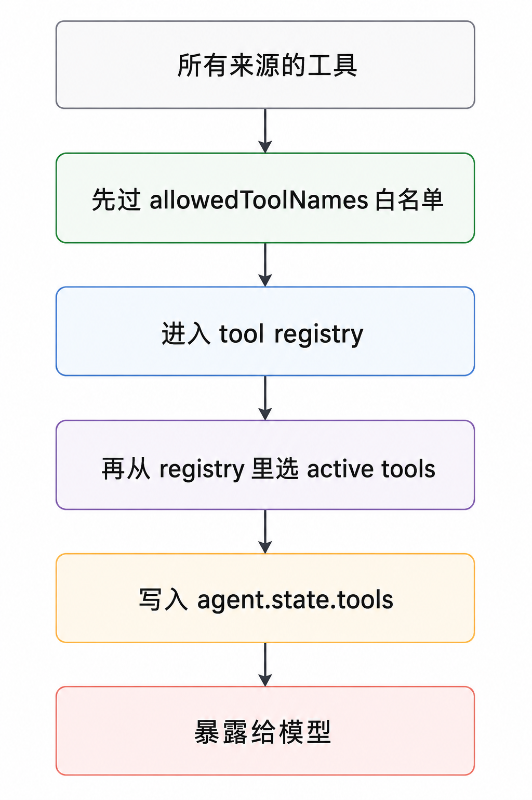

# Pi 系列 05 ｜ Tool 系统(下)：工具从哪来、怎么暴露，以及 extension 的角色

- 来源：https://mp.weixin.qq.com/s/Fl4fYAY5iVDjvjPOhLm5pA
- 公众号：CodeAgent
- 发布时间：2026-06-11
- 抓取日期：2026-08-05
- 说明：正文由微信 HTML 完整转换为 Markdown，文章配图已本地归档。

---

前面四篇可以看这里：
[Pi 系列 01｜用最小例子看 agent runtime 的事件流](https://mp.weixin.qq.com/s?__biz=MzU4NDk1MTk2MA==&mid=2247484544&idx=1&sn=20d89abeb7586d4471e2e81c56a7a780&scene=21#wechat_redirect)
[Pi 系列 02｜Agent loop 与 turn：一次 prompt 为什么会拆成 4 趟](https://mp.weixin.qq.com/s?__biz=MzU4NDk1MTk2MA==&mid=2247484597&idx=1&sn=dbf2d7b09a59db4c9c47863593277cc9&scene=21#wechat_redirect)
[Pi 系列 03｜Provider 抽象与统一事件协议](https://mp.weixin.qq.com/s?__biz=MzU4NDk1MTk2MA==&mid=2247484612&idx=1&sn=2448667f924a09541e1707d94efc57c8&scene=21#wechat_redirect)
[Pi 系列 04｜Tool 系统 (上) ：一个 toolCall 的一生](https://mp.weixin.qq.com/s?__biz=MzU4NDk1MTk2MA==&mid=2247484637&idx=1&sn=074cde1e3e568a1b875c8c9ebb9826ce&scene=21#wechat_redirect)
## 写在前面
上篇我们了解了 toolCall，看了一个工具调用怎么执行、出错怎么处理。
但有一个没有提及：toolCall 是怎么来的？模型怎么知道自己有哪些工具可用？工具又是怎么进到系统里的
这一篇简单了解下工具从注册、暴露给模型、到执行前的权限控制这一段。
我们着重了解下面几个问题：
-
工具是怎么提供给系统的？

-
模型怎么知道自己有哪些工具？

-
工具多了怎么处理？

-
extension 扮演什么角色？

-
权限怎么控制？默认拦不拦？

-
真实的工具长什么样？

## Q1：工具是怎么提供给系统的？
先看 core。 对 core 来说，工具就是 `agent.state.tools`，一个 `AgentTool[]` 数组。core 不关心这些工具从哪来、有几个，它只做一件事：拿到这一组工具，需要时执行。
这里有一条边界：core 不管「工具供给」，它只管「工具执行」。谁来提供工具、提供多少，是上层的事。
再看 coding-agent。 它提供了内置工具，一共 7 个，写死在一个 `Set`（`allToolNames`）里：
```
read、bash、edit、write、grep、find、ls

```
这 7 个是固定的——它们直接写在源码里，不会随项目或环境自动变多变少。要增减得靠后面说的 extension 或 SDK。
每个工具有一个对应的工厂函数 `createXxxToolDefinition(cwd, options)`，按当前目录创建实例。coding-agent 还预先组好了三套常用组合：
-
`createCodingToolDefinitions`：read、bash、edit、write（能改文件）

-
`createReadOnlyToolDefinitions`：read、grep、find、ls（不含改文件的工具）

-
`createAllToolDefinitions`：全部 7 个

这些工厂通过 SDK 对外导出。这里要分清 core 和 coding-agent：core 不会替调用方自动选择工具，你给它什么 `AgentTool[]`，它就用什么；但 coding-agent 作为上层应用，会给 CLI/SDK 一个默认 active set。
默认 active 的是 `read、bash、edit、write`：
```
const defaultActiveToolNames: ToolName[] = ["read", "bash", "edit", "write"];

const allowedToolNames = options.tools ?? (options.noTools === "all" ? [] : undefined);

const initialActiveToolNames: string[] = options.tools

  ? [...options.tools]

  : options.noTools

    ? []

    : defaultActiveToolNames;

```
同时，coding-agent session 会先把全部 7 个内置工具定义放进自己的 registry，后面再按 active tools 决定哪些真正进 `agent.state.tools`：
```
const baseToolDefinitions = this._baseToolsOverride

  ? Object.fromEntries(

      Object.entries(this._baseToolsOverride).map(([name, tool]) => [

        name,

        createToolDefinitionFromAgentTool(tool),

      ]),

    )

  : createAllToolDefinitions(this._cwd, {

      read: { autoResizeImages },

      bash: { commandPrefix: shellCommandPrefix, shellPath },

    });

```
所以更准确地说：core 不管工具选择；coding-agent 默认给一套常用 active tools，但调用方可以通过 `tools` / `noTools` 或 extension API 调整。
> ❝
一点说明：源码没有注释解释这三套组合「为什么这么分组」。但我们从「只读组合不含 edit/write/bash」这个组合，可以合理判断（非 pi 声明）：「只读组合」从源头就不给 edit/write/bash，等于让模型根本没有改文件的能力——这比「给全部工具，再在执行时拦住危险的」更稳妥，因为前者不依赖任何运行时判断是否正确。这是一种通用的安全思路（不提供 > 拦截），可以借鉴；但 pi 源码只摆出了这几套组合，并没有声明它出于安全目的。

## Q2：模型怎么知道自己有哪些工具？
这个问题要先拆成两半，因为它们的归属不同：
-
A. 模型怎么「知道」有哪些工具 —— 这是 harness 的事（把工具信息放进请求）。

-
B. 模型怎么「决定」调哪个 —— 这是模型自己的推理，不是 pi 的代码逻辑。

我们能从源码查的是 A。B 要先说清楚：pi 源码里没有一个 `decideIntent()` 之类的函数。harness 的职责是「把选项和说明摆好」，至于选哪个，是模型读了这些信息后自己判断的。决策逻辑不在代码里，而在模型那一侧。
回到 A，顺着源码看一遍。每次请求模型，pi 会构建一个 `Context` 对象，它有三个并列的字段：
-
`systemPrompt`：系统提示词

-
`messages`：对话历史

-
`tools`：可用工具的列表

工具就放在 `tools` 这个字段里，和 `systemPrompt`、`messages` 平级。
`Context` 在 agent loop 构建请求时由 `context.tools` 填好，再交给各 provider，转成它们自己 API 的 tools 参数（以 Anthropic 为例，是 `convertTools()`）。
换句话说，完整工具定义不是只靠 prompt 描述，而是主要走 provider 的结构化工具参数。 Anthropic、OpenAI 是 `tools`，Bedrock 这类 provider 会转成自己的 `toolConfig`。这些通道会把工具名、description、参数 schema 作为结构化信息交给模型，模型再以结构化的 toolCall 形式返回。
coding-agent 这层额外做了一件事：在 system prompt 里另放了一个 "Available tools" 列表和一段 guidelines（来自 `buildSystemPrompt()`）。但它只放每个工具的一句话简介（snippet），而且只有调用方提供了 snippet 的工具才会出现在这个列表里。源码里这段是这样的：
```
// A tool appears in Available tools only when the caller provides a one-line snippet.

const tools = selectedTools || ["read", "bash", "edit", "write"];

const visibleTools = tools.filter((name) => !!toolSnippets?.[name]);

const toolsList =

  visibleTools.length > 0

    ? visibleTools.map((name) => `- ${name}: ${toolSnippets![name]}`).join("\n")

    : "(none)";

```
它最终拼进 system prompt 的样子（模板片段）：
```
Available tools:

${toolsList}

In addition to the tools above, you may have access to other custom tools depending on the project.

```
没给 snippet 的工具，不进这个列表。注意这里有个前提：它必须本来就是 active tool。如果工具已经进了 `agent.state.tools`，只是没给 snippet，那模型在 system prompt 里看不到它的一句话简介，但通过 API 的 tools 字段照样能调用；如果它根本没被激活，就不会进 tools 字段。
## Q3：工具多了怎么处理？
先说 core：core 不管「多不多」。它拿到 `agent.state.tools` 数组，有几个就把几个放进请求的 tools 字段。core 自身没有任何「工具数量管理」。
那「管理」发生在 coding-agent。工具集在 `_refreshToolRegistry()` 里汇总，三个来源合并进一个以工具名为 key 的 Map：
1.
内置工具（`_baseToolDefinitions`）

1.
extension 注册的工具（`getAllRegisteredTools()`）

1.
通过 SDK 直接传入的工具（`_customTools`）

同名工具的规则要稍微细一点：
-
extension 之间，同名工具是先注册者胜出；

-
extension / SDK custom tools 会进入同一个 `allCustomTools` 列表；

-
合并进 definition registry 时，custom tools 会覆盖前面已经放进去的内置工具；如果 SDK custom tool 和 extension 工具同名，由于 SDK custom tools 排在后面，也会覆盖 extension 工具。

extension 之间“先注册者胜出”的逻辑在 `ExtensionRunner.getAllRegisteredTools()`：
```
/** Get all registered tools from all extensions (first registration per name wins). */

getAllRegisteredTools(): RegisteredTool[] {

const toolsByName = new Map<string, RegisteredTool>();

for (const ext of this.extensions) {

    for (const tool of ext.tools.values()) {

      if (!toolsByName.has(tool.definition.name)) {

        toolsByName.set(tool.definition.name, tool);

      }

    }

  }

returnArray.from(toolsByName.values());

}

```
再看 registry 合并，内置会先放进 `definitionRegistry`，custom tools 后放，所以后者可以覆盖前者。保留关键部分看就是这样：
```
const registeredTools = this._extensionRunner.getAllRegisteredTools();

const allCustomTools = [

  ...registeredTools,

  ...this._customTools.map((definition) => ({

    definition,

    sourceInfo: createSyntheticSourceInfo(`<sdk:${definition.name}>`, { source: "sdk" }),

  })),

].filter((tool) => isAllowedTool(tool.definition.name));

// definitionRegistry 里已经先放过内置工具。

for (const tool of allCustomTools) {

  definitionRegistry.set(tool.definition.name, {

    definition: tool.definition,

    sourceInfo: tool.sourceInfo,

  });

}

```
工具“多了怎么办”这里，还要分清两层：准入白名单和 active tools。
可以把流程想成这样：


第一层是准入过滤：`_allowedToolNames` 白名单，配合 `isAllowedTool()`。不在白名单里的工具，三个来源一律被过滤掉，不会进 registry。举个例子：某个 extension 注册了 50 个工具，但白名单只列了 5 个，那最终有资格进入系统的就只有 5 个，另外 45 个模型完全看不到。
第二层是 active tools：registry 里有的工具，不等于这一轮都会暴露给模型。coding-agent 会通过 `setActiveToolsByName()` 把当前 active 的工具放进 `agent.state.tools`，而 core 请求模型时用的正是这组 `agent.state.tools`。如果设置了 `allowedToolNames`，coding-agent 会把允许的工具都加入 active set；如果没设置白名单，也可以只激活 registry 里的某个子集。
这两层都比上篇讲的 `beforeToolCall` 更靠前：`beforeToolCall` 是「工具在、执行时拦」，白名单和 active tools 是「决定工具能不能进集合、进不进请求」。
还有一点，通过源码了解可知：
-
pi 没有工具数量上限或 top-N 截断

-
pi 没有按需懒加载工具

-
pi 没有工具分组、折叠

也就是说，pi 没有工具数量上限、top-N 截断、按需懒加载这些自动策略。它提供的是准入白名单和 active tools 两个选择点；最终进入 `agent.state.tools` 的工具会完整暴露给模型。如果 active set 本身很大，token 的权衡仍然留给应用层。
> ❝
个人推断：这符合 pi 一贯的取向——给机制，不替你做策略决定。如果你的应用工具特别多，需要「按需暴露、动态加载」这类能力（有些 agent 产品和 MCP 场景会做），那是应用层要自己补的一层，pi core 没有提供。

## Q4：工具多了，extension 扮演什么角色？
先说下什么是 extension，这里不是浏览器那个插件
pi extension 的作用，是让你不改 pi 源码，就能往 agent 生命周期里插入逻辑、往系统里加工具、provider、命令。它在几乎每个生命周期节点都提供了 hook。
关键类型都在 `packages/coding-agent/src/core/extensions/`：
-
`ExtensionAPI`（types.ts）：注册用的 API，比如 `registerTool()`、`registerCommand()`。

-
`ExtensionRuntimeState`（types.ts）：`registerProvider()` 在这里——03 篇里 hello.mjs 改 baseUrl 用的就是它，所以你其实早就用过 extension 了。

-
`ExtensionEvent`（types.ts）：所有 hook 事件的联合类型，里面包含 `ToolCallEvent`（就是下面 Q5 权限用的那个）、`ContextEvent`（改上下文，未来讲 memory 会用到）等。

-
`ExtensionRunner`（runner.ts）：事件分发器，把事件发给已注册的 handler（`emit()` / `emitToolCall()` / `emitContext()`）。

所以 extension 不是只能加个菜单项的简单插件，而是一套覆盖生命周期的 hook 加注册机制。
它能加工具，这就是「工具会变多」的来源 —— 内置只有 7 个，但 extension 可以不断增加。前面那道白名单和 active tools 的作用也在这里：约束「加进来的工具最终哪些生效」。
## Q5：权限怎么控制？默认拦不拦？
上篇讲过拦截点 `beforeToolCall`，这里回答两个没讲的：它怎么接入系统、默认是什么策略。
先看 core。 权限拦截不依赖 coding-agent 或 extension，`beforeToolCall` 是 core 自己的能力：
-
在 `agent.ts` 里，`beforeToolCall` 是 Agent 的一个 `public` 属性；

-
构造时可以直接传：`new Agent({ beforeToolCall: ... })`；

-
这个函数会被带进 loop 配置，在每次工具执行前调用。

也就是说，只用 pi core 就能做权限拦截——给 `agent.beforeToolCall` 赋一个函数，返回 `{ block: true }` 就拦下，返回 `undefined` 就放行。不需要 extension。如果你将来用 SDK 嵌入 pi 写自己的应用，这是最直接的权限控制方式。
再看 coding-agent 怎么用这个拦截点。 它在 agent-session 里给 `beforeToolCall` 设置了一个函数，但这个函数自己不写任何权限策略，只是把工具调用转发给 extension 的 `tool_call` 钩子（`ToolCallEvent`）。判断拦不拦，交给 extension。
那默认呢？coding-agent 默认不拦任何工具，也不自带权限确认。 它给 `beforeToolCall` 接的那个函数，只在有 extension 注册了 `tool_call` 处理器时才真正起作用；开箱状态下没有这样的 extension，于是工具调用直接执行。
要做权限确认，得自己提供一个处理 `tool_call` 的 extension，或者用 core 直接设置 `beforeToolCall`。
这里能看出一条清晰的分层：
-
core：提供 `beforeToolCall` 这个拦截点——纯机制，不含任何策略；

-
coding-agent：把拦截点转发给 extension——也不含策略，只做转发；

-
extension：真正写「拦不拦」的地方。

策略被逐层交给更外层，core 只保留机制。这和整个系列反复出现的取向一致：会因应用不同而不同的决定，不写进通用 loop，而是留出 hook 交给上层。
## Q6：真实的工具长什么样？
前面都在讲工具怎么被组织、暴露、控制。最后看两个真实工具——read 和 bash。它们各自面对一个不同的现实问题，从中能看到一个工具要处理的事不止「执行」本身。
源码在 `packages/coding-agent/src/core/tools/`。
read 面对的问题：输出可能很大。 一个文件几万行，不能整个交给模型。read 的做法：
-
默认上限 2000 行或 50KB，先到先截（`truncate.ts`）；

-
截断后，明确告诉模型被截断了——工具结果里会带续读提示，比如 `[Showing lines 1-2000 of 8500. Use offset=2001 to continue.]`；

-
工具的 description 里写明续读办法：用 offset/limit 继续读，直到读完。

这里的关键是截断之后要让模型知道。如果默默截掉，模型会以为自己读到了完整文件，基于残缺信息做判断。这和上篇那条「错误要变成模型能读的反馈」是同一个道理——截断也是一种要回传给模型的信息。
bash 面对的问题：命令边跑边出、可能跑很久、还有副作用，而且输出末尾通常更关键。 bash 的做法：
-
流式：stdout/stderr 一有输出就通过回调送出去（接上篇讲的 `onUpdate`，发 `tool_execution_update` 事件），不是等命令结束才一次性给；

-
保留尾部输出：输出过大时保留最后 2000 行或 50KB，因为命令失败、测试报错这类关键信息通常在最后；

-
保存完整输出：如果发生截断，完整输出会写到临时文件，结果里告诉模型 `Full output: ...`；

-
超时：到时间就杀进程；

-
可中断：用户 abort 时，通过 signal 杀进程；

-
杀整棵进程树：用的是 `killProcessTree` 而不是只杀直接子进程——因为 bash 可能再拉起一堆子进程（比如 `npm run`），只杀父进程会留下孤儿进程。

把两个工具放一起看：

read

bash

面对的问题

输出可能超大

边跑边出、输出可能很大且尾部更关键、可能长跑、有副作用

处理

截断 + 声明截断 + 给续读手段

流式输出 + 尾部截断 + 保存完整输出 + 超时 + 可中断 + 杀进程树

体现的通用点

截断也要回传给模型

执行类工具要兼顾关键输出可见和进程可控停止

两个工具的复杂度都不在「做那件事」本身，而在做的过程中要同时照顾两头：read 主要照顾模型（别让它以为读全了），bash 一边照顾模型（看到关键尾部和完整输出位置），一边照顾系统（别让进程不受控）。
## 小结
这一篇讲的是工具在被模型调用之前的那一段——怎么进系统、怎么暴露给模型、怎么控制：
1.
工具从哪来：core 只认 `agent.state.tools` 一个数组，不管来源；coding-agent 提供 7 个硬编码内置工具，extension 和 SDK 也能加。

1.
怎么暴露给模型：完整工具定义走 provider 的结构化工具参数，system prompt 里另有可选的简介列表；至于「选哪个」是模型的推理，不是 harness 的逻辑。

1.
多了怎么办：pi 没有数量上限、按需加载、分组；coding-agent 提供白名单准入和 active tools 两个选择点，token 的权衡留给应用层。

1.
权限：拦截点在 core（`beforeToolCall`），coding-agent 转发给 extension，默认不拦。策略逐层交给更外层，core 只保留机制。

1.
真实工具：read 和 bash 说明，工具的复杂度在于执行过程中对模型、对系统的双重负责。

贯穿这几个问题的是同一种分工：core 提供机制，具体策略由应用层决定。工具供给、数量控制、权限判断这些会因应用而异的决定，pi core 都没有写死，而是留出接口让上层来定。这也是为什么用 core 就能搭出一个可控的 agent——它把机制准备好了，剩下的策略交给使用者。
