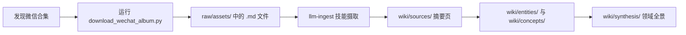

# 微信文章批量摄取

微信文章（mp.weixin.qq.com）是中文互联网重要的技术内容来源，但直接下载和归档存在两个障碍：

1. **单篇文章访问容易被拦截**：浏览器或脚本直接访问文章链接时，经常遇到“环境异常，完成验证后即可继续访问”的验证页。
2. **合集页面包含多篇文章**：一个系列通常有 10 篇以上，手动一篇篇保存效率低。

因此，知识库需要一个**从微信合集页面批量下载文章**的自动化摄取入口。

## 核心策略

绕过单篇文章验证，改为从**合集页面（appmsgalbum）**入手：

- 合集页面使用移动版微信 User-Agent 访问时，通常不需要额外验证。
- 合集页面的 HTML 中嵌入了 `cgiData`，包含前 10 篇文章的标题和 URL。
- 如果合集超过 10 篇，微信会通过 JSON 接口分页返回后续文章。

## 摄取流程



## 技术实现

仓库工具：

```text
scripts/ingest/
├── download_wechat_album.py
└── README.md
```

脚本主要步骤：

1. 解析合集 URL 中的 `__biz` 和 `album_id` 参数。
2. 用 Android 微信 UA 请求合集页面。
3. 从 `cgiData.articleList` 提取文章列表。
4. 若 `continue_flag` 为 1，调用 `appmsgalbum?action=getalbum&...&f=json` 加载分页。
5. 对每篇文章再次用微信 UA 请求，提取 `<div id="js_content">` 中的正文。
6. 用 HTML 解析器将正文转为 Markdown，保留图片链接和基本排版。

## 使用方式

```bash
python3 scripts/ingest/download_wechat_album.py \
    "https://mp.weixin.qq.com/mp/appmsgalbum?__biz=...&action=getalbum&album_id=..." \
    ./raw/assets
```

输出文件会按文章标题命名，可直接进入 `llm-ingest` 摄取流程。

## 注意事项

- 微信反爬策略可能变化，大量下载失败时可尝试加 Cookie 或使用代理。
- 图片只保留链接，不下载图片文件本身。
- 合集 URL 必须是 `mp.weixin.qq.com/mp/appmsgalbum` 页面，不能是单篇文章链接。

## 相关工具

- 工具脚本：[scripts/ingest/download_wechat_album.py](../../scripts/ingest/download_wechat_album.py)
- 脚本说明：[scripts/ingest/README.md](../../scripts/ingest/README.md)
- 知识库摄取工作流：[[claude-code-skills]]
