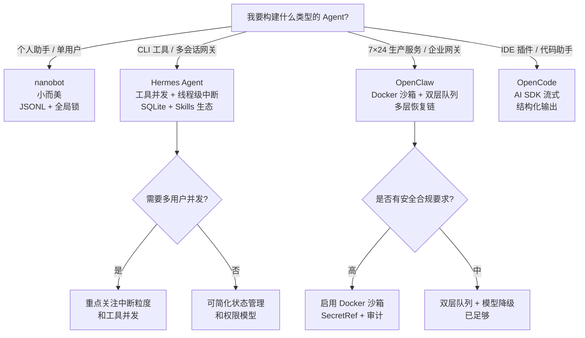

# 四大开源 Agent 框架 12 维度对比

## 一句话总结

Hermes（Python）、nanobot（Python）、OpenClaw（TypeScript）、OpenCode（TypeScript）代表了 Agent 实现的四种工程哲学：Hermes 是**务实主义**（网关级可靠），nanobot 是**极简主义**（个人助手轻量），OpenClaw 是**防御主义**（生产级纵深防御），OpenCode 是**信任主义**（IDE 原生流式优先）。

## 框架定位

| 框架 | 语言 | 目标场景 | 核心哲学 |
|---|---|---|---|
| [[hermes-agent]] | Python | CLI / Gateway / 多会话服务 | 循环简单、中断可靠、工具并发、生产优先 |
| nanobot | Python | 个人助手 / 单用户 | 小而美、零外部依赖、显式组装 |
| OpenClaw | TypeScript | 生产级 Gateway / 企业服务 | 纵深防御、分层恢复、可配置策略 |
| OpenCode | TypeScript | IDE 插件 / 代码助手 | 流式优先、AI SDK 原生、结构化输出 |

## 12 维度总表

| 维度 | Hermes | nanobot | OpenClaw | OpenCode |
|---|---|---|---|---|
| **编排循环** | ReAct while + 线程级中断 + 并发工具 | actor 消息泵 + 全局 asyncio.Lock 串行 | 双层队列 + 5 层恢复链 + in-process 重启 | `while(true)` 流式事件驱动 |
| **工具系统** | 自注册 Registry + AST 扫描 + `_generation` TTL | `Tool` ABC + dict Registry + 先 cast 再 validate | 6 层策略管道 + Docker 沙箱 + 循环检测 | DSL 定义 + zod 校验 + AI SDK |
| **记忆系统** | 内置 frozen snapshot + 外部 MemoryProvider ABC | MEMORY.md + HISTORY.md 双层文件 | Markdown 事实来源 + SQLite 索引 + 向量/BM25 | SQLite + Drizzle ORM 三层表 |
| **上下文管理** | preflight/响应后/错误恢复三入口压缩 | RuntimeContext 合并 user；丢弃非 user 历史 | 四层独立预算 + compaction agent | 指令向上查找 + 实时环境 |
| **Prompt 构建** | 洋葱式 11 层 + 缓存 + 上下文文件优先级 | Bootstrap 文件 + 技能摘要索引 | PromptMode 三级 + 工具排序 + 路径压缩 | 2-part system + agent prompt 覆盖 |
| **输出解析** | Transport 归一化 + 流式 scrubber | Think 块剥离 + error 不入历史 | 流式状态机 + 单调输出 + 代码块保护 | AI SDK 流式 + 工具修复 + Doom Loop |
| **状态管理** | SQLite WAL + FTS5 + schema 调和 | JSONL + 进程内 dict 缓存 + 全局锁 | 文件级写锁 + ACP Map 缓存 | Session 状态机 + Instance Map |
| **错误处理** | 结构化分类器 + 六类恢复动作 | 分层降级 + `_HINT` | 指数退避 + 模型故障转移 + 循环检测 | 三级分类 + 尊重 retry-after |
| **安全防护** | HARDLINE/DANGEROUS + tirith + SSRF + 脱敏 | `allowFrom` 默认拒绝 + workspace 限制 | Docker 沙箱 + SecretRef + 审计 | `PermissionNext` + Bash AST |
| **验证循环** | schema sanitize + 审批状态机 + 护栏 | 先 cast 再 validate 类型防火墙 | 工具循环警告 + 配置懒加载 | 结构化输出工具模式 + zod |
| **子 Agent 编排** | `delegate_task` 临时 AIAgent + 中断级联 | 后台沙箱线程 + Bus 回灌 | 独立 session + push announce + 深度链 | `TaskTool` child session + 内联 |
| **初始化/环境** | YAML 三路合并 + profile + 环境后端 ABC | 显式 `onboard` + 启发式 Provider 匹配 | JSON5 + `$include` + Jiti 插件 | git root commit ID + 7 层配置 |

## 关键差异洞察

### 1. 并发模型 = 目标场景的投影

- **Hermes** 唯一支持**工具级并发**（ThreadPoolExecutor max=8），适合需要同时读多个文件/搜索多个关键词的网关场景。
- **nanobot** 用**全局 asyncio.Lock 串行所有会话**，吞吐天花板=1，但实现极简，适合个人助手。
- **OpenClaw** 的**双层队列**（session lane 串行 + global lane 控制并发）是生产级服务化 Agent 的标配。
- **OpenCode** 作为 IDE 插件，**单线程流式**足够，复杂度让位于低延迟 UI 更新。

### 2. 对 LLM 的信任程度决定循环复杂度

- **OpenCode 最信任模型**：无显式迭代上限，依赖 `finish` 原因决定终止。
- **nanobot 次信任**：40 轮硬上限 + `has_tool_calls` 终止。
- **Hermes 开始不信任**：双保险预算 + grace call + 线程级中断。
- **OpenClaw 最不信任**：5 层恢复链 + compaction 快照回退 + 模型降级链。

### 3. 持久化选择反映扩展性需求

- **JSONL**（nanobot）：零 schema 成本，适合个人项目。
- **SQLite + 声明式迁移**（Hermes）：平衡查询能力与运维成本。
- **SQLite + ORM**（OpenCode）：适合 IDE 场景的高效查询和级联操作。
- **Markdown 事实源 + SQLite 索引**（OpenClaw）：兼顾人工可读性与检索性能。

### 4. 安全防护层次

| 框架 | 默认沙箱 | 命令审批 | SSRF 防护 | 密钥管理 |
|---|---|---|---|---|
| Hermes | 环境后端 ABC | HARDLINE + DANGEROUS + tirith | IP 黑名单 + DNS 后验证 | 黑名单不透传 API key |
| nanobot | workspace 限制 | `allowFrom` 默认拒绝 | 独立 security 模块 | — |
| OpenClaw | **Docker 默认** | 三级安全 × 三档询问 | DNS 前/后双重验证 | **SecretRef 引用** |
| OpenCode | — | `PermissionNext` 规则引擎 | — | — |

OpenClaw 的安全纵深最完整；nanobot 的"默认拒绝所有"是安全优先的另一种表达；Hermes 的 HARDLINE 地板不可绕过；OpenCode 更依赖 IDE 宿主环境的安全边界。

### 5. 子 Agent 编排风格

- **Hermes**：同框架临时 AIAgent，同步阻塞，父循环拿到 summary。
- **nanobot**：后台沙箱线程，结果通过 Bus 以 system 消息回灌。
- **OpenClaw**：独立 session，事件驱动 push，支持 wake-on-descendant。
- **OpenCode**：`TaskTool` 创建 child session，主循环内联执行 subtask。

## 选型建议

| 场景 | 推荐框架 | 理由 |
|---|---|---|
| 个人本地助手 | nanobot | 零依赖、易理解、文件式记忆 |
| CLI Agent / Skills 平台 | Hermes | 可扩展工具系统、生产级中断、并发执行 |
| 企业级 Gateway | OpenClaw | 沙箱、审计、故障转移、并发控制 |
| IDE 集成 / 代码助手 | OpenCode | 流式体验、AI SDK 生态、结构化输出 |
| 学习 Agent 架构入门 | nanobot → Hermes → OpenCode → OpenClaw | 复杂度递增，概念逐层展开 |

## 对书稿写作的启示

本书稿（`drafts/agent-book-beginner/`）以"实习生比喻"讲解 Agent 的 12 个维度。每个维度的"四项目实现对比"章节可以直接引用本 synthesis：

- **第 1 章 编排循环**：用 Hermes 的并发/中断、nanobot 的 actor 锁、OpenClaw 的双层队列、OpenCode 的流式循环做对比。
- **第 2 章 工具系统**：用 Hermes 自注册、nanobot ABC、OpenClaw 策略管道、OpenCode DSL 对比。
- **第 3 章 记忆系统**：用 Hermes 双层、nanobot 双文件、OpenClaw hybrid 检索、OpenCode ORM 对比。
- ……依此类推。

## 相关概念与来源

- [[orchestration-loop]] | [[agent-tool-system]] | [[agent-memory-system]] | [[context-management]]
- [[prompt-building-for-agents]] | [[output-parsing]] | [[state-management]] | [[error-handling]]
- [[agent-security]] | [[validation-loop]] | [[sub-agent-orchestration]] | [[initialization-environment]]
- [[hermes-agent]] | [[nanobot-framework-analysis]] | [[openclaw-framework-analysis]] | [[opencode-framework-analysis]]
