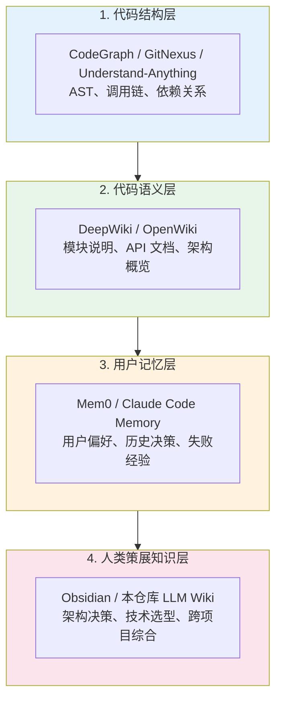
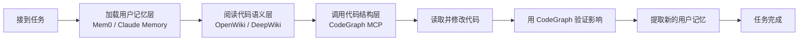

# AI Coding 上下文基础设施分层

AI 辅助编程场景中，Agent 需要多类上下文才能有效工作。这些上下文可按抽象层级划分为四层：代码结构层、代码语义层、用户记忆层、以及可选的人类策展长期知识层。不同工具占据不同层级，彼此互补而非替代。

## 四层模型

### 1. 代码结构层

**回答的问题**：这些代码之间如何连接？

- 某个函数被谁调用？
- 修改这个文件会影响哪些模块？
- 依赖关系长什么样？

**代表工具**：[[codegraph]]、[[gitnexus]]、[[understand-anything-mcp]]

**知识形态**：图（节点 = 文件/类/函数，边 = import/call/extends）

**使用时机**：任务执行中精确定位、变更影响分析

### 2. 代码语义层

**回答的问题**：这个代码库是什么、为什么这样设计？

- 这个模块的职责是什么？
- API 的入口和用法是什么？
- 项目整体架构如何？

**代表工具**：[[deepwiki]]、[[openwiki]]

**知识形态**：markdown 页面（概述、摘要、链接）

**使用时机**：任务开始前建立全局上下文

### 3. 用户记忆层

**回答的问题**：这个用户/Agent 之前经历过什么？

- 用户偏好什么框架和代码风格？
- 上周为什么否决了这个方案？
- 哪些做法在这个项目里已经证明会失败？

**代表工具**：[[mem0]]、Claude Code 内置 [[agent-memory-system]]

**知识形态**：以用户为中心的事实、偏好、事件

**使用时机**：贯穿整个交互过程，避免重复错误

### 4. 人类策展知识层

**回答的问题**：跨项目的长期知识如何沉淀和复用？

- 为什么团队选择这个架构？
- 不同技术方案的对比结论是什么？
- 哪些经验值得复用到下一个项目？

**代表工具**：Obsidian LLM Wiki、本仓库 `index.md`（人类策展的知识目录）

**知识形态**：人类主导、AI 辅助的跨项目综合

**使用时机**：项目结束后提取可复用洞察，或新项目启动前查阅

---

## 工具配合工作流

一个完整的 AI 辅助编程任务可以按以下顺序调用各层：

### 阶段说明

1. **加载用户记忆**：先了解用户偏好和项目约定，避免重复踩坑
2. **阅读语义 wiki**：建立对任务相关模块的整体理解
3. **调用代码图谱**：精确定位需要修改的文件和符号
4. **修改代码**：基于精确上下文执行改动
5. **验证影响**：通过调用链/依赖分析确认没有遗漏
6. **提取记忆**：把本次得到的新约定或失败经验写入记忆层

---

## 工具对比矩阵

| 维度 | CodeGraph | OpenWiki / DeepWiki | Mem0 |
|---|---|---|---|
| **处理对象** | 代码结构 | 代码语义 | 用户交互 |
| **知识形态** | 图 | markdown | 结构化事实 |
| **更新触发** | 代码变更 | 代码重大变更 | 每次交互 |
| **最佳问题** | 谁调用了 X？ | X 模块是做什么的？ | 用户喜欢怎么做？ |
| **给谁的** | Agent | Agent + 人 | Agent |
| **是否本地** | 是 | OpenWiki 是，DeepWiki 否 | 可选 |
| **与 RAG 关系** | 图检索增强 | 编译时替代部分检索 | 记忆注入替代上下文 |

---

## 常见误区

### 误区 1：OpenWiki 和 CodeGraph 二选一

实际上两者互补。OpenWiki 解决“是什么”，CodeGraph 解决“怎么连”。复杂项目最好两个都用。

### 误区 2：Agent Memory 可以替代 Wiki

不能。Mem0 记录的是用户偏好和交互历史，不会告诉你代码库的结构或 API 用法。

### 误区 3：所有项目都需要完整四层

小型项目可能只需要 Claude Code 内置记忆 + 代码本身就够了。四层堆栈适用于：
- 中大型代码库
- 多 Agent 协作
- 长期维护项目
- 团队共享上下文

---

## 选型建议

| 你的情况 | 推荐组合 |
|---|---|
| 个人小项目，只在 Claude Code 里写 | Claude Memory + 代码本身 |
| 中型项目，想让 Agent 更快理解 | OpenWiki + CodeGraph |
| 公开开源项目，希望有公开文档 | DeepWiki（自动）+ 本地 CodeGraph |
| 多 Agent/多工具协作 | Mem0 + OpenWiki + CodeGraph |
| 想沉淀跨项目经验 | 以上全部 + Obsidian / weilan-knowledge-wiki |

---

## 相关页面

- [[agent-wiki]] —— Agent Wiki 范式的抽象定义
- [[codegraph]] —— 代码知识图工具
- [[openwiki]] —— LangChain 开源代码 wiki CLI
- [[deepwiki]] —— Cognition 公开代码 wiki 服务
- [[mem0]] —— Agent 记忆层
- [[agent-memory-system]] —— Agent 记忆系统概念
- [[knowledge-graph]] —— 知识图谱通用概念
- [[rag-knowledge-retrieval-landscape]] —— RAG 与知识检索领域全景
- [[ai-memory-vs-human-km]] —— AI 记忆与人类知识管理的分野

## 来源

- [[mem0-in-context-17]] —— mem0.ai In Context #17 对 Agent Wikis 的综述
