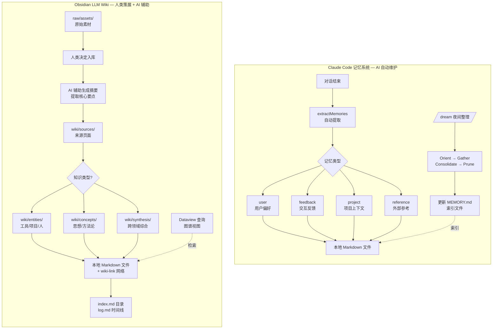
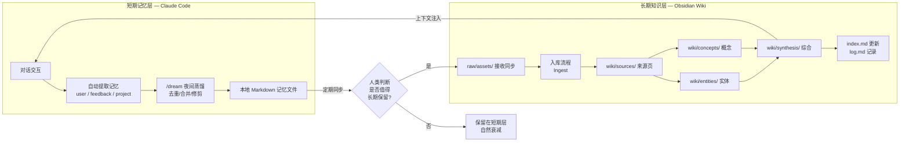

# AI 记忆系统与人类知识管理的趋同与分野

Claude Code 的文件式记忆系统与 Obsidian 的 LLM Wiki 模式，在底层架构上惊人地相似，但设计目标和维护主体截然不同。这种趋同暗示了「结构化本地知识存储」可能是人机协作时代的通用基础设施。

## 架构趋同：相同的底层模式

| 维度 | Claude Code 记忆系统 | Obsidian LLM Wiki |
|------|---------------------|-------------------|
| **存储介质** | 本地 Markdown 文件 | 本地 Markdown 文件 |
| **结构化元数据** | YAML frontmatter（name/description/type） | YAML frontmatter（type/created/updated/tags） |
| **索引机制** | MEMORY.md（200行上限） | index.md（内容目录） |
| **时间线记录** | KAIROS 日志 / `/dream` 夜间整理 | log.md（只追加） |
| **链接方式** | wiki-link `[[page-name]]` | wiki-link `[[page-name]]` |
| **层级隔离** | 个人/团队/项目三层 | raw → wiki 分层提炼 |

两者都放弃了数据库存储，选择纯文本文件。这使得知识可版本控制、可 diff、可 git 共享、无厂商锁定。

### 架构对比图

## 核心分野：谁维护知识？

**Claude Code 记忆系统 —— AI 自动维护**

- **写入触发**: 每次对话结束时自动提取记忆（`extractMemories`）
- **整理机制**: `/dream` 夜间四阶段蒸馏（Orient→Gather→Consolidate→Prune）
- **检索方式**: Sonnet 相关性选择 Top 5，注入系统提示
- **记忆类型**: 强制四类（user/feedback/project/reference），有明确的「不记忆清单」
- **目标**: 让 AI 越用越懂用户，减少重复交代背景

**Obsidian LLM Wiki —— 人类策展 + AI 辅助**

- **写入触发**: 人类决定何时将 raw 素材提炼为 wiki 页面
- **整理机制**: 人类主导分类，AI 辅助生成摘要和提取要点
- **检索方式**: 双向链接 + 图谱视图 + Dataview 查询 + 可选的向量语义搜索
- **记忆类型**: 无强制分类，用户自由组织（PARA / Zettelkasten / MOC）
- **目标**: 构建人类的「第二大脑」，AI 负责簿记和执行

## 互补而非替代

Claude Code 的记忆系统解决了**短期协作中的上下文连续性**问题——AI 记住你上周说过的技术栈偏好，下次对话自动应用。Obsidian 的 LLM Wiki 解决了**长期知识的复利积累**问题——将散落的文章、论文、经验编译成可交叉引用的结构化网络。

### 理想互补工作流

理想工作流可能是：Claude Code 的 `feedback` 和 `project` 记忆自动同步到 Obsidian 的 wiki 中，由人类进行更高层的综合和策展。人类的判断决定什么值得长期保留，AI 的自动化确保短期上下文不丢失。

## 一个有趣的矛盾点

Claude Code 的记忆系统明确列出不记忆的内容：「代码范式、规范、架构、文件路径或项目结构 —— 这些均可通过读取当前项目状态获取」。而 Obsidian 的 wiki 恰恰需要人工记录这些项目级的结构化知识。这暗示：**AI 倾向于只记忆无法从代码本身推导出来的「隐性知识」**（用户偏好、团队约定、历史决策），而**人类 wiki 更适合记录可以从代码推导但需要人类解释的「显性知识」**（架构设计、技术选型理由、演进历史）。
