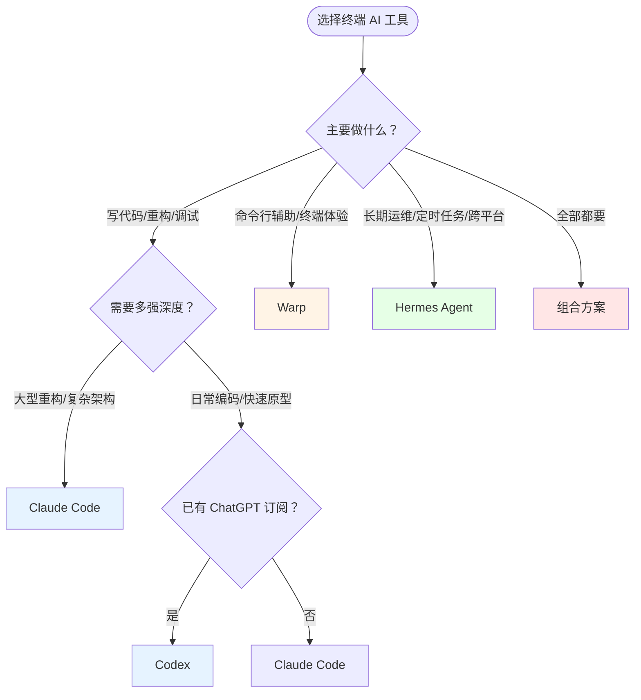

# 终端 AI 工具选型对比

## 问题域

2026 年，开发者在终端中调用 AI 的选择已从「有没有」变成「选哪个」。Claude Code、OpenAI Codex、Warp、Hermes Agent 四款工具都声称自己是「终端 AI 助手」，但它们解决的是完全不同的问题。

本页通过四个决策维度（编码深度、协作方式、生命周期、终端体验），帮助开发者根据场景选择合适工具或组合。

---

## 四工具核心定位

| 工具 | 一句话定位 | 核心用户场景 |
|------|-----------|-------------|
| [[claude-code]] | 专业编码工具 | 深度代码理解、复杂重构、批量修改 |
| [[codex]] | 通用 AI 编程助手 + 桌面自动化 | 多任务并行、桌面工作流、ChatGPT 生态用户 |
| [[warp]] | 智能终端（Agentic Development Environment）| 更好的终端体验 + AI 辅助命令行工作流 |
| [[hermes-agent]] | 持久化自主 Agent | 长期记忆积累、跨平台访问、定时自动化、开源自主 |

---

## 选型决策树

---

## 七维对比矩阵

### 1. 编码能力

| 工具 | 代码理解深度 | 重构能力 | 测试生成 | 备注 |
|------|-------------|---------|---------|------|
| Claude Code | 最强 | 最强 | 强 | 对大型代码库的上下文理解同类最佳 |
| Codex | 中等 | 中等 | 中等 | o4-mini 默认，gpt-5 可选 |
| Warp | 间接（通过集成） | 间接 | 间接 | 本身不生成代码，运行 Claude/Codex |
| Hermes | 通用 | 弱 | 弱 | 编码不是强项，更适合运维和调度 |

### 2. 协作与并行

| 工具 | 多实例并行 | 任务分派 | 协作机制 | 备注 |
|------|-----------|---------|---------|------|
| Claude Code | Team Mode + `claude -w` | 手动 | Agent Teams（tmux + worktrees）| `/batch` 扇出大规模变更 |
| Codex | 桌面端多 Thread | 半自动 | Thread 列表管理 | 三个任务同时后台运行 |
| Warp | 多标签/分屏 | 无 | 无 | 传统终端的多窗口 |
| Hermes | 无 | 无 | 无 | 单 Agent 常驻，不强调并行编码 |

**OMC 补充**：[[oh-my-claudecode]] 为 Claude Code 增加了 19 Agent 自动编排和 5 种执行模式（Autopilot/Ralph/Ultrawork/Deep Interview/Plan），将并行能力提升到工程化级别。

### 3. 生命周期与记忆

| 工具 | 生命周期 | 记忆机制 | 跨会话连续性 | 定时任务 |
|------|---------|---------|-------------|---------|
| Claude Code | 会话式 | CLAUDE.md / AGENTS.md（手动）| 通过文件 | 不支持 |
| Codex | 会话式 | AGENTS.md（手动）| 通过文件 | 桌面端 Automations 支持 |
| Warp | 持续运行 | 云端同步历史/Workflows | 有（Warp Drive）| 不支持 |
| Hermes | 常驻守护 | MEMORY.md / USER.md / SOUL.md（自动）| 自动三层记忆 | 内置自然语言 Cron |

### 4. 终端体验

| 工具 | Block 化输出 | IDE 级编辑 | 智能补全 | 历史搜索 |
|------|-------------|-----------|---------|---------|
| Claude Code | 否 | 否 | 否 | 否 |
| Codex | 否 | 否 | 否 | 否 |
| Warp | 是（核心创新）| 是（核心创新）| 400+ CLI 工具 | 模糊搜索 + 项目过滤 |
| Hermes | 否 | 否 | 否 | FTS5 全文搜索历史对话 |

### 5. 访问方式

| 工具 | 终端 | IDE | 桌面 App | 移动端/消息平台 | 浏览器 |
|------|------|-----|---------|---------------|--------|
| Claude Code | 是 | 间接 | 否 | 否 | claude.ai/code |
| Codex | 是 | VS Code 插件 | 是（macOS/Win）| 否 | Codex Cloud |
| Warp | 是（自身）| 否 | 否 | 否 | 否 |
| Hermes | 是 | 否 | 否 | Telegram/Discord/Slack/WhatsApp | 否 |

### 6. 成本与模型

| 工具 | 模型绑定 | 开源 | 典型成本 | 省钱技巧 |
|------|---------|------|---------|---------|
| Claude Code | 仅 Claude | 否 | API Key 按量计费 | Plan mode 减少返工 |
| Codex | GPT-5/o4-mini（支持第三方）| CLI 开源 | ChatGPT 订阅已包含 | o4-mini 默认，复杂任务切 gpt-5 |
| Warp | Claude/GPT-4o 等 | 否 | 免费 + 付费功能 | 关闭不需要的 AI 功能 |
| Hermes | 200+ 模型（OpenRouter 等）| 是（MIT）| BYOK，可选廉价模型 | 接入 OpenRouter 廉价模型 |

### 7. Harness 工程化

| 工具 | AGENTS.md | feature_list.json | 端到端验证 | Harness 厚度 |
|------|-----------|-------------------|-----------|-------------|
| Claude Code | 支持（CLAUDE.md 扩展）| 手动维护 | `/guard` + 测试 | 薄（dumb loop）|
| Codex | 支持（三层查找合并）| 手动维护 |  suggest 模式确认 | 薄 |
| Warp | 间接 | 无 | 无 | 极薄（纯终端）|
| Hermes | 支持（项目级自动加载）| 无 | 无 | 中（自动记忆 + Skill）|

---

## 推荐组合方案

### 方案 A：专业编码（独立开发者 / 技术 Leader）
**Claude Code + Warp + OMC**
- Warp 作为默认终端（Block 化体验、IDE 级编辑）
- 在 Warp 中运行 Claude Code（Agent Toolbelt 集成）
- OMC 提供 19 Agent 编排和 5 种执行模式
- 适合：大型项目、复杂重构、多模块并行开发

### 方案 B：全能型（已有 ChatGPT 订阅）
**Codex 桌面端 + Claude Code**
- Codex 桌面端处理多 Thread 并行任务（修复 Bug / 写测试 / 重构）
- Claude Code 处理深度编码和架构决策
- 适合：全栈开发、需要桌面自动化、不想额外付费

### 方案 C：长期运维（DevOps / 远程工作者）
**Hermes Agent + Claude Code**
- Hermes 做大脑和调度（定时任务、跨平台通知、长期记忆）
- Claude Code 做执行引擎（繁重编码任务委托给子 Agent）
- 适合：需要 7×24 运维、手机控制 Agent、长期项目维护

### 方案 D：最佳终端体验
**Warp + Claude Code / Codex**
- Warp 提供 Block 化输出、IDE 级编辑、400+ 补全
- 在 Warp 中运行 Claude Code 或 Codex 作为 AI 代理
- 适合：终端重度用户、追求命令行效率

---

## 关键趋势判断

1. **终端层正在分化**：Claude Code（深度编码）↔ Codex（生态+桌面）↔ Warp（终端体验）↔ Hermes（常驻运维），四者不是互相替代，而是各自占据一个 niche。
2. **组合使用成为常态**：单一工具无法满足所有需求，最佳实践是「Warp 做终端 + Claude Code 做编码 + Hermes 做调度」或类似组合。
3. **Harness 工程化是分水岭**：没有 Harness 的裸用 AI 与有 Harness（AGENTS.md + feature_list + 验证机制）的工程化使用，产出可靠性差距可达数倍。
4. **OMC 代表了「编排层」的崛起**：在基础工具之上，专门负责多 Agent 调度、模型路由、Skills 管理的编排层正在成为一个独立层次。

## 相关来源

- [[agent-teams-tmux-worktrees]] —— Agent Teams 并行交付工程实践
- [[harness-engineering-guide]] —— Harness Engineering 完全指南
- [[hermes-agent-guide]] —— Hermes Agent 完全新手指南
- [[openai-codex-guide]] —— OpenAI Codex 完全新手指南
- [[warp-guide]] —— Warp 完全指南
- [[oh-my-claudecode-guide]] —— oh-my-claudecode 深度实战
