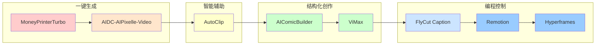
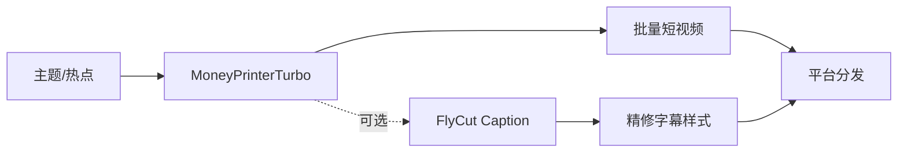
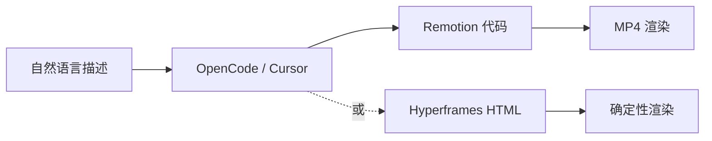
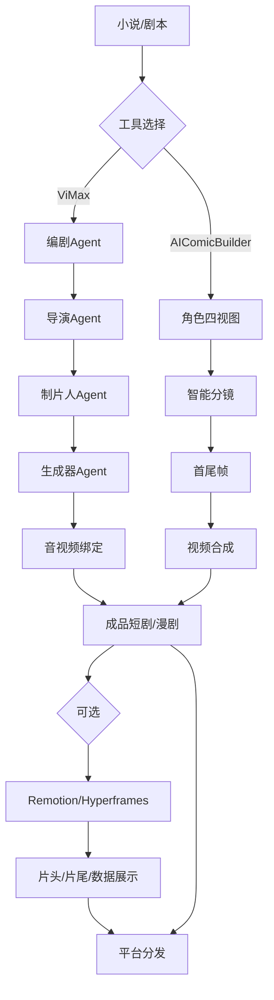
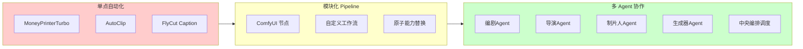

# AI 视频/媒体创作领域全景

## 领域概览

AI 视频/媒体创作生态可划分为四个递进的环节：**内容生成**（从无到有）、**内容编辑**（从粗到精）、**内容控制**（精确控制每一帧）、**内容分发**（平台适配与批量产出）。

---

## 能力分层结构图

| 层级 | 工具 | 交互方式 | 输入 | 输出 | 目标用户 | 可控性 |
|------|------|---------|------|------|---------|--------|
| **内容生成层** | [[moneyprinterturbo]] | Web UI / API | 主题/关键词 | 高清短视频 | 自媒体、营销人员 | 低（一键生成） |
| | [[aidc-aipixelle-video|AIDC-AIPixelle-Video]] | Web UI / 本地部署 | 主题/关键词 | 竖屏/横屏短视频 | 零门槛用户、本地部署爱好者 | 中（ComfyUI 模块化替换） |
| | [[vimax-agentic-video|ViMax]] | 脚本/配置驱动 | 创意/小说/剧本 | 叙事性长视频 | 内容创作者、IP 改编者 | 中高（多 Agent 协作，镜头级控制） |
| | [[aicomicbuilder|AIComicBuilder]] | Web UI（分镜编辑） | TXT/DOCX/PDF 剧本 | 漫剧/动画视频 | 漫画创作者、编剧 | 中高（分镜可人工精修） |
| **内容编辑层** | [[autoclip|AutoClip]] | Web UI | YouTube/B 站链接或本地文件 | 高光切片 + 自动标题 | 知识博主、UP 主、MCN | 中（AI 推荐 + 人工选择） |
| | [[auto-video-slicing|auto-video-slicing]] | 概念/评测 | 长视频 | 短片段 | 内容创作者 | — |
| | [[flycut-caption|FlyCut Caption]] | React 组件嵌入 | 视频文件 | 带字幕视频 / SRT | 开发者、剪辑工具集成方 | 高（逐段编辑、样式自定义） |
| **内容控制层** | [[remotion]] | 代码（React/TS） | 代码 / 自然语言描述 | MP4 动画 | 开发者、设计师 | 极高（帧级精确控制） |
| | [[hyperframes|Hyperframes]] | HTML + CLI | HTML 文件 / Agent 对话 | 渲染视频 | 开发者、AI Agent | 极高（HTML-native，确定性渲染） |
| **内容分发/短剧层** | [[open-source-short-drama-projects|open-source-short-drama-projects]] | 多工具组合 | 剧本/素材 | 短剧/漫剧成品 | 短剧团队、独立创作者 | 因工具而异 |

### 基础设施层（贯穿全链路）

- [[yt-dlp]] —— 多平台视频下载与字幕提取，是 AutoClip 等工具的素材获取基石。
- FFmpeg —— 视频处理的底层通用引擎，几乎所有工具链的必经之路。
- Whisper / faster-whisper —— 语音识别与字幕生成，FlyCut Caption 和 MoneyPrinterTurbo 的字幕能力来源。

---

## 能力光谱：从「一键生成」到「编程控制」

光谱左侧强调**速度和无干预**，右侧强调**精确性和可复现性**。每个工具在光谱上的位置反映了其设计哲学和适用场景。



| 位置 | 设计哲学 | 典型问题 | 代表工具 |
|------|---------|---------|---------|
| **极左：一键生成** | 最大化自动化，用户只提供意图 | "给我做一个关于xxx的短视频" | MoneyPrinterTurbo |
| **偏左：模块化生成** | 原子能力可替换，兼顾自动化与定制 | "用本地模型和指定TTS生成" | AIDC-AIPixelle-Video |
| **中部：智能辅助** | AI 做推荐，人做决策 | "从这段直播里找出最精彩的部分" | AutoClip |
| **偏右：结构化创作** | 人机协作，关键环节可人工干预 | "剧本AI分镜，但我需要调整第3个镜头" | AIComicBuilder、ViMax |
| **极右：编程控制** | 每一帧都精确可控、可版本化 | "这个动画的缓动曲线必须如此" | Remotion、Hyperframes |

> **选型原则**：追求**日更批量**选左侧，追求**品牌一致性**和**复杂叙事**选右侧。中间层工具（AutoClip、AIComicBuilder）是连接"效率"与"质量"的桥梁。

---

## 典型工作流组合

### 组合 A：自媒体日更流水线（效率优先）



- **特点**：全程自动化，30 分钟产出多条视频，适合资讯类、口播类账号。
- **瓶颈**：素材同质化（Pexels 库有限）、风格难以差异化。

### 组合 B：长视频二创流水线（素材复用）


- **特点**：将已有长视频资产转化为短视频平台的二次流量。
- **瓶颈**：AI 评分与人工审美存在偏差，最终选择仍需人介入。

### 组合 C：品牌动画/数据可视化（精确控制）



- **特点**：输出可版本控制（Git）、可自动化测试、可 CI/CD 集成。
- **瓶颈**：需要编程思维或 AI 助手辅助，不适合纯非技术用户。

### 组合 D：IP 改编 / 短剧生产（叙事深度）



- **特点**：端到端叙事能力，支持长视频和角色一致性——这是当前 AI 视频最难的环节。
- **瓶颈**：生成时间长、算力消耗大、多 Agent 协作的故障排查复杂。

---

## 目录结构：完整 AI 视频生产工作流

一个典型的 AI 视频项目目录结构如下：

```
ai-video-project/
├── 01-raw/
│   ├── scripts/           # 原始剧本/文案
│   ├── references/        # 参考视频/风格样片
│   └── assets/            # 待处理的原始素材
├── 02-pre-production/
│   ├── storyboard/        # 分镜脚本（AIComicBuilder / ViMax 输出）
│   ├── character-sheets/  # 角色一致性设定
│   └── shot-list/         # 镜头清单
├── 03-production/
│   ├── generated/         # AI 生成的原始视频片段
│   ├── audio/             # TTS 配音 / BGM / 音效
│   └── subtitles/         # 字幕文件（SRT / ASS）
├── 04-post-production/
│   ├── edited/            # 剪辑后的片段
│   ├── composited/        # 合成片段（Remotion / Hyperframes）
│   └── final/             # 最终成片
├── 05-distribution/
│   ├── platform-cut/      # 各平台适配版本
│   └── thumbnails/        # 封面图
└── pipeline-config/
    ├── comfyui-workflow.json   # ComfyUI 工作流配置
    ├── remotion-composition.tsx # Remotion 合成组件
    └── agent-config.yaml       # ViMax 多 Agent 配置
```

---

## Agentic 趋势观察

### 从单点工具到工作流平台

当前 AI 视频工具正在经历三个阶段演进：

| 阶段 | 特征 | 代表 |
|------|------|------|
| **单点自动化** | 一个工具完成一个环节（生成/剪辑/字幕） | MoneyPrinterTurbo、AutoClip |
| **模块化 Pipeline** | 原子能力可替换，用户自定义组合 | AIDC-AIPixelle-Video（ComfyUI 架构） |
| **多 Agent 协作** | 多个专业 Agent 分工，中央编排调度 | ViMax（导演+编剧+制片人+生成器） |



### ViMax 的多 Agent 导演制代表了什么

[[vimax-agentic-video]] 的核心突破不在于单点技术，而在于**将影视工业的分工逻辑映射到 AI Agent 架构**：

- **编剧 Agent**：RAG 驱动的长脚本生成，解决"AI 只能写短文案"的局限。
- **导演 Agent**：镜头级故事板设计 + 多机位模拟，解决"画面缺乏叙事结构"的局限。
- **制片人 Agent**：资产索引 + 一致性校验，解决"角色和场景前后不一致"的局限。
- **生成器 Agent**：并行镜头生成 + 音视频绑定，解决"生成效率低"的局限。

这一架构预示了未来方向：**AI 视频的竞争将从"谁的模型生成质量更高"转向"谁的 Agent 协作流程更可靠"**。模型能力趋于同质化（各家都能调用 Gemini、Kling、Veo），但**长脚本理解、一致性校验、多机位调度**等"导演能力"将成为差异化壁垒。

### Hyperframes 的 Agent-first 设计

[[hyperframes]] 从另一个角度体现了 Agentic 趋势：它不是让 Agent 去操作传统视频软件，而是**为 Agent 重新设计视频创作的抽象层**——HTML-native、CLI 非交互式、确定性渲染、skill 系统教 Agent 如何写 composition。这意味着未来视频创作可能不再有"打开软件"这一步骤，而是完全由 Agent 对话驱动。

---

## 关键概念速查

- [[ai-video-generation]] —— AI 视频生成的技术范式、核心原理与工作流类型对比。
- [[moneyprinterturbo]] —— 一键生成型工具的代表，中文生态首选。
- [[remotion]] —— 编程式视频创作的标杆，React 组件化思维做视频。
- [[yt-dlp]] —— 视频下载与字幕提取的基础设施。

---

## 来源索引

本全景图综合了以下来源的分析：

- 生成层：[[moneyprinterturbo]]、[[aidc-aipixelle-video]]、[[vimax-agentic-video]]、[[aicomicbuilder]]
- 编辑层：[[autoclip]]、[[auto-video-slicing]]、[[flycut-caption]]
- 控制层：[[opencode-remotion]]、[[hyperframes]]
- 分发/盘点层：[[open-source-short-drama-projects]]
