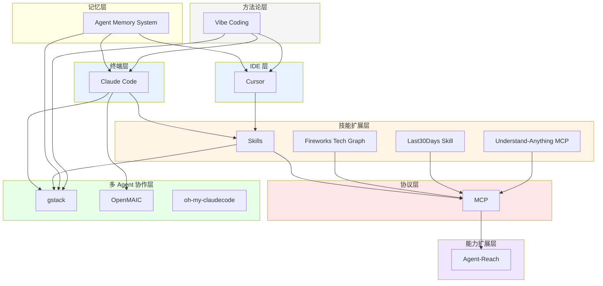
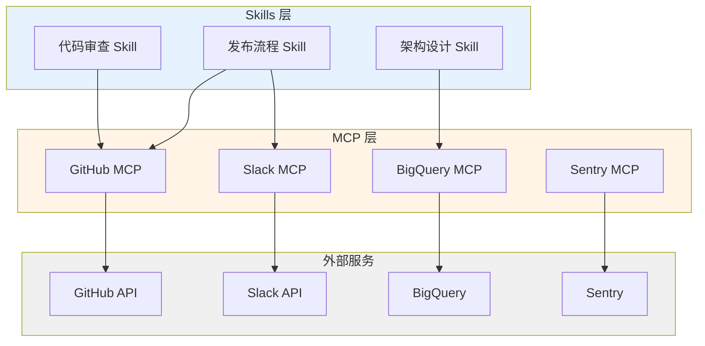
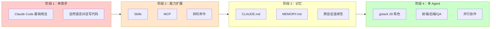

# Claude Code / AI Agent 辅助开发生态全景图

## 领域概览

AI 辅助编程已从「更聪明的自动补全」演进到「AI 工程团队协作」。当前生态覆盖从单点终端助手到多 Agent 工程团队的完整层次，核心驱动力是：

- **终端原生交互**：将 LLM 能力直接嵌入开发者已有的命令行工作流
- **可扩展架构**：通过 Skills、MCP、记忆系统层层叠加能力
- **团队化趋势**：从「一个通用助手」到「28 角色虚拟工程团队」

本页将散落在 11 篇 source 和 6 个 entity/concept 页面中的知识编织为一张有结构、有层次、有演进脉络的生态地图。

---

## 生态分层结构

| 层次 | 代表工具/概念 | 解决什么问题 | 与上下层的关系 |
|------|--------------|------------|--------------|
| **终端层** | [[claude-code]] | 在命令行中完成代码编写、重构、测试、部署的全链路任务 | 生态的「操作中枢」，向上承载 Skills/MCP/记忆，向下对接文件系统和 shell |
| **IDE 层** | [[cursor]] | 在可视化编辑器中提供内联 AI 编辑、项目级理解和 Agent 模式 | 与终端层互补：日常编码用 Cursor，批量重构/自动化用 Claude Code |
| **技能扩展层** | [[claude-code-skills]]、[[fireworks-tech-graph]]、[[last30days-skill]]、[[understand-anything-mcp]]、Hermes Skills | 将重复工作流、领域知识、专业工具固化为可一键触发的 AI 角色 | 依附于终端/IDE 层运行，通过 SKILL.md 或插件机制注入能力 |
| **协议层** | [[mcp]] | 标准化 AI 与外部工具/数据源之间的通信，实现「一次编写，处处调用」 | 横向贯通所有层次，为技能扩展层提供工具调用基础设施 |
| **多 Agent 协作层** | gstack（[[claude-code-gstack]]）、OpenMAIC（[[openmaic]]）、oh-my-claudecode | 将复杂任务拆解给多个专业 Agent 并行处理，突破单一会话的能力边界 | 建立在终端层 + 技能层之上，需要底层支持并行实例和角色隔离 |
| **能力扩展层** | Agent-Reach（[[panniantong-agent]]） | 为 Agent 一键装上互联网阅读和搜索能力（15+ 平台，零 API 费用） | 通过 MCP 或 CLI 集成到终端层，补齐 Agent 的实时信息获取短板 |
| **记忆层** | [[agent-memory-system]] | 跨会话持久化用户偏好、项目背景、工作指导，使 AI 越用越懂团队 | 为所有上层提供上下文连续性，是「复利式工程」的基础设施 |
| **方法论层** | [[vibe-coding]] | 定义人机协作的范式：从「代码工匠」到「设计导演」 | 贯穿所有层次的理念层，指导如何与 AI 有效协作 |



---

## 能力边界与互补关系

### Claude Code vs Cursor：终端与 IDE 的分工

两者不是替代关系，而是同一工作流中的不同环节：

- **Cursor** 适合：日常编码、可视化 diff、内联编辑、调试断点、VS Code 插件生态依赖
- **Claude Code** 适合：批量重构、跨文件搜索替换、自动化工作流（`/commit-push-pr`）、多 Agent 并行（Team Mode）、CI/CD 集成
- **最佳实践**：在 Cursor 中写代码，在 Claude Code 中做架构调整和自动化流程；两者都支持 Skills，团队规范可双端同步

### Skills vs MCP：「做什么」与「怎么连」

| 维度 | Skills（如 [[claude-code-skills]]） | MCP（[[mcp]]） |
|------|-----------------------------------|---------------|
| 本质 | 定义 AI 的「角色和工作流程」 | 定义 AI 与「外部世界通信的协议」 |
| 典型内容 | 设计文档模板、代码审查清单、发布流程 | Slack API、BigQuery 查询、Sentry 日志、Twitter 搜索 |
| 开发门槛 | 写 Markdown（SKILL.md） | 写 MCP 服务器适配层 |
| 关系 | Skills 可以调用 MCP 工具完成工作流中的具体步骤 | MCP 为 Skills 提供工具调用能力 |



示例：gstack 的 `/ship` Skill（定义发布流程）可能调用 MCP 连接的 GitHub API 创建 Release、调用 Slack MCP 发送通知。

### gstack 多 Agent vs Hermes Skills 插件化：「团队编排」与「个人工具箱」

- **gstack**（[[claude-code-gstack]]）解决的是「如何让 28 个角色协同完成一个项目」——团队编排问题，强调角色分工、并行执行、评审循环
- **Hermes**（[[hermes-agent-setup]]）解决的是「如何让一个 Agent 拥有 100+ 技能」——个人能力扩展问题，强调技能发现、插件加载、内存管理
- **关系**：Hermes 的 Skills 体系可以被 gstack 的某个角色使用；gstack 的 Team Mode 可以并行运行多个 Hermes Agent 实例

---

## 从单点工具到工程团队的演进路径



### 各阶段关键跃迁

| 阶段 | 关键跃迁 | 代表实践 |
|------|---------|---------|
| 1 → 2 | 从「每次重新交代」到「一键触发专业角色」 | 将 `/commit-push-pr` 写成斜杠命令；通过 MCP 连接 Slack/Sentry |
| 2 → 3 | 从「会话内有效」到「跨会话复利」 | 维护 CLAUDE.md 和 MEMORY.md，让 AI 记住「我们不用 list comprehension 处理大数据」 |
| 3 → 4 | 从「一个大脑」到「专业分工」 | 同时启动 CEO Agent（选题）+ 数据分析 Agent + 写作 Agent + 审核 Agent |

### 这个演进说明了什么趋势

1. **从工具到团队**：AI 编程的终极形态不是「更聪明的 IDE」，而是「可无限扩展的虚拟工程团队」
2. **从单次到复利**：核心价值不在于某次交互的速度，而在于经验沉淀使每次后续交互更高效（[[boris-cherny]] 提出的「复利式工程」）
3. **从封闭到开放**：MCP 协议的出现意味着 Agent 生态将从「各厂商孤岛」走向「工具互操作」
4. **从人工编排到自动编排**：当前多 Agent 仍需人类定义角色和流程，下一步是 Agent 自主协商任务分配

---

## 目录结构：配置了 Claude Code + Skills + MCP + 记忆的项目

一个完整配置的项目 `.claude/` 目录结构如下：

```
.claude/
├── CLAUDE.md              # 项目级记忆：架构约定、编码规范、操作偏差纠正
├── MEMORY.md              # 跨会话持久化记忆（user/feedback/project/reference）
├── commands/              # 自定义斜杠命令（Skills 的触发入口）
│   ├── commit-push-pr.md
│   ├── code-review.md
│   └── ship.md
├── skills/                # SKILL.md 技能定义文件
│   ├── architecture-design/
│   │   └── SKILL.md
│   ├── tech-graph/
│   │   └── SKILL.md
│   └── last30days-research/
│       └── SKILL.md
├── mcp/                   # MCP 服务器配置
│   ├── github-mcp.json
│   ├── slack-mcp.json
│   ├── bigquery-mcp.json
│   └── sentry-mcp.json
├── memory/                # 记忆系统数据（KAIROS 日志、/dream 夜间整理）
│   ├── kairos/
│   │   └── 2026-04-20.md
│   └── dream/
│       └── insights.md
└── teams/                 # 多 Agent 团队配置（gstack / OpenMAIC）
    ├── gstack-config.yaml
    └── openmaic-config.yaml
```

---

## Boris Cherny 的 13 个技巧在生态中的位置

[[boris-cherny]] 的技巧可按生态层次分类：

### 用好终端助手（阶段 1）
- **并行最大化**：同时运行 5 个 Claude 实例，标签页编号管理
- **网页和本地同时并行**：claude.ai/code + 本地 CLI + 手机会话
- **使用最强模型**：所有任务用 Opus 4.5，减少人工引导成本
- **规划先行（Plan mode）**：先沟通方案，满意后再自动执行

### 扩展能力（阶段 2）
- **斜杠命令固化工作流**：将内循环写成 `.claude/commands/`
- **子智能体自动化**：code-simplifier、verify-app 等子 Agent
- **PostToolUse 钩子**：自动格式化代码，处理剩余 10% 格式细节
- **MCP 扩展能力边界**：通过 MCP 调用 Slack、BigQuery、Sentry
- **权限精细化管理**：用 `/permissions` 预授权，不用 `--dangerously-skip-permissions`

### 团队协作与复利（阶段 3-4）
- **维护 CLAUDE.md**：团队共享记忆，记录操作偏差和纠正
- **验证反馈循环**：建立 bash/测试/浏览器验证机制，质量提升 2-3 倍
- **长任务技巧**：后台代理自行验证、Stop 钩子执行验证、沙箱免权限模式
- **复利式工程**：将经验沉淀到共享文件，AI 越用越懂团队

---

## 关键概念速查

- [[claude-code-skills]] —— 通过 SKILL.md 定义可复用斜杠命令和工作流，将重复任务固化为专业角色
- [[mcp]] —— 标准化 AI 与外部工具通信的开放协议，实现跨平台工具互操作
- [[multi-agent-collaboration]] —— 将复杂任务分解给多个专业 Agent 并行处理，通过角色分工和通信机制协同工作
- [[agent-memory-system]] —— 本地文件式记忆架构，分 user/feedback/project/reference 四类，支持 KAIROS 日志和 /dream 夜间整理
- [[vibe-coding]] —— 以意图驱动、信任 AI、快速验证为核心的新兴编程范式

---

## 来源索引

本 synthesis 基于以下 source 页面综合而成：

- [[claude-code-gstack]] —— Garry Tan 的 gstack 多 Agent 协作工作流（28 角色 + Team Mode）
- [[hermes-agent-setup]] —— NousResearch 开源的 Hermes Agent 框架（Skills 体系 + 8 种内存实现）
- [[openmaic]] —— 清华大学 OpenMAIC 多智能体互动课堂平台（LangGraph 编排）
- [[panniantong-agent]] —— Agent-Reach 一键互联网能力（15+ 平台，零 API 费用）
- [[claude-code-memory-system]] —— Claude Code 源码级记忆系统万字解析
- [[boris-cherny-tips]] —— Boris Cherny 的 13 个高效使用技巧
- [[claude-code-essential-projects]] —— Claude Code 必备开源项目（Claude How-To、OMC、best-practice）
- [[agent-skills-design]] —— 将设计文档写成 Skill 的实战教程
- [[fireworks-tech-graph]] —— 自然语言生成工业级架构图的 Skill
- [[last30days-skill]] —— 中国平台深度研究引擎 Skill
- [[understand-anything-mcp]] —— 将代码库转化为交互式知识图谱的 MCP 项目
