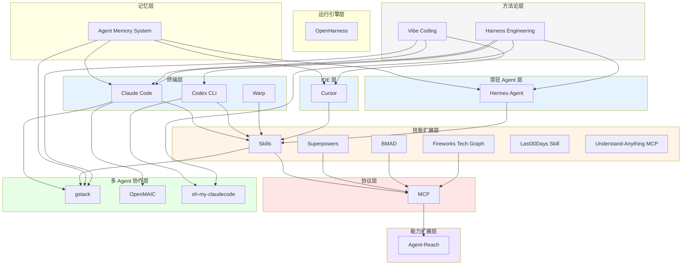
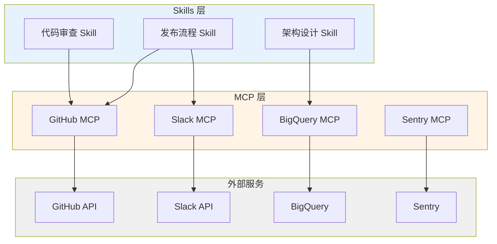
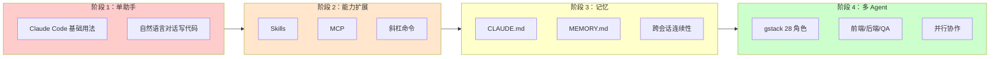

# Claude Code / AI Agent 辅助开发生态全景图

## 领域概览

AI 辅助编程已从「更聪明的自动补全」演进到「AI 工程团队协作」。当前生态覆盖从单点终端助手到多 Agent 工程团队的完整层次，核心驱动力是：

- **终端原生交互**：将 LLM 能力直接嵌入开发者已有的命令行工作流
- **可扩展架构**：通过 Skills、MCP、记忆系统层层叠加能力
- **团队化趋势**：从「一个通用助手」到「28 角色虚拟工程团队」

本页将散落在 11 篇 source 和 6 个 entity/concept 页面中的知识编织为一张有结构、有层次、有演进脉络的生态地图。

---

## 生态分层结构

| 层次 | 代表工具/概念 | 解决什么问题 | 与上下层的关系 |
|------|--------------|------------|--------------|
| **终端层** | [[claude-code]]、[[codex]]、[[warp]] | 在命令行/终端中完成代码编写、调试、部署的全链路任务 | 生态的「操作中枢」，向上承载 Skills/MCP/记忆，向下对接文件系统和 shell |
| **IDE 层** | [[cursor]] | 在可视化编辑器中提供内联 AI 编辑、项目级理解和 Agent 模式 | 与终端层互补：日常编码用 Cursor，批量重构/自动化用 Claude Code |
| **常驻 Agent 层** | [[hermes-agent]] | 持久化自主 Agent，跨平台（Telegram/Discord/Slack）、定时自动化、长期记忆积累 | 与终端层互补：Claude Code 专注编码会话，Hermes 做大脑调度和长期运维 |
| **技能扩展层** | [[claude-code-skills]]、[[superpowers]]、[[bmad-method]]、[[fireworks-tech-graph]]、[[last30days-skill]]、[[understand-anything-mcp]]、OMC Skills、Hermes Skills | 将重复工作流、领域知识、专业工具、工程纪律固化为可一键触发的 AI 角色 | 依附于终端/IDE 层运行，通过 SKILL.md 或插件机制注入能力 |
| **协议层** | [[mcp]] | 标准化 AI 与外部工具/数据源之间的通信，实现「一次编写，处处调用」 | 横向贯通所有层次，为技能扩展层提供工具调用基础设施 |
| **多 Agent 协作层** | gstack（[[claude-code-gstack]]）、OpenMAIC（[[openmaic]]）、[[oh-my-claudecode]] | 将复杂任务拆解给多个专业 Agent 并行处理，突破单一会话的能力边界 | 建立在终端层 + 技能层之上，需要底层支持并行实例和角色隔离 |
| **需求规格层** | [[openspec]] | 在代码之前添加轻量级规格层，让人和 AI 先就需求对齐 | 通过 proposal+specs+design+tasks 文件夹结构约束实现 |
| **能力扩展层** | Agent-Reach（[[panniantong-agent]]） | 为 Agent 一键装上互联网阅读和搜索能力（15+ 平台，零 API 费用） | 通过 MCP 或 CLI 集成到终端层，补齐 Agent 的实时信息获取短板 |
| **记忆层** | [[agent-memory-system]] | 跨会话持久化用户偏好、项目背景、工作指导，使 AI 越用越懂团队 | 为所有上层提供上下文连续性，是「复利式工程」的基础设施 |
| **方法论层** | [[vibe-coding]]、[[agent-harness]] | 定义人机协作的范式与工程化框架 | 贯穿所有层次的理念层，指导如何与 AI 有效协作 |



---

## 能力边界与互补关系

### Claude Code vs Cursor：终端与 IDE 的分工

两者不是替代关系，而是同一工作流中的不同环节：

- **Cursor** 适合：日常编码、可视化 diff、内联编辑、调试断点、VS Code 插件生态依赖
- **Claude Code** 适合：批量重构、跨文件搜索替换、自动化工作流（`/commit-push-pr`）、多 Agent 并行（Team Mode）、CI/CD 集成
- **最佳实践**：在 Cursor 中写代码，在 Claude Code 中做架构调整和自动化流程；两者都支持 Skills，团队规范可双端同步

### 终端 AI 工具三角：Claude Code vs Codex vs Warp

2026 年终端层的三个主力工具各有明确分工：

| 维度 | Claude Code | Codex CLI/App | Warp |
|------|-------------|---------------|------|
| 核心定位 | 专业编码工具 | 通用 AI 编程助手 + 桌面自动化 | 智能终端（Agentic Development Environment）|
| 深度编码 | 最强 | 中等 | 间接（通过集成 Claude Code/Codex）|
| 多任务并行 | Team Mode（多实例）| 桌面端多 Thread 并行 | 多标签/分屏 |
| 桌面自动化 | 无 | Computer Use（macOS GUI 操控）| 无 |
| 内置浏览器 | 无 | 有（前端调试）| 无 |
| 终端体验 | 传统终端 | 传统终端 | Block 化、IDE 级编辑器、400+ 补全 |
| 模型绑定 | 仅 Claude | GPT-5 / o4-mini（也支持第三方）| Claude / GPT-4o 等 |
| 生态绑定 | Anthropic API | ChatGPT 订阅通用 | 独立 |
| 与 Claude Code 关系 | 自身 | 竞品+互补 | 互补（Warp 中运行 Claude Code）|

**选择建议**：
- 专注写代码、调试、重构 → Claude Code
- 已有 ChatGPT 订阅、需要桌面自动化 → Codex
- 想要更好的终端体验、在终端中运行 AI 代理 → Warp + Claude Code/Codex

### Claude Code vs Hermes Agent：会话式 vs 常驻式

| 维度 | Claude Code | Hermes Agent |
|------|-------------|--------------|
| 生命周期 | 会话式，用完即止 | 常驻守护进程，持续运行 |
| 记忆机制 | 手动维护 CLAUDE.md / AGENTS.md | 自动三层持久记忆（MEMORY/USER/SOUL）|
| 编码能力 | 同类最强 | 通用能力，编码不是强项 |
| 访问方式 | 终端 + IDE | 终端 + 15+ 即时通讯平台 |
| 定时任务 | 不支持 | 内置自然语言 Cron |
| 模型 | 仅 Claude | 200+ 模型自由切换 |
| 开源 | 否 | 是（MIT）|

**最佳组合**：Hermes 做大脑和调度（感知任务、维护长期记忆、定时触发、跨平台通信），Claude Code 做执行引擎（繁重编码任务）。

### Skills vs MCP：「做什么」与「怎么连」

| 维度 | Skills（如 [[claude-code-skills]]） | MCP（[[mcp]]） |
|------|-----------------------------------|---------------|
| 本质 | 定义 AI 的「角色和工作流程」 | 定义 AI 与「外部世界通信的协议」 |
| 典型内容 | 设计文档模板、代码审查清单、发布流程 | Slack API、BigQuery 查询、Sentry 日志、Twitter 搜索 |
| 开发门槛 | 写 Markdown（SKILL.md） | 写 MCP 服务器适配层 |
| 关系 | Skills 可以调用 MCP 工具完成工作流中的具体步骤 | MCP 为 Skills 提供工具调用能力 |



示例：gstack 的 `/ship` Skill（定义发布流程）可能调用 MCP 连接的 GitHub API 创建 Release、调用 Slack MCP 发送通知。

### gstack 多 Agent vs Hermes Skills 插件化 vs OMC 编排：三种协作哲学

- **gstack**（[[claude-code-gstack]]）解决的是「如何让 28 个角色协同完成一个项目」——团队编排问题，强调角色分工、并行执行、评审循环
- **Hermes**（[[hermes-agent]]）解决的是「如何让一个 Agent 拥有 100+ 技能并持续成长」——个人能力扩展问题，强调技能发现、自动学习、跨平台常驻
- **OMC**（[[oh-my-claudecode]]）解决的是「如何让 Claude Code 拥有 19 个专属 Agent 和 5 种执行模式」——插件化编排问题，强调零配置开箱即用、自动并行化、智能模型路由

**关系**：OMC 直接建立在 Claude Code 之上；Hermes 的 Skills 可以被 gstack 的某个角色使用；gstack 的 Team Mode 可以并行运行多个 Claude Code + OMC 实例。

---

## 从单点工具到工程团队的演进路径



### 各阶段关键跃迁

| 阶段 | 关键跃迁 | 代表实践 |
|------|---------|---------|
| 1 → 2 | 从「每次重新交代」到「一键触发专业角色」 | 将 `/commit-push-pr` 写成斜杠命令；通过 MCP 连接 Slack/Sentry |
| 2 → 3 | 从「会话内有效」到「跨会话复利」 | 维护 CLAUDE.md 和 MEMORY.md，让 AI 记住「我们不用 list comprehension 处理大数据」 |
| 3 → 4 | 从「一个大脑」到「专业分工」 | 同时启动 CEO Agent（选题）+ 数据分析 Agent + 写作 Agent + 审核 Agent |

### 这个演进说明了什么趋势

1. **从工具到团队**：AI 编程的终极形态不是「更聪明的 IDE」，而是「可无限扩展的虚拟工程团队」
2. **从单次到复利**：核心价值不在于某次交互的速度，而在于经验沉淀使每次后续交互更高效（[[boris-cherny]] 提出的「复利式工程」）
3. **从封闭到开放**：MCP 协议的出现意味着 Agent 生态将从「各厂商孤岛」走向「工具互操作」
4. **从人工编排到自动编排**：当前多 Agent 仍需人类定义角色和流程，下一步是 Agent 自主协商任务分配

---

## AI 编程代理框架选型：Superpowers / BMAD / OpenSpec / OpenHarness

2026 年出现的四款框架覆盖了 AI 开发流水线的不同层次，本质上不是竞争关系，而是可以叠加使用的互补工具。

### 四款工具在生态中的位置

| 层次 | 工具 | 解决什么问题 | 与生态的关系 |
|------|------|------------|-------------|
| 需求层 | [[openspec]] | 代理"做什么需求" | 在代码之前添加轻量级规格层，让需求对齐 |
| 规划层 | [[bmad-method]] | 代理"该做什么文档" | 以 PRD/架构/用户故事为"合同"约束实现 |
| 执行层 | [[superpowers]] | 代理"怎么做事" | 强制 TDD + 七阶段工作流 + 代码审查 |
| 引擎层 | [[openharness]] | 代理"能做什么" | 独立运行，提供工具+权限+多代理调度 |

### 选型决策矩阵

| 场景 | 推荐组合 | 理由 |
|------|---------|------|
| 个人开发者，快速上手 | Superpowers | 一条命令安装，开箱即用，零学习成本 |
| 中大型团队，有真实用户 | BMAD + Superpowers | BMAD 保证需求对齐，Superpowers 保证实现质量 |
| 写代码前先对齐需求 | OpenSpec + Superpowers | OpenSpec 生成规格，Superpowers 约束实现 |
| 研究代理原理 / 国内模型 | OpenHarness | 唯一原生支持通义千问、DeepSeek、Kimi |
| 完整链路（最优） | OpenSpec → BMAD → Superpowers → OpenHarness | 需求→规划→执行→运行，仅在需要自建引擎时启用 OpenHarness |

### 与现有生态层的叠加关系

- **Superpowers** 直接叠加在终端层（Claude Code / Cursor / Codex）之上，与 [[claude-code-skills]] 互补：Skills 管"自定义规范"，Superpowers 管"通用纪律"
- **BMAD** 在规划阶段与 gstack / OMC 的多 Agent 角色体系互补：BMAD 提供文档驱动的敏捷方法论，gstack/OMC 提供执行层面的角色编排
- **OpenSpec** 作为需求层工具，可与任何终端/技能层组合使用
- **OpenHarness** 作为独立运行引擎，兼容 Superpowers Skills 格式和 Claude Code 插件格式，是自建场景的选择

---

## 目录结构：配置了 Claude Code + Skills + MCP + 记忆的项目

一个完整配置的项目 `.claude/` 目录结构如下：

```
.claude/
├── CLAUDE.md              # 项目级记忆：架构约定、编码规范、操作偏差纠正
├── MEMORY.md              # 跨会话持久化记忆（user/feedback/project/reference）
├── commands/              # 自定义斜杠命令（Skills 的触发入口）
│   ├── commit-push-pr.md
│   ├── code-review.md
│   └── ship.md
├── skills/                # SKILL.md 技能定义文件
│   ├── architecture-design/
│   │   └── SKILL.md
│   ├── tech-graph/
│   │   └── SKILL.md
│   └── last30days-research/
│       └── SKILL.md
├── mcp/                   # MCP 服务器配置
│   ├── github-mcp.json
│   ├── slack-mcp.json
│   ├── bigquery-mcp.json
│   └── sentry-mcp.json
├── memory/                # 记忆系统数据（KAIROS 日志、/dream 夜间整理）
│   ├── kairos/
│   │   └── 2026-04-20.md
│   └── dream/
│       └── insights.md
└── teams/                 # 多 Agent 团队配置（gstack / OpenMAIC）
    ├── gstack-config.yaml
    └── openmaic-config.yaml
```

---

## Boris Cherny 的 13 个技巧在生态中的位置

[[boris-cherny]] 的技巧可按生态层次分类：

### 用好终端助手（阶段 1）
- **并行最大化**：同时运行 5 个 Claude 实例，标签页编号管理
- **网页和本地同时并行**：claude.ai/code + 本地 CLI + 手机会话
- **使用最强模型**：所有任务用 Opus 4.5，减少人工引导成本
- **规划先行（Plan mode）**：先沟通方案，满意后再自动执行

### 扩展能力（阶段 2）
- **斜杠命令固化工作流**：将内循环写成 `.claude/commands/`
- **子智能体自动化**：code-simplifier、verify-app 等子 Agent
- **PostToolUse 钩子**：自动格式化代码，处理剩余 10% 格式细节
- **MCP 扩展能力边界**：通过 MCP 调用 Slack、BigQuery、Sentry
- **权限精细化管理**：用 `/permissions` 预授权，不用 `--dangerously-skip-permissions`

### 团队协作与复利（阶段 3-4）
- **维护 CLAUDE.md**：团队共享记忆，记录操作偏差和纠正
- **验证反馈循环**：建立 bash/测试/浏览器验证机制，质量提升 2-3 倍
- **长任务技巧**：后台代理自行验证、Stop 钩子执行验证、沙箱免权限模式
- **复利式工程**：将经验沉淀到共享文件，AI 越用越懂团队

---

## 关键概念速查

- [[claude-code-skills]] —— 通过 SKILL.md 定义可复用斜杠命令和工作流，将重复任务固化为专业角色
- [[mcp]] —— 标准化 AI 与外部工具通信的开放协议，实现跨平台工具互操作
- [[multi-agent-collaboration]] —— 将复杂任务分解给多个专业 Agent 并行处理，通过角色分工和通信机制协同工作
- [[agent-memory-system]] —— 本地文件式记忆架构，分 user/feedback/project/reference 四类，支持 KAIROS 日志和 /dream 夜间整理
- [[vibe-coding]] —— 以意图驱动、信任 AI、快速验证为核心的新兴编程范式

---

## Harness 层：生态的"操作系统"

2026 年 [[agent-harness]] 概念的爆发为整个生态添加了一个新的理解维度。Harness 是 LLM 之外的**全部工程化基础设施**——它不是某个单独的工具或框架，而是将上述所有层次连接起来的"操作系统"。

### Harness 如何贯穿各层

| 生态层 | Harness 视角的对应组件 |
|--------|----------------------|
| 终端层/IDE 层 | Prompt 构建 + 输出解析（模型与开发者的接口） |
| 技能扩展层 | 工具系统（schema 定义、权限门控、沙箱执行） |
| 协议层 | 工具调用的标准化通道 |
| 多 Agent 协作层 | 子 Agent 编排 + 状态管理 + 终止条件 |
| 记忆层 | 记忆系统 + 上下文管理 |
| 方法论层 | 安全防护 + 验证循环 + 错误处理 |

### 薄 vs 厚：生态中的两种设计哲学

生态中的工具和框架正沿两条路线分化：

- **薄 Harness 路线**（[[claude-code]]）：dumb loop 哲学，所有智能在模型内部，Harness 只管理轮次。押注模型进步速度超过维护复杂基础设施的能力。
- **厚 Harness 路线**（[[langgraph]]）：显式状态图，通过确定性控制确保可靠性和可审计性。需要在确定性、可审计性和可靠性上有最大控制权。

**脚手架原则**为两者提供了调和框架：为移除而构建——随着模型能力提升，Harness 复杂性应降低。但需注意模型-Harness 共进化陷阱。

### 工程三层演进的生态映射

| 演进阶段 | 对应的生态能力 | 代表实践 |
|---------|--------------|---------|
| Prompt Engineering（2022-2024） | 单点工具的"怎么说"优化 | 精心设计提示词引导模型输出 |
| Context Engineering（2025） | [[agent-memory-system]] + CLAUDE.md | 系统化管理记忆、持久化、状态 |
| Harness Engineering（2026） | 全部 12 大模块的统一系统框架 | Claude Code / [[openai-agents-sdk]] / [[langgraph]] 的完整 Harness 实现 |

### Harness Engineering 实践

[[agent-harness]] 中 Harness Engineering 方法论为生态提供了工程化框架：

**四要素映射到生态工具**：
| 要素 | 代表实践 |
|------|---------|
| 提示词结构 | AGENTS.md（Claude Code / Codex / Hermes 通用）|
| 状态文件 | CLAUDE.md + feature_list.json + claude-progress.txt |
| 工具配置 | Skills + MCP |
| 验证机制 | `/guard` + `/careful` + Puppeteer MCP 端到端测试 |

**三 Agent 架构**（Planner + Generator + Evaluator）是生态中多 Agent 协作的理论基础，OMC 的 19 Agent 体系是其工程化扩展。

**Context Anxiety 与 Context Reset**：当 Context Window 接近上限时模型会产生「急于收尾」的冲动，根本解法是 Reset + 结构化状态文件传递，而非 Compaction。

### 生产级验证：Symphony 和 Minions

OpenAI Symphony（3 人 5 个月零代码百万行应用）和 Stripe Minions（每周 1300 个零代码 PR）两个案例证明了 Harness Engineering 的实际价值。两者的共同教训：
- 构建时间 > 1 分钟时 Agent 生产力急剧下降
- 失败时应问"缺少什么能力/上下文/结构"而非"换提示"
- 环境定义比模型能力更关键

## 技能树脉络

- [[agent-harness-thread]] —— Agent Harness 十二模块技能树：从编排循环到环境初始化的工程化学习路径 + 面试题

## 来源索引

本 synthesis 基于以下 source 页面综合而成：

- [[claude-code-gstack]] —— Garry Tan 的 gstack 多 Agent 协作工作流（28 角色 + Team Mode）
- [[hermes-agent-guide]] —— Hermes Agent 完全新手指南（Skills 体系 + 三层记忆 + 多平台网关）
- [[openmaic]] —— 清华大学 OpenMAIC 多智能体互动课堂平台（LangGraph 编排）
- [[panniantong-agent]] —— Agent-Reach 一键互联网能力（15+ 平台，零 API 费用）
- [[claude-code-memory-system]] —— Claude Code 源码级记忆系统万字解析
- [[boris-cherny-tips]] —— Boris Cherny 的 13 个高效使用技巧
- [[claude-code-essential-projects]] —— Claude Code 必备开源项目
- [[agent-skills-design]] —— 将设计文档写成 Skill 的实战教程
- [[fireworks-tech-graph]] —— 自然语言生成工业级架构图的 Skill
- [[last30days-skill]] —— 中国平台深度研究引擎 Skill
- [[understand-anything-mcp]] —— 将代码库转化为交互式知识图谱的 MCP 项目
- [[agent-harness-anatomy]] —— Agent Harness 十二大模块深度解析
- [[agent-teams-tmux-worktrees]] —— Agent Teams 并行交付工程实践
- [[harness-engineering-guide]] —— Harness Engineering 完全指南
- [[openai-codex-guide]] —— OpenAI Codex 完全新手指南
- [[warp-guide]] —— Warp 完全指南
- [[oh-my-claudecode-guide]] —— oh-my-claudecode 深度实战
- [[superpowers-guide]] —— Superpowers / BMAD / OpenSpec / OpenHarness 四款框架横向对比与选型建议
