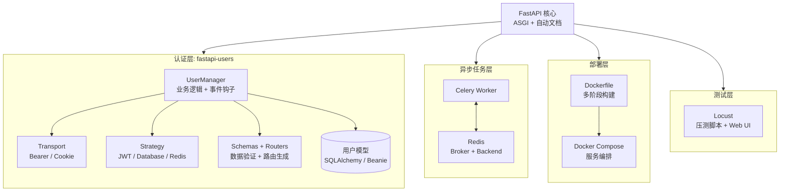
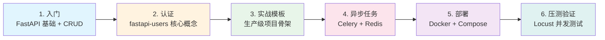

# FastAPI 技术栈知识全景图

FastAPI 技术栈是以 [[fastapi]] 框架为核心、围绕认证、异步任务、部署和测试四个维度展开的一套现代 Python 后端开发生态。掌握它意味着能够从空目录走到一个带用户认证、异步任务、可容器化部署、可压测验证的生产级 Web 服务。

---

## 知识分层结构

| 层级 | 模块 | 解决什么问题 | 依赖的下层 |
|------|------|------------|-----------|
| **核心层** | [[fastapi]] | 构建高性能异步 API、自动数据验证、生成 OpenAPI 文档 | Python 类型系统 + ASGI |
| **认证层** | [[fastapi-users]] | 用户注册、登录、密码重置、邮箱验证、权限分级 | FastAPI + 数据库（SQLAlchemy/Beanie） |
| **异步任务层** | [[celery]] + [[redis]] | 耗时操作异步化、定时任务、削峰填谷 | Redis（Broker + Backend） |
| **部署层** | [[docker]] + Docker Compose | 环境一致性、多服务编排、生产交付 | Linux 容器运行时 |
| **测试层** | Locust | 模拟并发、定位瓶颈、验证优化效果 | 待测应用本身 |

认证层内部又可细分为五个子模块：[[fastapi-users-user-model]]（数据库模型）、[[fastapi-users-auth-transport-strategy-1]] + [[fastapi-users-auth-transport-strategy-2]]（传输方式与策略组合）、[[fastapi-users-usermanager]]（业务逻辑与事件钩子）、[[fastapi-users-schemas-routers]]（数据契约与路由生成）。它们共同构成一个可插拔、可替换的认证系统。

---

## 模块依赖关系

### 模块依赖架构图



**必须按顺序学习**：FastAPI 基础 → fastapi-users 核心概念 → 数据库模型与适配器 → Transport/Strategy → UserManager → Schemas/Routers。这些模块之间存在前后依赖，跳过后续模块会难以理解整体装配方式。

**可独立使用**：Celery + Redis 的异步任务层、Docker 部署层、Locust 测试层都不依赖 fastapi-users，可以在任何 FastAPI 项目中单独引入。它们与核心层是横向扩展关系，而非纵向依赖。

---

## 推荐学习路径

### 表格版

| 阶段 | 目标 | 推荐阅读顺序 |
|------|------|-------------|
| **1. 入门** | 能写出带自动文档的 CRUD API | [[fastapi]] entity 页面 + 官方教程 |
| **2. 认证** | 为项目添加注册/登录/权限系统 | [[fastapi-users-concepts]] → [[fastapi-users-user-model]] → [[fastapi-users-auth-transport-strategy-1]] → [[fastapi-users-auth-transport-strategy-2]] → [[fastapi-users-usermanager]] → [[fastapi-users-schemas-routers]] |
| **3. 实战模板** | 拥有一个可直接复用的生产级项目骨架 | [[fastapi-users-project-template]] |
| **4. 异步任务** | 把耗时操作剥离到后台执行 | [[fastapi-celery-redis]] |
| **5. 部署** | 把应用和依赖服务打包成容器 | [[fastapi-docker-compose-deploy]] |
| **6. 压测验证** | 验证系统能承受预期并发 | [[fastapi-locust-load-test]] |

### Mermaid 学习路径图



从"入门"到"能部署一个带认证和异步任务的完整项目"，建议按上表顺序推进。每个阶段都有对应的 source 页面提供深度细节，本页面只负责标注地图位置。

---

## 实战项目组合

基于 [[fastapi-users-project-template]] 的典型生产项目，需要组合以下模块：

- **Web 框架**：FastAPI + Uvicorn，生产环境用 Gunicorn + UvicornWorker 多进程运行
- **认证系统**：fastapi-users，推荐 Bearer + DatabaseStrategy 组合（支持服务端令牌失效）
- **数据库**：PostgreSQL（生产）或 SQLite（开发），通过 SQLAlchemy 异步驱动连接
- **配置管理**：pydantic-settings，支持环境变量驱动的一键切换
- **异步任务**：Celery + Redis，处理邮件发送、图片处理、第三方 API 调用等
- **容器化部署**：Docker 多阶段构建 + Docker Compose 编排 FastAPI / PostgreSQL / Redis
- **性能验证**：Locust 压测，优化后 RPS 目标 5000+，平均响应时间 200ms 以内

这套组合的目录结构可参考 [[fastapi-celery-redis]] 中建议的 `app/api/`、`app/core/`、`app/models/`、`app/schemas/`、`app/tasks/` 分层方案，与 [[fastapi-users-project-template]] 的 `core/models/schemas` 结构自然衔接。

### 典型生产项目目录结构

```
fastapi-production-project/
├── app/
│   ├── __init__.py
│   ├── main.py                 # FastAPI 应用入口
│   ├── core/
│   │   ├── __init__.py
│   │   ├── config.py           # Pydantic Settings 配置
│   │   ├── database.py         # SQLAlchemy 异步引擎 / 会话
│   │   └── security.py         # 全局安全工具（密码哈希等）
│   ├── api/
│   │   ├── __init__.py
│   │   ├── deps.py             # 依赖注入（当前用户、数据库会话）
│   │   └── v1/
│   │       ├── __init__.py
│   │       ├── users.py        # 用户相关路由
│   │       └── items.py        # 业务路由示例
│   ├── models/
│   │   ├── __init__.py
│   │   └── user.py             # SQLAlchemy / Beanie 用户模型
│   ├── schemas/
│   │   ├── __init__.py
│   │   └── user.py             # Pydantic 数据验证模型
│   ├── tasks/
│   │   ├── __init__.py
│   │   └── email.py            # Celery 异步任务
│   └── users/
│       ├── __init__.py
│       ├── manager.py          # fastapi-users UserManager
│       └── endpoints.py        # 认证路由注册
├── alembic/                    # 数据库迁移
│   └── versions/
├── tests/
│   ├── __init__.py
│   ├── conftest.py
│   └── test_api.py
├── locust/
│   └── locustfile.py           # Locust 压测脚本
├── Dockerfile                  # 多阶段构建、非 root 用户
├── compose.yaml                # FastAPI + PostgreSQL + Redis
├── pyproject.toml              # 依赖与项目元数据
├── .env.example                # 环境变量模板
└── README.md
```

---

## 关键概念速查

本全景图涉及的核心概念已在独立页面中展开，可通过以下链接直达：

- [[async-tasks]] —— 异步任务模式的定义、Celery 架构与适用场景
- [[jwt-authentication]] —— JWT 结构、验证流程、与 Session 认证的对比
- [[containerization]] —— 容器化原理、与虚拟机的对比、适用场景
- [[load-testing]] —— 负载测试的定义、Locust 工具特性、关键性能指标

---

## 技术演进观察

从这 10 篇 FastAPI 相关文章中，可以观察到以下生态趋势：

1. **认证越来越插件化**：fastapi-users 将认证系统拆解为 Transport、Strategy、UserManager、Schemas、Routers 五个独立模块，开发者可按需组合（2 × 3 = 6 种认证后端），而非被迫接受一套固定方案。这种设计反映了现代 Web 框架从"内置一切"向"可插拔生态"的演进。

2. **部署越来越容器化**：从单容器运行到 Docker Compose 多服务编排，再到多阶段构建、非 root 用户、健康检查、依赖控制等生产级实践，容器化已成为 FastAPI 项目交付的默认假设，而非可选项。

3. **异步从框架层渗透到架构层**：FastAPI 原生支持 async/await，但真正的异步化不止于 API 层——Celery 将耗时操作剥离到独立 Worker，Redis 作为高性能中间件连接各层，数据库也全面采用异步驱动（asyncpg、aiosqlite）。异步思维已从"语法特性"扩展为"架构设计原则"。

4. **安全策略从"无状态优先"回退到"可控优先"**：早期 JWT 因无状态、易扩展而备受推崇，但 fastapi-users 的生产模板明确推荐 DatabaseStrategy 而非 JWTStrategy，原因是服务端可控性（登出/改密码后立即失效）在实际业务中比无状态更重要。这反映了安全设计从理想模型向工程务实的回归。

5. **压测成为交付闭环的一部分**：Locust 压测不再是上线前的"一次性仪式"，而是与每次大版本更新或架构调整绑定的常态化工程实践，与 CI/CD 流水线中的自动化测试形成互补。
