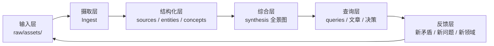

# 知识库现状诊断与知识飞轮设计

> 分析对象：`/home/weilan/workdir/selfcode/weilan-knowledge-wiki`  
> 分析时间：基于仓库当前文件结构与内容

---

## 一、现状：你已经拥有一个相当成熟的 LLM Wiki

你的知识库不是简单的笔记堆积，而是一个**有明确架构、有工作流、有综合产出**的知识系统。我看到的几个关键事实：

| 维度       | 现状                                                                             |
| -------- | ------------------------------------------------------------------------------ |
| **架构**   | Obsidian 式 LLM Wiki，raw/（原始输入）与 wiki/（结构化产物）分离                                 |
| **工作流**  | Ingest → Query → Lint 三环闭环，写在 `CLAUDE.md` 中                                    |
| **分类**   | sources / entities / concepts / synthesis / queries 五类页面                       |
| **规模**   | 约 39 个来源、70 个 wiki 页面、153 条 wiki-link                                          |
| **综合产出** | 8 个 synthesis 全景图，含 Mermaid 可视化                                                |
| **工具化**  | 4 个 Claude Code Skills（drawio-diagram / ljg-card / skill-creator / llm-ingest） |
| **版本管理** | Git 仓库，有 log.md 操作日志                                                           |

### 你目前做得好的地方

1. **raw/wiki 分离正确**  
   原始文章不可变，知识产物在 wiki 中可迭代。这是避免“收藏即遗忘”的关键。

2. **synthesis 层有战略价值**  
   你不只存摘要，还主动产出 `fastapi-ecosystem-landscape`、`claude-code-agent-ecosystem-landscape`、`ai-video-media-landscape` 等全景图。这是知识复利最核心的部分。

3. **Claude Code 技能化尝试**  
   把摄取流程写成 `.claude/skills/llm-ingest/SKILL.md`，说明你有把“知识管理”本身也工具化的意识。

---

## 二、当前存在的 5 个关键问题（不解决会卡住飞轮）

### 问题 1：Skills 与 CLAUDE.md 不同步

`llm-ingest` 技能描述的目录结构是 `wiki/comparisons/`，frontmatter 字段是 `title/confidence/last_ingested/sources/stale`；但实际 `CLAUDE.md` 和 `wiki/` 用的是 `synthesis/`、`queries/` 和 `type/created/updated/sources/tags`。

**后果**：Claude Code 加载 skill 后，生成的内容可能不符合你的实际规范，导致格式混乱、死链、索引遗漏。

### 问题 2：`wiki/queries/` 目录缺失，Index 中标注“暂无”

你的 CLAUDE.md 明确说“查询答案有复用价值时应归档为 query 页面”，但目录根本不存在。这意味着：
- 你向知识库提问后，答案没有沉淀下来；
- 同一个问题可能反复问、反复生成；
- 对话中的洞见没有进入 wiki 复利池。

### 问题 3：`raw/assets/` 为空，原始素材没有“待处理”状态

所有源文件已经在 `raw/archive/`，`raw/assets/` 不存在。这意味着：
- 没有“新文章待入库”的缓冲区；
- 你分不清哪些文章处理过、哪些没有；
- 批量自动化摄取难以触发（没有新增文件事件）。

### 问题 4：`README.md` 是空文件

仓库根目录 0 字节，外人或未来的你自己打开仓库不知道这是干什么、如何开始使用。

### 问题 5：缺少“检索层”

你的知识库目前依赖 Obsidian 图谱和人工浏览。但 70 页、153 条链接的规模下，已经很难靠人脑快速定位。你缺少：
- 基于向量/关键词的搜索；
- 自动标签/主题聚类；
- 按来源、时间、主题筛选的能力。

---

## 三、如何发挥这个知识库的能力（使用场景）

你的知识库已经可以用来做以下 4 类事：

### 1. 作为“研究副驾驶”：快速进入新领域

当你看到一个新的开源项目或技术趋势时，先问：

> “我的 wiki 里有没有类似的实体/概念？当前生态全景里它该放在哪一层？”

例如你看到一个新的 AI 视频工具，应该立刻对比 `ai-video-media-landscape` 里的能力光谱，判断它是“生成层、编辑层、控制层、分发层”中的哪一类，再决定要不要深入。

### 2. 作为“写作素材库”：避免重复调研

你已经在多个 synthesis 里画了全景图、做了对比表。今后写任何技术文章、做分享、做选型时，可以直接引用这些结论，而不是重新读 10 篇文章。

### 3. 作为“AI 协作的上下文”：让 LLM 更懂你

把 `CLAUDE.md` + `index.md` + 相关 synthesis 页面作为系统提示或 RAG 上下文喂给 Claude，可以让它：
- 知道你的分类习惯；
- 知道你已经掌握了哪些领域；
- 自动为新文章找到正确的实体/概念/synthesis 位置。

### 4. 作为“个人技术品牌”的源泉

你积累的不是零散剪藏，而是有结构的领域全景。这些全景图可以：
- 直接改写成公众号/博客文章；
- 生成 Mermaid 图用于演讲 PPT；
- 变成 GitHub 开源项目的技术文档或选型指南。

---

## 四、知识库如何管理：5 条具体建议

### 建议 1：立刻修复 Skills 与 CLAUDE.md 的一致性

有两个选择：

**方案 A（推荐）：以实际 `CLAUDE.md` 为准，重写 `llm-ingest` 技能。**
- 把技能里的 `comparisons/` 改为 `synthesis/`；
- 把 frontmatter 改为 `type/created/updated/sources/tags`；
- 把“必须翻译为中文”改成与你的 raw 一致的处理方式（你已经存的是中文原文）。

**方案 B**：如果 `llm-ingest` 是你从别处复制来的标准模板，那么应该把你的 wiki 目录改成和 skill 一致。但这样改动更大，不推荐。

### 建议 2：建立 `raw/assets/` 入库缓冲区，恢复“待处理”状态

把知识管理流程变成：

```
看到好文章 → 下载/复制到 raw/assets/ → 触发 Ingest → 移动到 raw/archive/
```

这样你可以：
- 批量知道“我堆积了多少篇没读”；
- 让脚本/LLM 自动扫描 `raw/assets/` 触发摄取；
- 避免把没处理过的文章直接丢进 archive 导致遗忘。

### 建议 3：创建 `wiki/queries/` 目录并养成归档习惯

每次向知识库提出一个“有复用价值的问题”后，让 Claude 把答案写成 `wiki/queries/<slug>.md`，frontmatter 类型为 `query`，并更新 `index.md`。

例如：
- “Claude Code 和 Cursor 应该怎么分工？”
- “FastAPI-Users 用 JWTStrategy 还是 DatabaseStrategy？”
- “做 AI 视频创业，应该选 MoneyPrinterTurbo 还是 ViMax？”

这些问题你很可能不只问一次，归档后就是永久资产。

### 建议 4：写一份活的 `README.md`

README 不需要很长，但必须回答：

```markdown
# weilan-knowledge-wiki

我的个人 LLM Wiki / 知识森林。用于沉淀技术文章、项目调研和跨领域综合。

## 快速开始

- 阅读全景：查看 `wiki/synthesis/`
- 按主题浏览：查看 `index.md`
- 了解工作流：阅读 `CLAUDE.md`
- 查看最新动态：查看 `log.md`

## 目录

- `raw/archive/`：原始文章（只读）
- `wiki/sources/`：来源摘要
- `wiki/entities/`：工具/项目/人
- `wiki/concepts/`：概念/方法/范式
- `wiki/synthesis/`：领域全景与跨领域分析
- `wiki/queries/`：可复用的问答归档

## 使用方式

1. 在 `raw/assets/` 放入新文章。
2. 在 Claude Code 中调用 `llm-ingest` 技能进行摄取。
3. 定期运行 `lint` 检查死链和孤立页面。
```

### 建议 5：引入轻量检索层（可选但关键）

当规模超过 100 页时，纯浏览会失效。可以逐步引入：

- **短期**：在 Claude Code 中使用 `grep` 或 `rg` 搜索关键词 + 读取相关页面；
- **中期**：用 Python 脚本生成 `wiki-tags.json` 和 `wiki-backlinks.json`，帮助 Claude 快速定位；
- **长期**：用 `obsidian-dataview` 或本地向量库（如 `chroma`、`sqlite-vss`）建立可搜索的索引。

---

## 五、知识飞轮设计：从“输入”到“复利”的闭环

知识飞轮的核心是：**每一次输入都要产生可复用的结构化资产，每一次输出都要催生新的输入问题。**

### 你的飞轮应该是这样转的



### 每一层的关键动作

| 飞轮环节 | 关键动作 | 输出物 | 复利点 |
|---------|---------|--------|--------|
| **输入** | 看到文章、论文、项目 → 丢进 `raw/assets/` | 待处理源文件 | 统一入口，不再散落 |
| **摄取** | 用 `llm-ingest` 技能处理，生成 source/entity/concept | 5-15 个关联 wiki 页 | 一次输入，多处受益 |
| **综合** | 每新增 3-5 个相关来源，审视是否需要更新/新增 synthesis | 领域全景图、对比分析 | 一张图抵十篇文章 |
| **查询** | 遇到问题时，先查 wiki 再提问；答案归档到 queries | 可复用问答页 | 不让洞见只留在对话里 |
| **输出** | 把 synthesis/queries 改写成文章、演讲、项目 | 公开内容、个人品牌 | 外部反馈反哺知识库 |
| **反馈** | 外界评论、新文章、新工具 → 发现现有知识矛盾或空白 | 新 raw/assets | 飞轮进入下一圈 |

### 让飞轮转起来的 3 个关键机制

**机制 1：摄取必须触发综合（你已经写在 CLAUDE.md 里了，但要执行）**

不要只生成 source 页面就结束。每次摄取后强制问三个问题：
1. 这个新来源属于哪个已有领域？应该更新哪个 synthesis？
2. 它是否挑战了现有结论？是否需要标注矛盾？
3. 它是否连接了两个之前不相关的领域？是否需要跨领域 synthesis？

**机制 2：查询必须归档（这是目前最大的缺口）**

每次你问 Claude 一个“需要翻 wiki 才能回答”的问题，如果答案好，就让它：
1. 创建 `wiki/queries/<slug>.md`；
2. 把答案结构化，引用相关 `[[source]]`、`[[concept]]`、`[[synthesis]]`；
3. 更新 `index.md`；
4. 追加 `log.md`。

**机制 3：输出必须反哺输入**

当你用 wiki 内容写了一篇文章或做了一个分享，把读者反馈、评论区问题、相关新文章再丢回 `raw/assets/`。这样你的知识库不是静态的，而是随着你的对外输出持续生长。

---

## 六、给你的下一步行动清单（按优先级）

### 本周做（修复基础）
- [ ] 重写 `llm-ingest/SKILL.md` 使其与 `CLAUDE.md` 完全一致
- [ ] 创建 `wiki/queries/` 目录
- [ ] 创建 `raw/assets/` 目录
- [ ] 写一份 `README.md`

### 本月做（建立习惯）
- [ ] 把最近 3 个向知识库提过的问题归档为 query 页面
- [ ] 建立“看到文章 → raw/assets/ → 触发 ingest”的固定流程
- [ ] 运行一次 `lint`：检查死链、孤立页面、缺失的实体/概念页

### 本季度做（放大价值）
- [ ] 把 8 个 synthesis 中的 2-3 个改写成公众号/博客文章
- [ ] 添加轻量检索：生成 `wiki/tags.json` + `wiki/backlinks.json`
- [ ] 让知识库开始接收外部反馈（发布、分享、讨论）

---

## 七、一句话总结

> 你的知识库已经是一棵成形的“知识树”，但还缺少“浇水系统”——query 归档、原始素材缓冲、skill 与规范的一致性、以及对外输出的管道。修好这四个环节，它就能从“资料库”变成“认知飞轮”。
