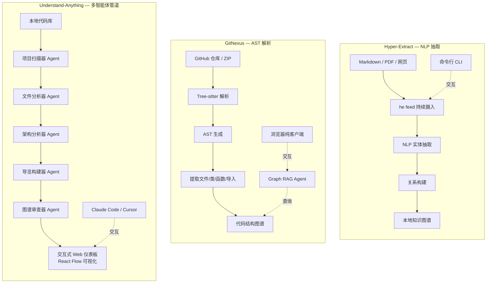
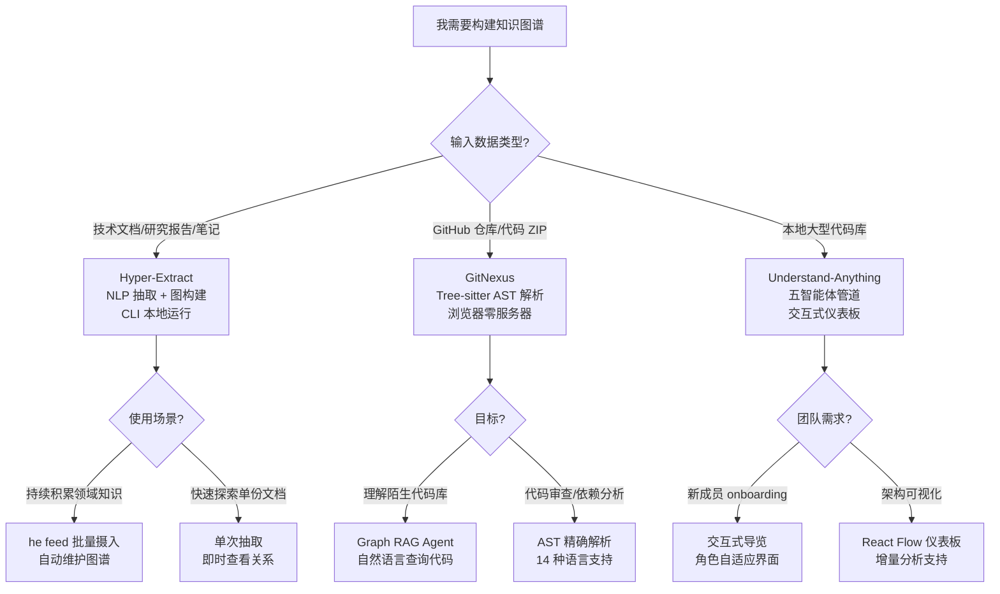

# 知识图谱构建工具选型对比

Hyper-Extract、GitNexus 和 Understand-Anything 三个工具都将非结构化信息转化为结构化知识图谱，但技术路线、输入类型和适用场景差异显著。

> 如需了解这些工具在完整知识检索领域中的位置，参见 [[rag-knowledge-retrieval-landscape]]。

## 核心定位速查

| 维度 | Hyper-Extract | GitNexus | Understand-Anything |
|------|---------------|----------|---------------------|
| **输入类型** | 杂乱文档（Markdown、PDF、网页等） | GitHub 仓库或 ZIP 文件 | 本地代码库 |
| **运行环境** | 命令行（CLI） | 浏览器（纯客户端） | Claude Code / Cursor 等 AI 编码平台 |
| **技术路线** | NLP 抽取 + 图构建 | Tree-sitter AST 解析 + Graph RAG | 五智能体管道 + React Flow 可视化 |
| **核心用户** | 研究人员、内容策展者 | 开发者、代码审查者 | 软件工程师、技术管理者 |
| **隐私模型** | 本地运行 | 纯客户端，零服务器 | 代码分析可能发送到 AI 服务 |

## 数据处理 Pipeline 对比

**Hyper-Extract** 侧重自然语言处理。通过 `he feed` 持续摄入文档，自动抽取实体和关系。优势在于处理非结构化文本（报告、论文、笔记），但不理解代码语义。

**GitNexus** 基于语法树解析。利用 Tree-sitter 生成 AST，提取文件、类、函数、导入关系等代码结构。支持 14 种编程语言，提供 Graph RAG Agent 用于代码探索。优势是精确理解代码依赖，劣势是仅限于代码输入。

**Understand-Anything** 采用多智能体协作。五个专用 Agent（项目扫描器→文件分析器→架构分析器→导览构建器→图谱审查器）分工完成代码分析，输出交互式 Web 仪表板（React Flow）。支持增量分析和角色自适应界面，但主要针对 TypeScript/JavaScript 生态优化。

## 选型决策树

- **处理技术文档/研究报告** → Hyper-Extract
- **探索陌生代码库/代码审查** → GitNexus（零服务器，直接丢仓库即可）
- **深度理解大型项目/团队 onboarding** → Understand-Anything（交互式 + 自然语言问答）

三者并非互斥：可以用 Hyper-Extract 构建领域知识图谱，用 GitNexus 理解代码结构，用 Understand-Anything 进行代码库的深度交互探索。
