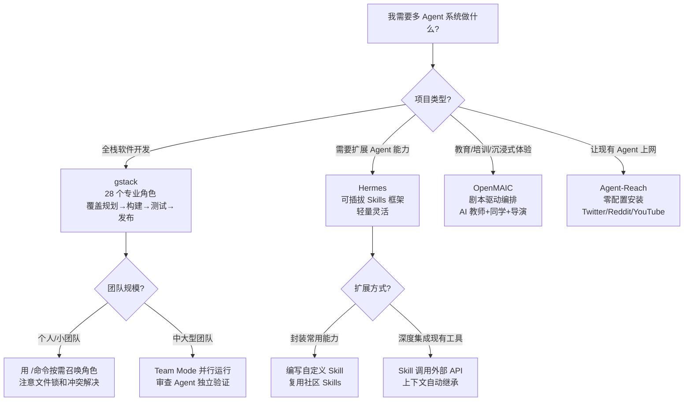

# 多 Agent 协作架构对比

gstack、Hermes、OpenMAIC 和 Agent-Reach 代表了多 Agent 系统的四种不同设计哲学：工程团队模拟、技能插件化、教育场景编排、能力边界扩展。

## 四方定位

| 维度 | gstack | Hermes | OpenMAIC | Agent-Reach |
|------|--------|--------|----------|-------------|
| **设计目标** | 将 Claude Code 变成完整虚拟工程团队 | 提供可扩展的 Agent Skills 体系 | 多 Agent 沉浸式互动课堂 | 给任意 AI Agent 装上互联网能力 |
| **角色数量** | 28 个专业角色（/命令触发） | 灵活的 Skills 体系（自定义） | AI 教师 + AI 同学 + AI 导演 | 无固定角色，纯工具集 |
| **协作模式** | Team Mode（主从 + 并行） | 子 Agent 调用（嵌套） | 多角色剧本编排 | 无协作，单个 Agent 调用工具 |
| **通信机制** | Agent 间消息传递 + 共享状态 | Skill 间上下文继承 | 剧本驱动的角色互动 | 直接调用上游 CLI 工具 |
| **部署形态** | Claude Code Skill | 本地 Agent 框架 | 一键部署的教育平台 | 开源 CLI 脚手架 |

## 架构深度对比

### 四方架构横向对比

```mermaid
flowchart TB
    subgraph gstack["gstack — 虚拟工程团队"]
        direction TB
        G1[规划 Agent] --> G2[前端 Agent | 后端 Agent | DevOps Agent]
        G2 --> G3[测试 Agent]
        G3 --> G4[发布 Agent]
        G5[审查 Agent] -.-> G2
        G6[共享状态 / 文件锁] -.-> G2
    end

    subgraph Hermes["Hermes — 技能插件化"]
        direction TB
        H1[核心 Agent] --> H2{需要何种能力?}
        H2 --> H3[Skill A: 代码审查]
        H2 --> H4[Skill B: 文档生成]
        H2 --> H5[Skill C: 测试执行]
        H3 -. 上下文继承 .-> H1
        H4 -. 上下文继承 .-> H1
        H5 -. 上下文继承 .-> H1
    end

    subgraph OpenMAIC["OpenMAIC — 教育剧本编排"]
        direction TB
        O1[剧本引擎] --> O2[AI 教师]
        O1 --> O3[AI 同学]
        O1 --> O4[AI 导演]
        O2 <-- 情境对话 --> O3
        O4 -. 节奏控制 .-> O2
        O4 -. 节奏控制 .-> O3
    end

    subgraph AgentReach["Agent-Reach — 单 Agent 能力扩展"]
        direction TB
        A1[单个 Agent] --> A2{访问哪个平台?}
        A2 --> A3[Twitter Channel]
        A2 --> A4[Reddit Channel]
        A2 --> A5[YouTube Channel]
        A3 --> A6[互联网内容]
        A4 --> A6
        A5 --> A6
    end
```

**gstack —— 工程团队的 Agent 化**

Garry Tan 将软件工程团队的完整流程（规划→构建→测试→发布）映射为 28 个可召唤的 Agent 角色。关键创新是 **Team Mode**：多个 Agent 实例并行运行，前端/后端/DevOps Agent 同时工作。这需要解决冲突（文件锁）、接口契约（API 定义先达成一致）和验证循环（独立审查 Agent）。gstack 的本质是「用 Agent 模拟人类团队协作」。

**Hermes —— 技能即 Agent**

Hermes 的设计理念相反：不是预定义 28 个角色，而是提供一个可扩展的 Skills 框架。每个 Skill 是一个独立的能力包，Agent 根据需要动态加载。这更像「插件化」而非「团队化」。优势是轻量和灵活，劣势是缺乏 gstack 那样开箱即用的完整工程流程。

**OpenMAIC —— 剧本驱动的教育编排**

清华大学的 OpenMAIC 将多 Agent 协作应用于教育场景。AI 教师、AI 同学、AI 导演等角色按剧本互动，生成沉浸式学习体验。这与 gstack 的「工程任务分解」截然不同——OpenMAIC 的协作目标是**体验设计**而非**产出交付**。角色间的通信不是基于文件和 API，而是基于教育剧本和情境对话。

**Agent-Reach —— 不是多 Agent，是给单 Agent 扩展能力**

Agent-Reach 严格来说不属于多 Agent 系统。它不定义多个协作角色，而是为**单个 Agent** 提供读取互联网内容的能力（Twitter、Reddit、YouTube 等）。但它的可插拔架构（每个平台一个独立 channel 文件）体现了多 Agent 系统的设计思想——模块化、可替换、零耦合。Agent-Reach 的价值在于证明：**Agent 的能力边界可以通过标准化的工具集无限扩展**。

## 共同模式与趋势

1. **从「单一大模型」到「专业化分工」**：无论是 28 个角色还是 Skills 插件，核心趋势都是让 Agent 在特定领域深度专精，而非追求通用性。
2. **可插拔架构成为共识**：gstack 的角色、Hermes 的 Skills、Agent-Reach 的 channels 都支持替换和扩展。
3. **上下文管理是瓶颈**：多 Agent 系统的最大挑战不是任务分配，而是如何在多个独立上下文中保持全局一致性。

## 选型建议



- **全栈项目开发** → gstack（28 角色覆盖完整工程链路）
- **自定义 Agent 能力扩展** → Hermes（灵活的 Skills 框架）
- **教育/培训场景** → OpenMAIC（剧本驱动的沉浸式体验）
- **让现有 Agent 获得互联网能力** → Agent-Reach（零配置，一句话安装）
