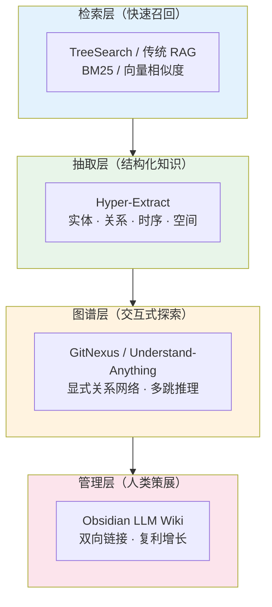

# RAG 与知识检索领域全景

知识检索领域正在经历从"找得到"到"看得清"再到"管得住"的范式跃迁。本页将散落的技术路线编织为一张全景图，展示从简单检索到结构化知识网络的技术演进、各方法的适用边界，以及知识管理工具的互补关系。

---

## 领域概览：四个层次

知识检索领域可按处理深度分为四个层次，每层解决不同的问题：

| 层次 | 核心问题 | 代表方案 | 关键词 |
|------|---------|---------|--------|
| **检索** | 从大量文档中快速召回相关内容 | [[treesearch-retrieval]]、传统向量 RAG | 速度、召回率 |
| **抽取** | 将非结构化文本转化为结构化知识 | [[hyper-extract]] | 实体、关系、图谱 |
| **图谱** | 用显式关系网络支持推理与探索 | [[gitnexus]]、[[understand-anything-mcp]] | 可视化、多跳推理 |
| **管理** | 人类策展 + AI 辅助的持久知识运营 | [[obsidian]] LLM Wiki | 双向链接、复利增长 |

这四个层次并非替代关系，而是**能力叠加**——一个完整的知识系统往往需要同时覆盖多个层次。

### Mermaid 能力叠加图



---

## 技术演进脉络

### Mermaid 技术演进图

```mermaid
flowchart LR
    subgraph S1["第一阶段：传统 RAG"]
        direction TB
        S1A["向量嵌入 + ANN 搜索"]
        S1B["语义相似度替代精确匹配"]
        S1C["代表：向量数据库 + OpenAI Embedding"]
    end

    subgraph S2["第二阶段：NLP 文档抽取"]
        direction TB
        S2A["LLM 直接输出结构化知识"]
        S2B["8 种格式 / 80+ 领域模板"]
        S2C["代表：Hyper-Extract"]
    end

    subgraph S3["第三阶段：代码知识图谱"]
        direction TB
        S3A["Tree-sitter AST + Graph RAG"]
        S3B["交互式可视化 + 多跳推理"]
        S3C["代表：GitNexus / Understand-Anything"]
    end

    subgraph S4["第四阶段：人类策展知识管理"]
        direction TB
        S4A["双向链接 + 知识图谱视图"]
        S4B["人类主导 / AI 辅助 / 复利增长"]
        S4C["代表：Obsidian LLM Wiki"]
    end

    S1 --> S2
    S2 --> S3
    S3 --> S4

    style S1 fill:#e3f2fd
    style S2 fill:#e8f5e9
    style S3 fill:#fff3e0
    style S4 fill:#fce4ec
```



### 第一阶段：传统 RAG —— 向量检索的崛起与反思

[[rag]]（检索增强生成）通过向量嵌入 + 近似最近邻搜索，让大模型能够"查阅"外部知识。这是当前最主流的知识检索范式，核心假设是**语义相似度可以替代精确匹配**。

但向量检索存在结构性盲区：
- 文档被切分为文本块，丢失原始层级结构（法律条款的层级、代码的 AST）
- 依赖昂贵的嵌入 API 和向量数据库
- 对精确匹配场景（法条编号、函数名）表现不佳

[[treesearch-retrieval]] 代表了一条"回归本质"的反潮流路线：完全放弃向量模型，仅用 SQLite FTS5 + BM25 实现毫秒级检索，同时保留文档的原始树状结构。在 1000 万文档的法条库场景中，成本仅为传统 RAG 的 1/1000。

> **演进信号**：检索技术开始分化——语义检索覆盖开放问答，结构感知检索覆盖精确匹配。

### 第二阶段：NLP 文档抽取 —— 从文本到图谱

[[hyper-extract]] 将知识检索向前推进一步：不是检索原始文本，而是让 LLM 直接输出结构化知识。它支持 8 种提取格式（知识图谱、时序图、超图、空间图等），内置 80+ 领域模板，覆盖金融、法律、医学、中医、工业等场景。

核心假设是**"结构化知识比原始文本更有价值"**。通过 `he feed` 命令持续追加新文档，知识图谱可以动态生长。底层集成了 KG-Gen、GraphRAG、LightRAG、Hyper-RAG 等 10 余种前沿算法，自动选择最优方法。

> **演进信号**：检索的对象从"文本片段"升级为"知识三元组"，为后续推理奠定基础。

### 第三阶段：代码知识图谱 —— 从自然语言到编程语言

代码是一种高度结构化的"文本"，其依赖关系、调用链、继承层次天然适合图谱表示。这一领域出现了两条并行路线：

**浏览器端零服务器路线：[[gitnexus]]**
- 拖入 GitHub 仓库或 ZIP 文件即可在浏览器内生成交互式代码知识图谱
- 六阶段索引流水线：Structure → Parsing（Tree-sitter AST）→ Resolution → Clustering（Leiden）→ Processes → Search
- 预计算关系智能：在索引时完成聚类、调用链追踪和置信度评分，避免传统 Graph RAG 的多轮查询问题
- 支持 14 种编程语言，提供 MCP 集成供 AI Agent 调用

**AI 平台深度交互路线：[[understand-anything-mcp]]**
- 五智能体管道（项目扫描器→文件分析器→架构分析器→导览构建器→图谱审查器）
- 输出交互式 Web 仪表板（React Flow），支持自然语言问答（`/understand-chat`）和变更影响分析（`/understand-diff`）
- 角色自适应界面：初级开发者获得引导式教程，高级开发者获得架构洞察
- 增量分析优化，主要针对 TypeScript/JavaScript 生态

> **演进信号**：代码知识图谱从"静态可视化"走向"交互式探索"和"AI 驱动的智能问答"。

### 第四阶段：人类策展的知识管理 —— 从自动化到复利

[[obsidian]] 代表了知识检索的另一极：**人类主导、AI 辅助的持久知识运营**。它不是自动化工具，而是"认知基础设施"——通过双向链接、知识图谱视图和 LLM Wiki 模式，让人类负责策展和方向，AI 负责簿记和执行。

Karpathy 提出的 LLM Wiki 模式（`raw/` → `wiki/` → `index.md` + `log.md`）与本仓库的实践，展示了知识检索的终极形态：不是一次性查询，而是**可复利增长的结构化知识网络**。

> **演进信号**：知识检索的终点不是"找到答案"，而是"构建一个越用越聪明的知识系统"。

---

## 方法对比矩阵

| 维度 | TreeSearch | Hyper-Extract | GitNexus | Understand-Anything | Obsidian LLM Wiki |
|------|-----------|---------------|----------|---------------------|-------------------|
| **数据类型** | 结构化文档（Markdown、代码、JSON/XML） | 非结构化文本（报告、论文、新闻） | 代码库（14 种语言） | 代码库（TS/JS 优先） | 任意 Markdown 笔记 |
| **核心机制** | BM25 + 结构感知索引 | LLM 抽取 → 知识图谱 | Tree-sitter AST + Graph RAG | 五智能体管道 + React Flow | 双向链接 + 人类策展 |
| **自动化程度** | 全自动索引 | 单命令全自动 | 拖入即生成 | 命令触发分析 | 人类主导，AI 辅助 |
| **运行环境** | 本地 CLI | 本地 CLI | 浏览器（零服务器） | Claude Code / Cursor 等平台 | 本地桌面 + 插件 |
| **成本** | 极低（仅存储） | 中（LLM API） | 零（客户端运行） | 中（LLM API） | 低（本地优先） |
| **隐私** | 完全本地 | 本地运行 | 纯客户端 | 代码可能发往 AI 服务 | 完全本地 |
| **可解释性** | 高（精确匹配） | 中（结构化输出） | 高（显式依赖图） | 高（交互式可视化） | 高（人工 curated） |
| **最佳场景** | 法条库、医学文献、代码搜索 | 领域报告、研究综述 | 陌生代码库探索、代码审查 | 大型项目理解、团队 onboarding | 个人/团队长期知识积累 |
| **主要局限** | 不支持语义理解 | 非代码内容 | 浏览器内存限制（约 5k 文件） | TS/JS 生态优先 | 依赖人类投入 |

### 五维能力定位图

由于 Mermaid 不支持雷达图，以下用表格 + 箭头标注各方案在五个维度的相对定位（箭头方向表示优势方向）：

| 维度 | TreeSearch | Hyper-Extract | GitNexus | Understand-Anything | Obsidian LLM Wiki |
|------|-----------|---------------|----------|---------------------|-------------------|
| **精确性** | 高 ↑↑ | 中 ↑ | 高 ↑↑ | 高 ↑↑ | 高 ↑↑ |
| **自动化** | 高 ↑↑ | 高 ↑↑ | 高 ↑↑ | 中 ↑ | 低 ↓ |
| **可解释性** | 高 ↑↑ | 中 ↑ | 高 ↑↑ | 高 ↑↑ | 极高 ↑↑↑ |
| **成本** | 极低 ↓↓ | 中 → | 零 ↓↓ | 中 → | 低 ↓ |
| **隐私** | 完全本地 ↑↑ | 本地运行 ↑↑ | 纯客户端 ↑↑ | 可能外发 ↓ | 完全本地 ↑↑ |

> **定位解读**：
> - **TreeSearch** 和 **GitNexus** 在"精确性-成本-隐私"三角上表现最优，适合大规模文档和代码的本地处理。
> - **Hyper-Extract** 以中等成本换取结构化知识输出，是"自动化"与"可解释性"之间的平衡点。
> - **Understand-Anything** 牺牲部分隐私和自动化，换取交互式深度探索能力。
> - **Obsidian LLM Wiki** 在"可解释性"上独一档，但依赖人类投入，是长期知识积累的终极形态。

---

## 互补关系与组合方案

这些工具并非互斥，实际知识管理工作流中往往组合使用：

### 理想知识系统组件结构

```
ideal-knowledge-system/
├── ingestion/                    # 知识入库层
│   ├── raw/                      # 原始文档（文章、论文、转录稿）
│   ├── extractors/               # 结构化抽取（Hyper-Extract）
│   └── importers/                # 批量导入工具
├── indexing/                     # 索引与检索层
│   ├── fulltext/                 # 精确检索（TreeSearch / SQLite FTS5）
│   ├── vector/                   # 语义检索（向量数据库）
│   └── graph/                    # 图谱索引（代码知识图谱）
├── exploration/                  # 交互式探索层
│   ├── visualizer/               # 可视化引擎（React Flow / Obsidian Graph）
│   ├── query-engine/             # 多跳推理查询
│   └── mcp-server/               # AI Agent 调用接口
├── curation/                     # 人类策展层
│   ├── wiki/                     # 结构化 Markdown 页面
│   ├── index.md                  # 内容目录
│   └── log.md                    # 时间线记录
└── interfaces/                   # 用户界面层
    ├── obsidian-vault/           # 本地桌面端（完全本地）
    ├── web-dashboard/            # 浏览器端（GitNexus 模式）
    └── cli/                      # 命令行工具（Hyper-Extract / TreeSearch）
```

### 组合方案一：技术文档 + 代码理解（开发者场景）

1. 用 **Hyper-Extract** 将技术文档、API 规范、设计论文转化为领域知识图谱
2. 用 **GitNexus** 快速理解项目代码结构和依赖关系（零服务器，拖入即用）
3. 用 **Understand-Anything** 进行深度代码探索和变更影响分析
4. 用 **Obsidian** 记录架构决策、技术选型理由和团队约定（人类 curated 的隐性知识）

### 组合方案二：精确检索 + 语义探索（研究者场景）

1. 用 **TreeSearch** 建立大规模文档库的快速精确检索（法条、论文、实验记录）
2. 用 **Hyper-Extract** 从核心文献中抽取知识图谱，发现领域内的实体关系
3. 用 **Obsidian** 维护研究笔记，将抽取的知识与个人观点、实验观察链接起来

### 组合方案三：AI 记忆 + 人类 Wiki（协作场景）

[[ai-memory-vs-human-km]] 已经论证了 Claude Code 文件式记忆系统与 Obsidian LLM Wiki 的互补性：
- **AI 记忆系统**解决短期协作的上下文连续性（用户偏好、项目背景）
- **Obsidian Wiki**解决长期知识的复利积累（架构演进、综合结论、跨领域关联）

理想工作流：Claude Code 的 `feedback` 和 `project` 记忆自动同步到 Obsidian wiki，由人类进行更高层的综合和策展。

---

## 从 RAG 到知识网络的演进趋势

向量检索 → 知识图谱增强 → 交互式探索 → 人类策展

这个演进路径说明了三个深层趋势：

1. **从隐式到显式**：向量检索的相似度是黑盒的，知识图谱的关系是显式可解释的。随着对可解释性和推理能力的需求增长，显式结构化知识的价值在上升。

2. **从静态到动态**：早期 RAG 是"索引一次，查询多次"；现代工具（GitNexus 的实时影响分析、Understand-Anything 的增量分析、Hyper-Extract 的 `he feed`）都支持知识的动态生长和实时更新。

3. **从自动化到人机协作**：完全自动化的知识抽取可以处理大规模数据，但无法替代人类的判断、综合和策展。Obsidian LLM Wiki 模式表明，最高价值的知识网络需要人类定义方向、AI 负责执行。

---

## 关键概念速查

- [[rag]] —— 检索增强生成的核心流程与适用场景
- [[knowledge-graph]] —— 实体-关系模型、与向量检索的对比、代码知识图谱特化
- [[agent-memory-system]] —— AI Agent 的四类结构化记忆与文件式存储架构
- [[ai-memory-vs-human-km]] —— Claude Code 记忆系统与 Obsidian Wiki 的趋同与分野
- [[knowledge-graph-tools-comparison]] —— Hyper-Extract / GitNexus / Understand-Anything 的选型对比

---

## 相关来源

- [[treesearch-retrieval]] —— TreeSearch：让文档检索回归本质
- [[hyper-extract]] —— Hyper-Extract：一条命令将杂乱文档转为知识图谱
- [[gitnexus]] —— GitNexus：浏览器端代码知识图谱生成器
- [[understand-anything-mcp]] —— Understand-Anything：代码库转交互式知识图谱
- [[obsidian-knowledge-base]] —— 个人如何用 Obsidian 搭建本地知识库
