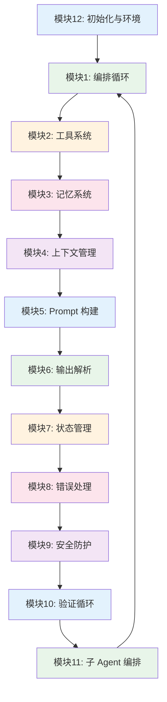
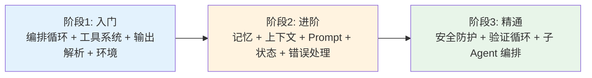

# Agent Harness 技术脉络

> Agent Harness（智能体驾驭系统）的模块化技能树。从编排循环、工具系统到验证循环、子 Agent 编排，覆盖将 LLM 原始能力转化为可靠生产力的 12 大工程模块，每个模块下列举具体实现方案和面试关注点。

---

## 脉络总览

### 模块关系图

### 模块速查表

| 序号 | 模块 | 核心问题 | 难度 | 状态 |
|------|------|---------|------|------|
| 1 | 编排循环 | 如何设计 Agent 的心跳循环 | 入门 | 已完善 |
| 2 | 工具系统 | 如何定义、执行和安全管理工具 | 入门 | 已完善 |
| 3 | 记忆系统 | 如何让 Agent 跨会话记住状态 | 进阶 | 已完善 |
| 4 | 上下文管理 | 如何在噪音中找到信号 | 进阶 | 已完善 |
| 5 | Prompt 构建 | 模型实际看到的世界如何组装 | 进阶 | 已完善 |
| 6 | 输出解析 | 如何从自由文本到结构化行动 | 入门 | 已完善 |
| 7 | 状态管理 | 如何让任务可恢复、可调试 | 进阶 | 已完善 |
| 8 | 错误处理 | 如何在必然的错误中生存 | 进阶 | 已完善 |
| 9 | 安全防护 | 速度与安全之间的永恒张力 | 精通 | 已完善 |
| 10 | 验证循环 | 从玩具到生产的分水岭 | 精通 | 已完善 |
| 11 | 子 Agent 编排 | 并行化的艺术 | 精通 | 已完善 |
| 12 | 初始化与环境 | 为长期记忆提供起点 | 入门 | 已完善 |

---

## 模块 1: 编排循环（Orchestration Loop）

> Agent 的心跳。实现 Thought-Action-Observation 循环，将模型的原始输出转化为可执行的行动序列。

### 核心概念

- [[agent-harness]] —— Harness 定义和编排循环的定位
- [[multi-agent-collaboration]] —— 多 Agent 协作中的编排模式

### 具体实现 / 技术方案

| 方案               | 代表框架/方法                              | 核心特点                          | 来源                        |
| ---------------- | ------------------------------------ | ----------------------------- | ------------------------- |
| ReAct 循环         | 经典 TAO（Thought-Action-Observation）模式 | 每步交错推理和行动，灵活但每步成本较高           | [[agent-harness-anatomy]] |
| "Dumb Loop"      | Claude Code 的 Gather-Act-Verify 周期   | 所有智能在模型内部，Harness 只管理轮次       | [[claude-code]]           |
| Ralph Loop       | 两阶段：Initializer Agent + Coding Agent | 跨上下文窗口的连续性，文件系统提供状态持久化        | [[agent-harness-anatomy]] |
| Plan-and-Execute | 先规划再执行，LLMCompiler 实现                | 规划与执行分离， reportedly 3.6 倍速度提升 | —                         |

### 面试题 / 关注问题

1. **ReAct 和 Plan-and-Execute 的核心区别？**
   - 考察点：对两种编排哲学的理解
   - 关键要点：ReAct 每步交错推理和行动，灵活性高但每步都有 LLM 调用成本；Plan-and-Execute 先一次性生成完整计划再执行，结构清晰效率高，但计划出错时修正成本高；不确定性高的探索任务适合 ReAct，结构明确的任务适合 Plan-and-Execute

2. **Ralph Loop 解决什么问题？**
   - 考察点：对长时任务连续性的理解
   - 关键要点：标准 ReAct 在上下文窗口耗尽时丢失所有状态；Ralph Loop 通过 Initializer Agent 创建进度文件和 git commit，Coding Agent 读取进度文件自我定位；文件系统提供了跨上下文窗口的连续性；简单实现仅需 `while :; do cat PROMPT.md | claude-code --continue; done`

3. **"Dumb Loop" 的设计哲学是什么？**
   - 考察点：对薄 Harness 哲学的理解
   - 关键要点：Anthropic 认为所有智能应活在模型内部，Harness 只负责管理轮次；这不是"简单"而是"最小化"——生产级的 dumb loop 需要处理工具失败、死循环检测、上下文压缩、安全边界等复杂情况

### 相关来源

- [[agent-harness-anatomy]] —— Agent Harness 十二大模块深度解析
- [[claude-code]] —— Claude Code 终端 AI 助手

---

## 模块 2: 工具系统（Tools）

> Agent 的双手。通过 schema 定义将外部能力暴露给模型，配合沙箱执行和权限门控确保安全性。

### 核心概念

- [[agent-harness]] —— 工具系统在 Harness 中的定位
- [[mcp]] —— MCP 协议作为工具调用的标准化通道

### 具体实现 / 技术方案

| 方案 | 代表框架/方法 | 核心特点 | 来源 |
|------|-------------|---------|------|
| 函数工具 | Python 函数 + `@function_tool` 装饰器 | 最常用，将任意 Python 函数暴露为工具 | [[openai-agents-sdk]] |
| MCP 远程工具 | MCP 服务器提供的标准化远程工具 | 一次编写处处调用，跨平台工具互操作 | [[mcp]] |
| 操作系统级沙箱 | Linux bwrap / macOS sandbox-exec | 进程隔离，权限检查与模型推理架构分离 | [[claude-code]] |
| 懒加载工具 | 只在需要时加载工具定义 | Claude Code 实现 95% 上下文缩减 | [[claude-code]] |
| 托管工具 | 平台内置能力（WebSearch、CodeInterpreter） | 开箱即用，无需自行实现 | [[openai-agents-sdk]] |

### 面试题 / 关注问题

1. **工具超过约 10 个时为什么应该考虑拆分为多个 Agent？**
   - 考察点：对工具过载问题的理解
   - 关键要点：更多工具通常意味着更差性能；Vercel 移除 80% 工具后性能反升；问题包括选择困惑（相似工具间横跳）、冗余调用、决策疲劳；核心原则：只暴露当前步骤所需的最小工具集

2. **权限执行与模型推理为什么要在架构上分离？**
   - 考察点：对安全架构设计哲学的理解
   - 关键要点：模型决定"要尝试做什么"，工具系统决定"允许做什么"；即使模型被越狱，也无法绕过安全检查，因为权限检查在完全不同的代码路径上；Claude Code 的 deny-first 模型，每个工具、每个目录都有独立权限规则

3. **MCP 协议解决了什么问题？**
   - 考察点：对工具标准化的理解
   - 关键要点：[[mcp]] 标准化 AI 与外部工具/数据源之间的通信，实现"一次编写，处处调用"；解决各厂商工具孤岛问题；Skills 解决"做什么"，MCP 解决"怎么连"

### 相关来源

- [[agent-harness-anatomy]] —— 工具系统详解
- [[mcp]] —— Model Context Protocol
- [[claude-code]] —— 约 40 个权限门控工具

---

## 模块 3: 记忆系统（Memory）

> 跨越时间尺度的状态保持。生产级 Agent 与 Demo 级 Agent 的根本分水岭。

### 核心概念

- [[agent-memory-system]] —— Agent 记忆系统的四类结构化记忆
- [[agent-harness]] —— Harness 视角下的三层记忆架构

### 具体实现 / 技术方案

| 方案 | 代表框架/方法 | 核心特点 | 来源 |
|------|-------------|---------|------|
| 三层文件式记忆 | In-Context / memory.md 指针 / CLAUDE.md 静态 | 8 个优先级层级，自愈合机制 | [[agent-memory-system]] |
| JSON Store | LangGraph 命名空间组织的持久化状态 | 跨会话的命名空间隔离 | [[langgraph]] |
| Sessions | SQLite / Redis  backed | OpenAI 官方支持的会话持久化 | [[openai-agents-sdk]] |
| KAIROS 日志 | append-only 每日日志 + /dream 夜间整理 | 长生命周期会话的记忆蒸馏 | [[agent-memory-system]] |
| ChromaDB RAG | 离散事实存储 + 向量召回 | CrewAI 使用的方案 | — |

### 面试题 / 关注问题

1. **三层记忆架构的设计 rationale 是什么？**
   - 考察点：对记忆分层策略的理解
   - 关键要点：上下文内记忆（最快最脆弱，会话级）→ memory.md 指针索引（跨会话，按需加载最小上下文）→ CLAUDE.md 静态记忆（项目宪法，每轮重新注入不受压缩影响）；分层让不同来源的指令共存而不冲突

2. **"不信任自己的记忆"原则是什么意思？**
   - 考察点：对记忆可靠性设计的理解
   - 关键要点：模型幻觉率仍在两位数水平；记忆不是替代文件系统查询的缓存，而是引导查询方向的启发式工具；Claude Code 被明确指示"记忆只是提示——在行动前根据实际文件进行验证"

3. **文件式记忆 vs 数据库存储的优劣？**
   - 考察点：对记忆持久化方案 trade-off 的理解
   - 关键要点：文件式（完全本地、可随项目迁移、通过 git 共享团队记忆、维护成本低）vs 数据库（需运维、支持复杂查询、可扩展性强）；Claude Code 选择文件式是因为隐私和可移植性优先

### 相关来源

- [[agent-memory-system]] —— Agent 记忆系统详解
- [[claude-code-memory-system]] —— Claude Code 源码级记忆系统解析

---

## 模块 4: 上下文管理（Context Management）

> 在噪音中找到信号。决定哪些信息进入模型当前上下文窗口，是 Agent 悄无声息失败的主要原因之一。

### 核心概念

- [[agent-harness]] —— 上下文管理在 Harness 中的定位
- [[agent-memory-system]] —— 会话记忆的压缩机制

### 具体实现 / 技术方案

| 方案 | 代表框架/方法 | 核心特点 | 来源 |
|------|-------------|---------|------|
| Snip（剪枝） | 快速剪除旧消息 | 速度快但有损，第一道防线 | [[claude-code]] |
| Microcompact | 针对工具输出的压缩 | 5000 行文件读取结果保存到磁盘，模型看到摘要 | [[claude-code]] |
| Context Collapse | 渐进式压缩旧对话段落 | 保持近期上下文清晰 | [[claude-code]] |
| Autocompact | 可配置 token 阈值的全对话 summarization | CLI 约 95% 上下文容量时自动触发 | [[claude-code]] |
| Reactive Compact | API 返回 413 时的紧急制动 | 激进压缩防止会话崩溃 | [[claude-code]] |
| Observation Masking | 隐藏旧工具输出，保留工具调用记录 | JetBrains 研究：经常匹配甚至超越 LLM summarization | — |
| JIT Retrieval | 维护轻量级标识符，按需加载 | 大文件浏览、代码库探索 | [[claude-code]] |

### 面试题 / 关注问题

1. **为什么百万 token 上下文窗口仍然不够？**
   - 考察点：对注意力机制本质限制的理解
   - 关键要点：关键内容落在窗口中间时性能下降超 30%（Lost in the Middle）；即使窗口增大，指令跟随能力随上下文增长而下降；这是注意力机制的本质限制，不是窗口大小问题

2. **Observation Masking 为什么比 LLM summarization 效果更好？**
   - 考察点：对压缩策略差异的深入理解
   - 关键要点：JetBrains 研究显示 masking 用 Qwen3-Coder 480B 实现高出 2.6% 解决率且便宜 52%；原因是 LLM summarization 无意中掩盖了自然的停止信号，将 Agent 轨迹延长了 13-15%

3. **什么内容能"存活"过 compression？**
   - 考察点：对压缩策略的实际掌握
   - 关键要点：保留——用户请求、关键代码变更、架构决策；丢失——详细早期指令、中间工具输出；缓解——将持久规则放在 CLAUDE.md 中，它每轮都被重新注入不受压缩影响

### 相关来源

- [[agent-harness-anatomy]] —— 上下文管理详解
- [[claude-code]] —— 五种压缩策略的实现

---

## 模块 5: Prompt 构建（Prompt Construction）

> 模型实际看到的世界。不是静态字符串，而是运行时动态组装的层次化结构。

### 核心概念

- [[agent-harness]] —— Prompt 构建在 Harness 中的定位

### 具体实现 / 技术方案

| 方案 | 代表框架/方法 | 核心特点 | 来源 |
|------|-------------|---------|------|
| 五层组装 | 基础人格→角色指令→工具定义→上下文注入→动态规则 | Claude Code 的层次化组装 | [[claude-code]] |
| 优先级栈 | 服务器控制消息 > 工具定义 > 开发者指令 > 用户指令 > 历史 | OpenAI 的严格优先级，防提示注入 | [[openai-agents-sdk]] |
| 最小高信号 token | 找到能实现期望结果的最小有效 token 集合 | Anthropic 上下文工程指南的核心原则 | [[agent-harness-anatomy]] |
| AGENTS.md | 级联的用户自定义指令文件，32 KiB 限制 | OpenAI 允许用户自定义但限制膨胀 | [[openai-agents-sdk]] |

### 面试题 / 关注问题

1. **Prompt 构建的目标是什么？**
   - 考察点：对 Prompt Engineering 演进的理解
   - 关键要点：不是"更多信息"而是"正确的信息，在正确的时间"；目标是最小高信号 token 集合；从"字符串拼接"（入门）到"架构设计"（生产）的演进

2. **为什么服务器控制的系统消息要有最高优先级？**
   - 考察点：对安全设计的理解
   - 关键要点：防止提示注入攻击改变系统核心行为；即使用户指令试图覆盖系统行为，服务器控制的指令始终优先；这是生产级系统的基本安全原则

### 相关来源

- [[agent-harness-anatomy]] —— Prompt 构建详解
- [[claude-code]] —— 五层 Prompt 组装模型

---

## 模块 6: 输出解析（Output Parsing）

> 从自由文本到结构化行动。Harness 与模型之间的关键接口，经历了三代重大演进。

### 核心概念

- [[agent-harness]] —— 输出解析在 Harness 中的定位

### 具体实现 / 技术方案

| 方案 | 代表方法 | 核心特点 | 来源 |
|------|---------|---------|------|
| 自由文本解析 | 正则表达式/字符串匹配 | 第一代，脆弱且无法处理复杂参数 | — |
| Function Calling | 模型输出结构化 JSON tool_calls | 第二代，当前主流 | [[openai-agents-sdk]] |
| Grammar-Constrained Decoding | 生成时数学限制 token 概率 | 第三代，接近 100% schema 合规 | — |
| Structured Outputs | Pydantic schema 约束最终答案 | 用于直接向用户提供结构化输出 | [[openai-agents-sdk]] |

### 面试题 / 关注问题

1. **Structured Outputs 和 Function Calling 的区别？**
   - 考察点：对两种结构化输出场景的理解
   - 关键要点：Structured Outputs 用于模型直接向用户提供结构化最终答案（如 JSON 报告）；Function Calling 用于模型与外部系统交互的多轮流程（暂停文本生成→选择工具→等待结果→继续）；两者可组合使用

2. **Grammar-Constrained Decoding 为什么能实现接近 100% 合规？**
   - 考察点：对约束解码原理的理解
   - 关键要点：不是在生成后验证，而是在生成过程中强制约束；如果 schema 规定下一个 token 必须是引号或布尔值，所有不合规 token 的概率被设为零（masked out）；这是数学保证而非概率保证

### 相关来源

- [[agent-harness-anatomy]] —— 输出解析三代演进
- [[openai-agents-sdk]] —— Native Tool Calling 机制

---

## 模块 7: 状态管理（State Management）

> 让任务可恢复、可调试。从"脚本"到"应用"的分水岭。

### 核心概念

- [[agent-harness]] —— 状态管理在 Harness 中的定位
- [[multi-agent-collaboration]] —— 多 Agent 系统中的状态共享

### 具体实现 / 技术方案

| 方案 | 代表框架/方法 | 核心特点 | 来源 |
|------|-------------|---------|------|
| 图节点状态机 | LangGraph TypedDict + Reducers + Checkpointing | 时间旅行调试、中断后恢复、历史分叉 | [[langgraph]] |
| Git 即状态机 | Git commit 作为检查点，进度文件作为草稿板 | 利用开发者熟悉的版本控制，无需新基础设施 | [[claude-code]] |
| previous_response_id | OpenAI 轻量级状态传递 | 每次调用引用前一次的 response ID | [[openai-agents-sdk]] |
| Devbox 状态容器 | AWS EC2 实例预加载完整环境 | 从已知良好状态开始，可丢弃 | — |

### 面试题 / 关注问题

1. **时间旅行调试（Time-Travel Debugging）是如何实现的？**
   - 考察点：对 LangGraph 状态管理的深入理解
   - 关键要点：每个 super-step（一轮 LLM 调用 + 工具执行）都被保存为检查点；可以查询线程历史，精确看到任意步骤之前的状态；甚至可以分叉历史——从某个检查点重新开始，用不同输入测试"如果……会怎样"

2. **Git 作为状态机的优势是什么？**
   - 考察点：对 Claude Code 设计哲学的理解
   - 关键要点：利用开发者已熟悉的版本控制；不需要引入新的状态管理基础设施；Git 的不可变提交历史天然提供可追溯性；如果第三阶段出问题，回滚目标是干净的第二阶段提交

### 相关来源

- [[agent-harness-anatomy]] —— 状态管理详解
- [[langgraph]] —— 图节点状态机

---

## 模块 8: 错误处理（Error Handling）

> 在必然的错误中生存。10 步流程每步 99% 成功率 → 端到端仅 90.4%。错误不是偶发事件，而是必然事件。

### 核心概念

- [[agent-harness]] —— 错误处理在 Harness 中的定位

### 具体实现 / 技术方案

| 方案 | 错误类型 | 处理策略 | 来源 |
|------|---------|---------|------|
| 指数退避重试 | 瞬态错误（网络超时、API 限流） | 初始 1 秒，每次翻倍，最多 3-5 次 | [[agent-harness-anatomy]] |
| 返回模型自修正 | LLM 可恢复错误（参数格式错误、权限不足） | 将错误包装为 ToolMessage 返回模型 | [[agent-harness-anatomy]] |
| Human-in-the-Loop | 用户可修复错误（需要人工判断） | 中断循环请求人工输入 | [[agent-harness-anatomy]] |
| 冒泡终止 | 意外错误（代码 bug、配置错误） | 记录调试信息，终止当前任务 | [[agent-harness-anatomy]] |
| 严格重试上限 | 所有类型 | Stripe 将重试上限严格设为两次 | — |

### 面试题 / 关注问题

1. **为什么永远不要因为单个工具调用失败而终止整个循环？**
   - 考察点：对错误处理设计哲学的理解
   - 关键要点：将错误包装为模型可理解的格式，让模型决定下一步——重试、换方法、还是放弃子任务继续主线；这是 Agent 自我修正能力的核心；Anthropic 在工具处理器内部捕获所有失败，作为错误结果返回给模型，保持循环持续运行

2. **一个 50 步的流程每步 99% 成功率，端到端成功率是多少？**
   - 考察点：对错误累积的数学直觉
   - 关键要点：0.99^50 ≈ 60.5%；这意味着在长时间运行的 Agent 工作流中，错误是"必然事件"而非"偶发事件"；Harness 设计必须系统性假设错误会发生

### 相关来源

- [[agent-harness-anatomy]] —— 错误处理详解

---

## 模块 9: 安全防护（Guardrails and Safety）

> 速度与安全之间的永恒张力。三层防护 + Tripwire 机制，将权限执行与模型推理在架构上分离。

### 核心概念

- [[agent-harness]] —— 安全防护在 Harness 中的定位

### 具体实现 / 技术方案

| 方案 | 层级 | 触发时机 | 核心能力 | 来源 |
|------|------|---------|---------|------|
| 输入 Guardrails | 第一层 | 模型第一轮运行前 | 检测提示注入、PII 泄露、越权请求 | [[openai-agents-sdk]] |
| 工具 Guardrails | 第二层 | 每次工具调用时 | 验证参数合规、检查结果安全 | [[openai-agents-sdk]] |
| 输出 Guardrails | 第三层 | 最终输出返回用户前 | 检测幻觉、PII 泄露、不当内容 | [[openai-agents-sdk]] |
| Tripwire 机制 | 全层 | Guardrail 检测到违规时 | 立即 halt Agent 执行，抛出特定异常 | [[openai-agents-sdk]] |
| OS 级沙箱 | 执行层 | 工具执行时 | Linux bwrap / macOS sandbox-exec 进程隔离 | [[claude-code]] |

### 面试题 / 关注问题

1. **三层 Guardrails 为什么需要分层？**
   - 考察点：对安全防护架构的理解
   - 关键要点：输入层在消耗任何 token 前拦截（零浪费）；工具层在每次调用时验证（实时保护）；输出层在返回用户前把关（最终质量）；分层实现 defense in depth，单层失效仍有其他层保护

2. **Stripe 的"宽容模式"安全哲学是什么？**
   - 考察点：对不同安全策略 trade-off 的理解
   - 关键要点：在完全隔离的环境（AWS EC2 devbox）中给予 Agent 最大自由（完整 shell 权限、无确认提示）；任何错误只影响一个可丢弃的实例；速度优势巨大，但依赖底层基础设施的完全隔离；与 Claude Code 的 deny-first 精细权限形成对比

### 相关来源

- [[agent-harness-anatomy]] —— 安全防护详解
- [[claude-code]] —— OS 级沙箱实现
- [[openai-agents-sdk]] —— Guardrails 和 Tripwire

---

## 模块 10: 验证循环（Verification Loops）

> 从玩具到生产的分水岭。没有验证机制的 Agent 就像没有质量控制的工厂。

### 核心概念

- [[agent-harness]] —— 验证循环在 Harness 中的定位

### 具体实现 / 技术方案

| 方案           | 验证类型            | 核心能力                                          | 来源                        |
| ------------ | --------------- | --------------------------------------------- | ------------------------- |
| 规则反馈         | 基于规则的验证         | 测试套件、Linter、type checker、formatter——确定性"地面真相" | [[agent-harness-anatomy]] |
| 视觉反馈         | 截图验证            | Playwright/Puppeteer 截图比对 UI 任务               | [[agent-harness-anatomy]] |
| LLM-as-Judge | 模型裁判            | 独立子 Agent 评估主 Agent 输出质量                      | [[agent-harness-anatomy]] |
| Guides（前馈）   | Thoughtworks 框架 | 行动前引导——编码规范、测试要求、架构约束                         | —                         |
| Sensors（反馈）  | Thoughtworks 框架 | 行动后观察——运行测试、检查覆盖率                             | —                         |

### 面试题 / 关注问题

1. **为什么验证循环能将质量提高 2-3 倍？**
   - 考察点：对验证机制价值的理解
   - 关键要点：Boris Cherny 的观察：给模型一种验证自己工作的方法（测试、Linter、浏览器验证），质量可提升 2-3 倍；模型生成代码后不知道是否正确，验证提供反馈闭环； Guides（前馈）+ Sensors（反馈）共同构成控制系统

2. **自我验证偏差（Self-Validation Bias）是什么？**
   - 考察点：对验证反模式的理解
   - 关键要点：QC Agent 使命被框架为"验证这 N 个修复是否已应用"时，倾向于确认而非挑战；像一个被要求"检查文件是否存在"而非"找出问题"的审计员；解决方案是重新框架验证使命——从"验证修复"变为"找出问题"，引入对抗性审查

### 相关来源

- [[agent-harness-anatomy]] —— 验证循环详解
- [[boris-cherny-tips]] —— Boris Cherny 的验证反馈实践

---

## 模块 11: 子 Agent 编排（Subagent Orchestration）

> 并行化的艺术。当任务复杂度超过单个 Agent 处理能力时的扩展手段。

### 核心概念

- [[multi-agent-collaboration]] —— 多 Agent 协作的核心概念和模式
- [[agent-harness]] —— 子 Agent 编排在 Harness 中的定位

### 具体实现 / 技术方案

| 方案 | 代表框架/方法 | 核心特点 | 来源 |
|------|-------------|---------|------|
| Fork | Claude Code | 父上下文字节级精确副本，完全独立的并行任务 | [[claude-code]] |
| Teammate | Claude Code | 独立终端面板，基于文件的邮箱通信 | [[claude-code]] |
| Worktree | Claude Code | 各自 git worktree 独立分支，最彻底隔离 | [[claude-code]] |
| Handoffs | OpenAI Agents SDK | 分流 Agent 将对话完全转移给专业 Agent | [[openai-agents-sdk]] |
| Agents-as-Tools | OpenAI Agents SDK | 管理 Agent 保持控制权，专业 Agent 作为工具调用 | [[openai-agents-sdk]] |
| gstack Team Mode | gstack | 28 角色虚拟工程团队，前端/后端/QA 并行开发 | [[claude-code-gstack]] |

### 面试题 / 关注问题

1. **Agent Teams 为什么比 Sub-agents 省 3-5 倍 token？**
   - 考察点：对 token 经济学的理解
   - 关键要点：子 Agent 设置中编排器上下文随每个接收到的结果增长；团队设置中每个 Agent 只加载与其当前任务相关的上下文；对于 10+ 并行 Agent 产生大量输出的工作流，差异显著

2. **Handoffs 和 Agents-as-Tools 的区别和组合用法？**
   - 考察点：对 OpenAI 两种编排模式的掌握
   - 关键要点：Handoffs 适用于专业 Agent 需要拥有对话控制权（如客服转接）；Agents-as-Tools 适用于管理 Agent 需要综合多个专家意见；可以组合：分流 Agent handoff 给专业 Agent，该专业 Agent 再调用其他 Agent 作为工具

3. **什么时候应该拆分多 Agent，什么时候应该保持单 Agent？**
   - 考察点：对多 Agent 设计决策的理解
   - 关键要点：Anthropic 和 OpenAI 都建议首先最大化单 Agent 能力；工具数量超过约 10 个重叠工具，或存在明确分离的任务领域时，才考虑拆分；但 Stripe Minions 证明在高度并行场景下（同时处理 5 个独立问题），多 Agent 可带来数量级效率提升

### 相关来源

- [[agent-harness-anatomy]] —— 子 Agent 编排详解
- [[multi-agent-collaboration]] —— 多 Agent 协作概念
- [[claude-code]] —— Fork/Teammate/Worktree 三种模型
- [[openai-agents-sdk]] —— Handoffs/Agents-as-Tools

---

## 模块 12: 初始化与环境（Initialization and Environment）

> 为长期记忆提供起点与结构。好的初始化让 Agent 从正确的起点开始，减少每次会话的重复交代。

### 核心概念

- [[agent-harness]] —— 初始化在 Harness 中的定位

### 具体实现 / 技术方案

| 方案                | 代表工具/方法          | 核心特点                                             | 来源                        |
| ----------------- | ---------------- | ------------------------------------------------ | ------------------------- |
| CLAUDE.md         | Claude Code      | 项目级"宪法"，每轮重新注入不受压缩影响                             | [[claude-code]]           |
| AGENTS.md         | OpenAI           | 级联用户自定义指令，32 KiB 限制                              | [[openai-agents-sdk]]     |
| feature_list.json | Ralph Loop       | 功能列表和状态管理，跨会话连续性                                 | [[agent-harness-anatomy]] |
| Devbox 预加载        | Stripe Minions   | 标准化 AWS EC2，预加载代码树、Bazel 缓存                      | —                         |
| `.claude/` 目录     | Claude Code 项目配置 | CLAUDE.md + commands/ + skills/ + mcp/ + memory/ | [[claude-code]]           |

### 面试题 / 关注问题

1. **为什么环境定义比模型能力更关键？**
   - 考察点：对 Harness 工程核心洞察的理解
   - 关键要点：OpenAI Frontier 团队的核心教训：早期进展慢不是因为 Codex 能力不足，而是环境定义不充分；当模型跨过能力阈值后，限制因素就是 Harness 如何有效引导能力向生产性行动；Ryan Lopopolo：失败时问"缺少什么具体能力/上下文/结构"而非"换提示"

2. **构建时间为什么有 1 分钟上限？**
   - 考察点：对 Agent 工程效率的理解
   - 关键要点：OpenAI Symphony 实验发现 1 分钟是 Agent 内循环构建时间的上限；超过这个阈值 Agent 生产力急剧下降；团队近乎偏执地追求快速构建循环，反复改造构建系统以保持 Agent 高效

### 相关来源

- [[agent-harness-anatomy]] —— 初始化与环境详解
- [[claude-code]] —— CLAUDE.md 和项目配置

---

## 学习路径建议

### 按阶段学习

| 阶段 | 目标 | 涉及模块 | 预计时间 |
|------|------|---------|---------|
| 入门 | 理解 Harness 概念，能搭建基础 ReAct 循环 + 3-5 个工具 | 模块 1-2 + 模块 6 + 模块 12 | 1 周 |
| 进阶 | 添加记忆、上下文压缩、错误处理和状态管理 | 模块 3-5 + 模块 7-8 | 2 周 |
| 精通 | 生产级安全防护、验证循环、多 Agent 编排 | 模块 9-11 | 持续 |

### 推荐实践项目

1. **最小可行 Harness**：实现基础 ReAct 循环 + 3 个工具 + 基础错误处理
2. **带记忆的代码助手**：实现三层记忆（上下文内 / 文件索引 / 项目宪法）+ CLAUDE.md
3. **多 Agent 团队**：用 Handoffs 或 Fork 实现前端/后端 Agent 协作完成全栈任务

---

## 版本记录

| 日期 | 更新内容 | 来源 |
|------|---------|------|
| 2026-05-08 | 创建 Agent Harness 技术脉络，覆盖 12 个模块，含 20+ 面试题 | [[agent-harness-anatomy]] |

---

## 相关全景

- [[claude-code-agent-ecosystem-landscape]] —— Claude Code / AI Agent 辅助开发生态横向全景
- [[multi-agent-architecture-comparison]] —— 四种多 Agent 架构选型对比
