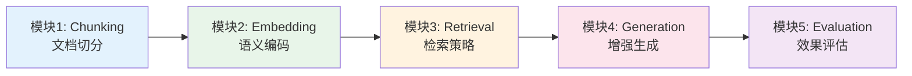
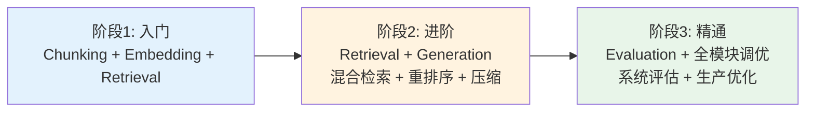

# RAG 技术脉络

> RAG（检索增强生成）技术栈的模块化技能树。从文档切分、语义编码到检索策略、增强生成和效果评估，每个模块下列举具体实现方案、适用场景和面试关注点。

---

## 脉络总览

### 模块关系图

### 模块速查表

| 序号  | 模块         | 核心问题                | 难度  | 状态  |
| --- | ---------- | ------------------- | --- | --- |
| 1   | Chunking   | 如何切分文档才能保留语义完整性     | 入门  | 已完善 |
| 2   | Embedding  | 如何选择编码模型将文本转为向量     | 入门  | 已完善 |
| 3   | Retrieval  | 如何从海量文档中召回最相关的片段    | 进阶  | 已完善 |
| 4   | Generation | 如何将检索结果有效注入生成过程     | 进阶  | 已完善 |
| 5   | Evaluation | 如何系统评估 RAG 系统的端到端效果 | 精通  | 已完善 |

---

## 模块 1: Chunking（文档切分）

> 将长文档分割为适合模型上下文窗口的文本块，切分策略直接影响后续检索质量和生成效果。

### 核心概念

- [[rag]] —— RAG 核心流程中"文档切分"环节的原理和重要性

### 具体实现 / 技术方案

| 方案         | 代表工具/方法                               | 适用场景                | 来源                       |
| ---------- | ------------------------------------- | ------------------- | ------------------------ |
| 固定长度切分     | CharacterSplitter（按字符数切分，可配置 overlap） | 快速原型、对结构不敏感的通用文本    | —                        |
| 递归层次切分     | RecursiveSplitter（按段落→句子→单词递归切分）      | 需要保留自然语言层次结构的文档     | —                        |
| 语义边界切分     | SemanticSplitter（按语义相似度边界切分）          | 要求 chunk 内语义高度内聚的场景 | —                        |
| 结构感知切分     | 保留 Markdown 标题树、代码 AST、法律条款层级         | 结构化文档（技术文档、法条、代码库）  | [[treesearch-retrieval]] |
| Agentic 切分 | 由 LLM 根据内容动态决定切分边界                    | 高质量要求、成本可接受的生产场景    | —                        |

### 面试题 / 关注问题

1. **Chunk size 和 overlap 如何权衡？**
   - 考察点：对检索精度和召回率 trade-off 的理解
   - 关键要点：size 过大→噪声多、精度下降；size 过小→上下文断裂、召回碎片化；overlap 缓解边界问题但增加冗余；典型值 256-1024 tokens，overlap 10-20%

2. **为什么固定长度切分在代码和法律文档上表现差？**
   - 考察点：对文档结构重要性的认识
   - 关键要点：固定切分会切断函数体、法律条款的层级引用关系；结构感知切分（如按 AST、标题树）保留语义完整性

3. **TreeSearch 为什么不切分文档？**
   - 考察点：对"切分 vs 结构保留"设计哲学的理解
   - 关键要点：[[treesearch-retrieval]] 选择保留原始文档树结构（Markdown 标题树、代码 AST），通过 BM25 在结构上搜索，避免切分造成的语义断裂

### 相关来源

- [[treesearch-retrieval]] —— TreeSearch：保留文档结构的非向量检索方案
- [[obsidian-knowledge-base]] —— Obsidian 本地知识库中的文档组织策略

---

## 模块 2: Embedding（嵌入编码）

> 将文本块编码为高维向量，使语义相似的文本在向量空间中距离相近，是向量检索的基础。

### 核心概念

- [[rag]] —— RAG 中嵌入编码的作用和流程

### 具体实现 / 技术方案

| 方案 | 代表模型/方法 | 适用场景 | 来源 |
|------|-------------|---------|------|
| 闭源 API 嵌入 | OpenAI text-embedding-3-large / 3-small | 快速上线、多语言通用、成本可接受 | — |
| 开源轻量嵌入 | nomic-embed-text-v1.5、BAAI/bge-small-en | 隐私敏感、成本敏感、可本地部署 | — |
| 多语言嵌入 | BAAI/bge-m3、 multilingual-e5 | 中文/多语言场景、跨语言检索 | — |
| 本地私有化嵌入 | Obsidian + Ollama 本地嵌入模型 | 完全离线、个人隐私笔记 | [[obsidian]] |
| 稀疏向量嵌入 | SPLADE、BM25 的向量扩展 | 关键词精确匹配与语义检索的混合 | — |

### 面试题 / 关注问题

1. **如何选择 embedding 模型？**
   - 考察点：对模型选型维度的掌握
   - 关键要点：语言覆盖（英文/中文/多语言）、向量维度（影响存储和速度）、上下文长度、MTEB 排行榜表现、延迟和成本、是否支持微调

2. **Embedding 模型的上下文长度限制对 RAG 有什么影响？**
   - 考察点：对 embedding 过程局限性的理解
   - 关键要点：模型通常有 512-8192 tokens 的输入限制；超出部分被截断导致信息丢失；长文档需要先切分再编码；部分新模型支持长上下文嵌入（如 jina-embeddings-v2 支持 8k）

3. **向量维度是不是越高越好？**
   - 考察点：对向量检索工程 trade-off 的理解
   - 关键要点：更高维度通常带来更好的语义区分度，但增加存储成本和检索延迟；实际中 384-1536 维是常见 sweet spot；需结合 ANN 索引算法（HNSW、IVF）的维度敏感性综合考虑

### 相关来源

- [[obsidian-knowledge-base]] —— Obsidian 本地嵌入方案（Ollama + nomic-embed-text）

---

## 模块 3: Retrieval（检索策略）

> 从编码后的向量库或索引中召回与查询最相关的文本片段。检索策略的选择直接决定 RAG 系统的召回率和精确率。

### 核心概念

- [[rag]] —— 检索增强生成的核心流程
- [[knowledge-graph]] —— 知识图谱与向量检索的互补关系

### 具体实现 / 技术方案

| 方案           | 代表工具/方法                                       | 适用场景                 | 来源                       |
| ------------ | --------------------------------------------- | -------------------- | ------------------------ |
| 稠密向量检索（ANN）  | HNSW、IVF_FLAT、DiskANN + FAISS/Milvus/Pinecone | 语义理解、开放问答、大规模文档库     | —                        |
| 稀疏关键词检索      | BM25 + SQLite FTS5 / Elasticsearch            | 精确匹配、法条编号、函数名搜索      | [[treesearch-retrieval]] |
| 混合检索（Hybrid） | 向量得分 + BM25 得分的加权融合（RRF）                      | 同时需要语义理解和精确匹配        | —                        |
| 图谱增强检索       | Graph RAG、LightRAG、Hyper-RAG                  | 需要多跳推理、关系探索的复杂查询     | [[hyper-extract]]        |
| 代码专用检索       | Tree-sitter AST + 结构感知索引                      | 代码库搜索、依赖关系追踪         | [[gitnexus]]             |
| 重排序精排        | Cross-encoder 重排序（如 bge-reranker）             | 对召回结果进行精排提升 top-k 质量 | —                        |

### 面试题 / 关注问题

1. **ANN 算法的种类和对比？HNSW vs IVF vs LSH？**
   - 考察点：对近似最近邻算法的掌握
   - 关键要点：HNSW（图索引，高召回，内存占用大）、IVF（倒排文件，平衡召回和速度）、LSH（局部敏感哈希，快速但召回较低）；选择取决于数据规模、延迟要求、内存预算

2. **Graph RAG 与传统 RAG 的核心区别是什么？**
   - 考察点：对知识图谱增强检索的理解
   - 关键要点：传统 RAG 基于语义相似度（黑盒），Graph RAG 基于显式关系（白盒）；Graph RAG 支持多跳推理（"A 的公司 B 的 CEO 是谁"）；但构建和维护知识图谱成本高；[[hyper-extract]] 提供自动化抽取方案

3. **TreeSearch 为什么放弃向量检索？**
   - 考察点：对检索范式 trade-off 的深度理解
   - 关键要点：[[treesearch-retrieval]] 在 1000 万文档法条库场景下，BM25 + 结构感知的成本仅为传统 RAG 的 1/1000；向量检索丢失文档结构、依赖昂贵 API、对精确匹配场景表现不佳

4. **如何评估检索阶段的质量？Recall@K vs MRR vs NDCG？**
   - 考察点：对检索评估指标的理解
   - 关键要点：Recall@K（前 K 个结果中 relevant 的比例，关注不漏）、MRR（第一个 relevant 结果的位置倒数，关注速度）、NDCG（考虑排序质量）；RAG 场景通常更关注 Recall@K 保证不遗漏关键信息

### 相关来源

- [[treesearch-retrieval]] —— TreeSearch：BM25 + 结构感知的零向量检索
- [[hyper-extract]] —— Hyper-Extract：NLP 文档抽取支持 10+ 种图谱算法
- [[gitnexus]] —— GitNexus：代码知识图谱的浏览器端检索方案

---

## 模块 4: Generation（增强生成）

> 将检索到的上下文与用户查询拼接为增强提示，送入 LLM 生成最终回答。生成阶段的质量控制是 RAG 系统可用性的关键。

### 核心概念

- [[rag]] —— RAG 生成阶段的流程和原理

### 具体实现 / 技术方案

| 方案 | 代表工具/方法 | 适用场景 | 来源 |
|------|-------------|---------|------|
| 直接拼接生成 | 检索结果直接拼接到 system prompt | 简单场景、上下文窗口充足 | — |
| Re-rank 精排后生成 | Cross-encoder 对召回结果重排序，取 top-k | 召回结果噪声大、需要高质量 top-k | — |
| 上下文压缩 | 压缩检索结果后再生成（如 LLMLingua、Selective Context） | 上下文窗口紧张、检索结果多 | — |
| 多路检索融合 | 同时检索多个索引，融合结果后生成 | 多数据源、需要综合多类知识的场景 | — |
| Self-RAG / Corrective RAG | 让模型自我评估检索质量，决定是否重新检索 | 高可靠性要求、检索结果可能不相关 | — |
| 引用溯源生成 | 要求模型在回答中标注信息来源 | 需要可验证性的场景（医疗、法律） | — |

### 面试题 / 关注问题

1. **如何处理检索到的噪声上下文（不相关的 chunks）？**
   - 考察点：对 RAG 鲁棒性的理解
   - 关键要点：Re-rank 精排过滤低质量结果；上下文压缩去除冗余；Self-RAG 让模型判断检索质量并决定是否重试；在 prompt 中明确指示模型忽略无关信息；训练模型对噪声上下文有更强鲁棒性

2. **上下文窗口不够时，检索结果太多怎么办？**
   - 考察点：对上下文压缩和检索策略的综合掌握
   - 关键要点：LLMLingua 等压缩技术缩减 token；Selective Context 基于信息熵选择关键句；调整检索 top-k 数量；分层检索（先粗排再精排）；使用支持更长上下文的模型

3. **Self-RAG 和传统 RAG 的区别？**
   - 考察点：对自适应检索策略的理解
   - 关键要点：传统 RAG 固定检索一次然后生成；Self-RAG 让模型在生成过程中动态判断是否需要额外检索、检索结果是否可靠、是否修正之前生成内容；增加 token 消耗但提升准确性和可验证性

### 相关来源

- [[rag]] —— 检索增强生成的核心概念

---

## 模块 5: Evaluation（效果评估）

> 系统评估 RAG 系统端到端效果，覆盖检索质量、生成质量和整体用户体验三个层面。

### 核心概念

- [[rag]] —— RAG 评估的基本思路

### 具体实现 / 技术方案

| 方案 | 代表工具/方法 | 评估维度 | 来源 |
|------|-------------|---------|------|
| 自动化框架 | RAGAS（Faithfulness、Answer Relevance、Context Precision 等） | 端到端：忠实度、答案相关性、上下文精确率 | — |
| 自动化框架 | ARES（LLM 判断 + 统计校准） | 端到端：上下文相关性、答案忠实度、答案有用性 | — |
| LLM-as-Judge | GPT-4 / Claude 作为裁判评估回答质量 | 生成质量：流畅度、准确性、完整性 | — |
| 人工评估 | 黄金答案对比 + 人工打分 | 准确性、完整性、可读性 | — |
| 检索专用指标 | Recall@K、MRR、NDCG | 检索阶段质量 | — |
| A/B 测试 | 线上真实用户反馈对比 | 用户满意度、任务完成率 | — |

### 面试题 / 关注问题

1. **RAG 系统的评估指标体系应该包含哪些维度？**
   - 考察点：对 RAG 评估体系的系统性理解
   - 关键要点：检索维度（Recall@K、Precision@K、MRR）、生成维度（Faithfulness、Answer Relevance、Fluency）、端到端维度（任务完成率、用户满意度）；RAGAS 提供 5 个核心指标：Faithfulness、Answer Relevancy、Context Precision、Context Recall、Context Entity Recall

2. **自动评估（RAGAS）和人工评估的关系？**
   - 考察点：对评估方法 trade-off 的理解
   - 关键要点：自动评估成本低、可重复、适合迭代优化，但可能受 LLM 裁判偏差影响；人工评估成本高、主观性强，但更接近真实用户体验；生产环境通常两者结合：自动评估用于 CI/CD 迭代，人工评估用于关键版本发布前校验

3. **Faithfulness（忠实度）指标是如何计算的？**
   - 考察点：对 RAGAS 具体指标的理解
   - 关键要点：将生成的回答拆分为多个陈述，逐一检查每个陈述是否能在检索到的上下文中找到支持证据；支持陈述数 / 总陈述数 = Faithfulness；核心假设：如果回答中的信息无法从检索上下文推导，则可能是幻觉

### 相关来源

- [[rag]] —— 检索增强生成的评估思路

---

## 学习路径建议

### 按阶段学习

| 阶段 | 目标 | 涉及模块 | 预计时间 |
|------|------|---------|---------|
| 入门 | 理解 RAG 基本原理，能搭建简单的向量检索问答系统 | Chunking + Embedding + Retrieval | 1 周 |
| 进阶 | 掌握混合检索、重排序、上下文压缩，优化检索质量 | Retrieval + Generation | 2 周 |
| 精通 | 系统评估、调优端到端效果，处理生产级挑战 | Evaluation + 全模块调优 | 持续 |

### 推荐实践项目

1. **个人笔记 RAG**：用 Obsidian + Ollama 本地嵌入 + 本地向量库，实现完全离线的个人笔记问答
2. **法条检索系统**：用 TreeSearch 模式（BM25 + 结构感知）构建法律文档检索，对比向量检索的效果差异
3. **多跳问答**：用 Graph RAG 构建知识图谱，实现"A 的公司 B 的 CEO 是谁"类多跳推理

---

## 版本记录

| 日期 | 更新内容 | 来源 |
|------|---------|------|
| 2026-05-08 | 创建 RAG 技术脉络，覆盖 5 个模块，含 15+ 面试题 | [[rag-knowledge-retrieval-landscape]] |

---

## 相关全景

- [[rag-knowledge-retrieval-landscape]] —— RAG 与知识检索领域横向全景（工具对比 + 演进脉络）
- [[knowledge-graph-tools-comparison]] —— 知识图谱工具选型对比
